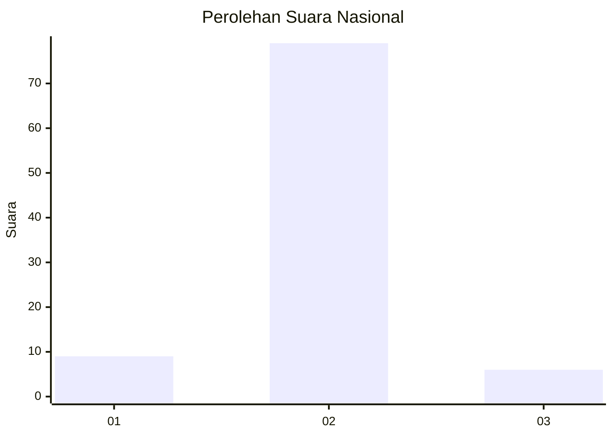
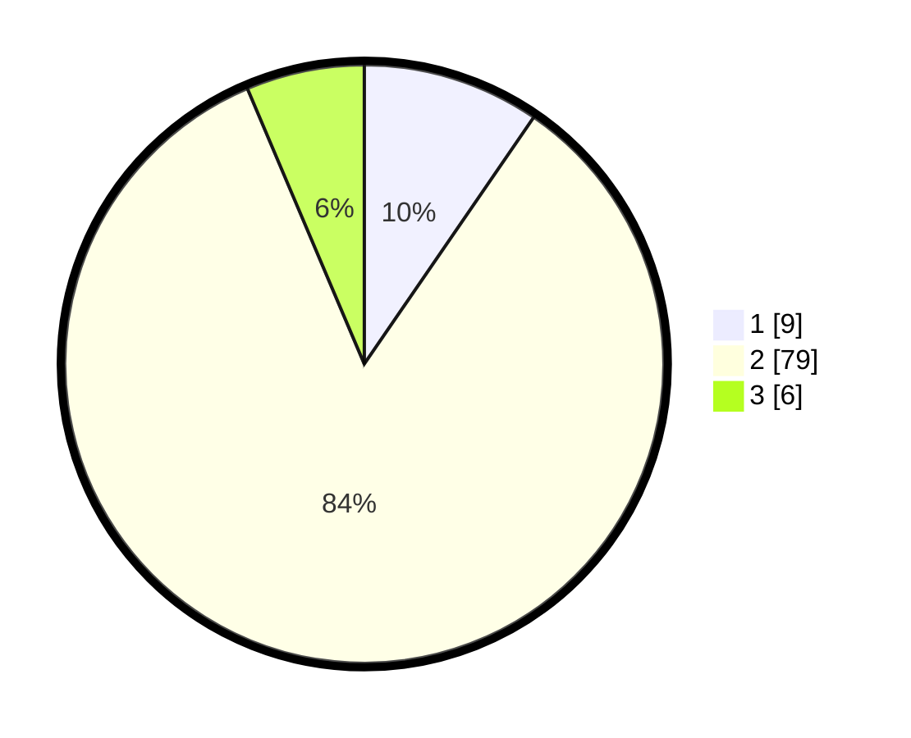

# Hasil

## Grafik

## Tabel

| No. | Nama Paslon    | Suara | Suara (raw) | Persentase |
|:--- |:-------------- | -----:| -----------:| ----------:|
| 1   | ANIES MUHAIMIN | 9     | [9][p-1]    | 9,57       |
| 2   | PRABOWO GIBRAN | 79    | [79][p-2]   | 84,04      |
| 3   | GANJAR MAHFUD  | 6     | [6][p-3]    | 6,38       |

[p-1]: https://github.com/gigit-pemilu/pemilu-2024/blob/main/pilpres/hitung-suara/sub/21-kepulauan-riau/sub/04-lingga/sub/13-bakung-serumpun/sub/2005-tanjung-lipat/sub/003-tps/sub/paslon-1.txt
[p-2]: https://github.com/gigit-pemilu/pemilu-2024/blob/main/pilpres/hitung-suara/sub/21-kepulauan-riau/sub/04-lingga/sub/13-bakung-serumpun/sub/2005-tanjung-lipat/sub/003-tps/sub/paslon-2.txt
[p-3]: https://github.com/gigit-pemilu/pemilu-2024/blob/main/pilpres/hitung-suara/sub/21-kepulauan-riau/sub/04-lingga/sub/13-bakung-serumpun/sub/2005-tanjung-lipat/sub/003-tps/sub/paslon-3.txt

## Foto C Plano

https://sirekap-obj-formc.kpu.go.id/10d1/pemilu/ppwp/21/04/13/20/05/2104132005003-20240214-203249--bde183e7-a388-47fd-a337-bc877e7bd832.jpg

https://sirekap-obj-formc.kpu.go.id/10d1/pemilu/ppwp/21/04/13/20/05/2104132005003-20240214-203432--56a74f2d-9f2a-48bf-871d-0411a6fc247b.jpg

https://sirekap-obj-formc.kpu.go.id/10d1/pemilu/ppwp/21/04/13/20/05/2104132005003-20240214-204116--c01698e0-2048-4361-bb37-21210fa823fe.jpg

## Metadata

| Key        | Value               |
| ---------- | ------------------- |
| Time Stamp | 2024-02-15 00:41:44 |

