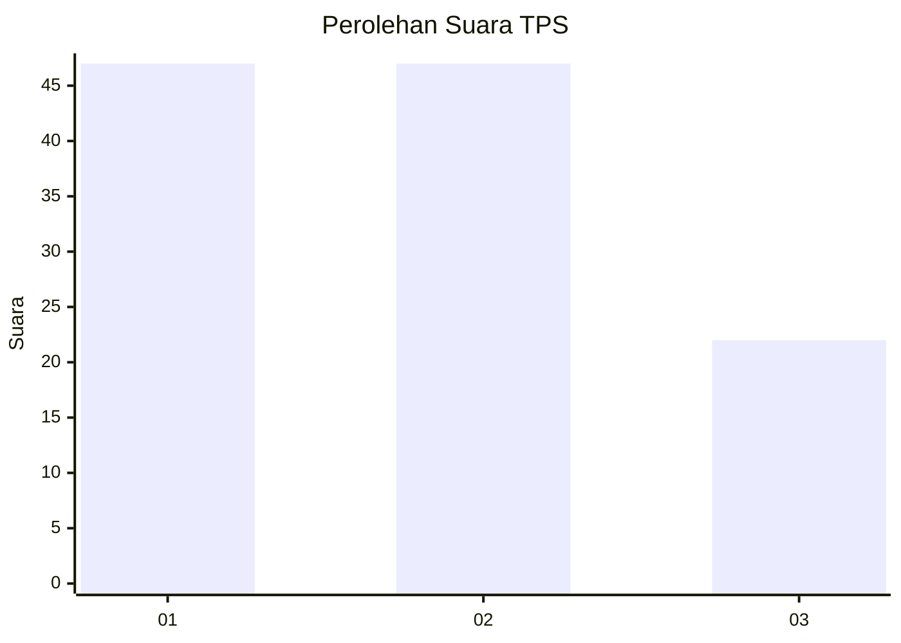
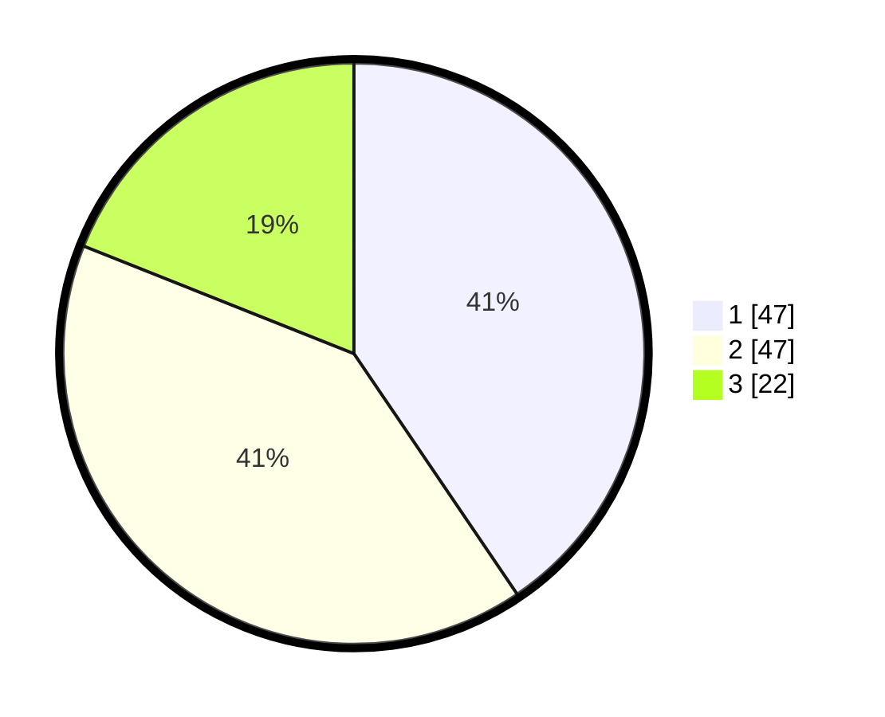

# Hasil

## Grafik

## Tabel

| No. | Nama Paslon    | Suara | Suara (raw) | Persentase |
|:--- |:-------------- | -----:| -----------:| ----------:|
| 1   | ANIES MUHAIMIN | 47    | [47][p-1]   | 40,52      |
| 2   | PRABOWO GIBRAN | 47    | [47][p-2]   | 40,52      |
| 3   | GANJAR MAHFUD  | 22    | [22][p-3]   | 18,97      |

[p-1]: https://github.com/gigit-pemilu/pemilu-2024-21-kepulauan-riau/blob/main/pilpres/hitung-suara/sub/21-kepulauan-riau/sub/05-kepulauan-anambas/sub/01-siantan/sub/1001-terempa/sub/003-tps/sub/paslon-1.txt
[p-2]: https://github.com/gigit-pemilu/pemilu-2024-21-kepulauan-riau/blob/main/pilpres/hitung-suara/sub/21-kepulauan-riau/sub/05-kepulauan-anambas/sub/01-siantan/sub/1001-terempa/sub/003-tps/sub/paslon-2.txt
[p-3]: https://github.com/gigit-pemilu/pemilu-2024-21-kepulauan-riau/blob/main/pilpres/hitung-suara/sub/21-kepulauan-riau/sub/05-kepulauan-anambas/sub/01-siantan/sub/1001-terempa/sub/003-tps/sub/paslon-3.txt

## Foto C Plano

https://sirekap-obj-formc.kpu.go.id/b0e3/pemilu/ppwp/21/05/01/10/01/2105011001003-20240216-153708--e295a338-01be-4532-95a8-4774b2130d33.jpg

https://sirekap-obj-formc.kpu.go.id/b0e3/pemilu/ppwp/21/05/01/10/01/2105011001003-20240216-153709--39e7e679-b568-4a7a-853b-155c56b9b9f4.jpg

https://sirekap-obj-formc.kpu.go.id/b0e3/pemilu/ppwp/21/05/01/10/01/2105011001003-20240216-153709--fe649fc4-f5dd-443a-892a-475ee1dbb5a8.jpg

## Metadata

| Key        | Value               |
| ---------- | ------------------- |
| Time Stamp | 2024-02-16 16:25:10 |

## DATA PEMILIH TETAP

Jumlah pemilih dalam DPT: **177**.
 * L: **80**.
 * P: **97**.

## DATA PENGGUNA HAK PILIH

Jumlah pengguna hak pilih dalam DPT: **110**.
 * L: **53**.
 * P: **57**.

Jumlah pengguna hak pilih dalam DPTb: **6**.
 * L: **5**.
 * P: **1**.

Jumlah pengguna hak pilih dalam DPK: **3**.
 * L: **2**.
 * P: **1**.

Jumlah pengguna hak pilih: **119**.
 * L: **60**.
 * P: **59**.

## JUMLAH SUARA SAH DAN TIDAK SAH

JUMLAH SELURUH SUARA SAH: **116**.

JUMLAH SUARA TIDAK SAH: **3**.

JUMLAH SELURUH SUARA SAH DAN SUARA TIDAK SAH: **119**.

