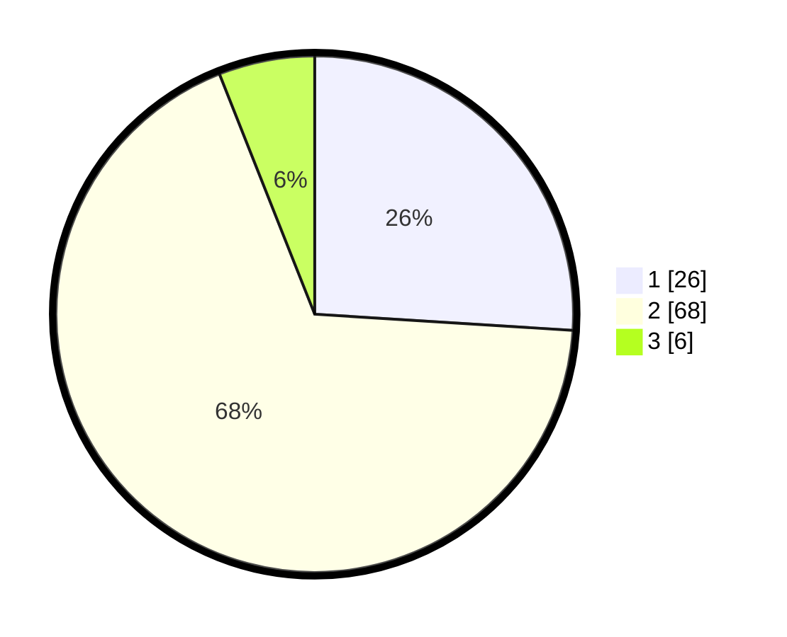

# Hasil

## Grafik

## Tabel

| No. | Nama Paslon    | Suara | Suara (raw) | Persentase |
|:--- |:-------------- | -----:| -----------:| ----------:|
| 1   | ANIES MUHAIMIN | 26    | [26][p-1]   | 26,00      |
| 2   | PRABOWO GIBRAN | 68    | [68][p-2]   | 68,00      |
| 3   | GANJAR MAHFUD  | 6     | [6][p-3]    | 6,00       |

[p-1]: https://github.com/gigit-pemilu/pemilu-2024-21-kepulauan-riau/blob/main/pilpres/hitung-suara/sub/21-kepulauan-riau/sub/05-kepulauan-anambas/sub/05-jemaja-timur/sub/2001-kuala-maras/sub/002-tps/sub/paslon-1.txt
[p-2]: https://github.com/gigit-pemilu/pemilu-2024-21-kepulauan-riau/blob/main/pilpres/hitung-suara/sub/21-kepulauan-riau/sub/05-kepulauan-anambas/sub/05-jemaja-timur/sub/2001-kuala-maras/sub/002-tps/sub/paslon-2.txt
[p-3]: https://github.com/gigit-pemilu/pemilu-2024-21-kepulauan-riau/blob/main/pilpres/hitung-suara/sub/21-kepulauan-riau/sub/05-kepulauan-anambas/sub/05-jemaja-timur/sub/2001-kuala-maras/sub/002-tps/sub/paslon-3.txt

## Foto C Plano

https://sirekap-obj-formc.kpu.go.id/a3ba/pemilu/ppwp/21/05/05/20/01/2105052001002-20240217-201524--cd45b7b9-c301-488c-932a-e12d76013931.jpg

https://sirekap-obj-formc.kpu.go.id/a3ba/pemilu/ppwp/21/05/05/20/01/2105052001002-20240217-201526--81bb2e67-dddf-4c50-9a40-bd03c33a0617.jpg

https://sirekap-obj-formc.kpu.go.id/a3ba/pemilu/ppwp/21/05/05/20/01/2105052001002-20240217-201525--c76562b2-ee20-4381-9674-13d70d9e85cd.jpg

## Metadata

| Key        | Value               |
| ---------- | ------------------- |
| Time Stamp | 2024-02-19 06:16:00 |

## DATA PEMILIH TETAP

Jumlah pemilih dalam DPT: **115**.
 * L: **61**.
 * P: **54**.

## DATA PENGGUNA HAK PILIH

Jumlah pengguna hak pilih dalam DPT: **106**.
 * L: **55**.
 * P: **51**.

Jumlah pengguna hak pilih dalam DPTb: **1**.
 * L: **1**.
 * P: **0**.

Jumlah pengguna hak pilih dalam DPK: **0**.
 * L: **0**.
 * P: **0**.

Jumlah pengguna hak pilih: **107**.
 * L: **56**.
 * P: **51**.

## JUMLAH SUARA SAH DAN TIDAK SAH

JUMLAH SELURUH SUARA SAH: **100**.

JUMLAH SUARA TIDAK SAH: **7**.

JUMLAH SELURUH SUARA SAH DAN SUARA TIDAK SAH: **107**.

