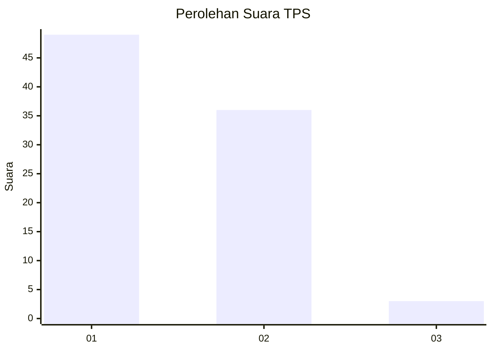
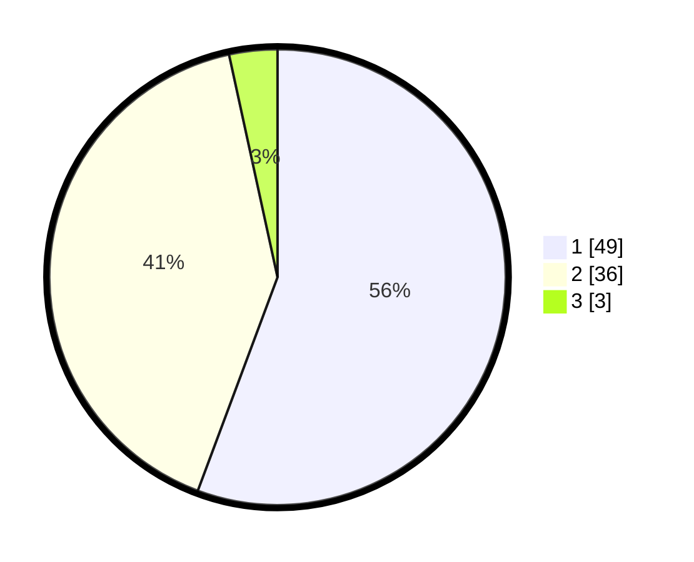

# Hasil

## Grafik

## Tabel

| No. | Nama Paslon    | Suara | Suara (raw) | Persentase |
|:--- |:-------------- | -----:| -----------:| ----------:|
| 1   | ANIES MUHAIMIN | 49    | [49][p-1]   | 55,68      |
| 2   | PRABOWO GIBRAN | 36    | [36][p-2]   | 40,91      |
| 3   | GANJAR MAHFUD  | 3     | [3][p-3]    | 3,41       |

[p-1]: https://github.com/gigit-pemilu/pemilu-2024-21-kepulauan-riau/blob/main/pilpres/hitung-suara/sub/21-kepulauan-riau/sub/05-kepulauan-anambas/sub/10-kute-siantan/sub/2001-payalaman/sub/005-tps/sub/paslon-1.txt
[p-2]: https://github.com/gigit-pemilu/pemilu-2024-21-kepulauan-riau/blob/main/pilpres/hitung-suara/sub/21-kepulauan-riau/sub/05-kepulauan-anambas/sub/10-kute-siantan/sub/2001-payalaman/sub/005-tps/sub/paslon-2.txt
[p-3]: https://github.com/gigit-pemilu/pemilu-2024-21-kepulauan-riau/blob/main/pilpres/hitung-suara/sub/21-kepulauan-riau/sub/05-kepulauan-anambas/sub/10-kute-siantan/sub/2001-payalaman/sub/005-tps/sub/paslon-3.txt

## Foto C Plano

https://sirekap-obj-formc.kpu.go.id/4367/pemilu/ppwp/21/05/10/20/01/2105102001005-20240216-032010--e496c2bf-2aca-41a4-81d8-08d1a89bb9d0.jpg

https://sirekap-obj-formc.kpu.go.id/4367/pemilu/ppwp/21/05/10/20/01/2105102001005-20240216-032012--d2df8207-9d76-488f-a25d-c8f4dc9805f8.jpg

https://sirekap-obj-formc.kpu.go.id/4367/pemilu/ppwp/21/05/10/20/01/2105102001005-20240216-032011--50285e49-31dc-45e2-b6ec-aebbca3289cd.jpg

## Metadata

| Key        | Value               |
| ---------- | ------------------- |
| Time Stamp | 2024-02-17 16:52:47 |

## DATA PEMILIH TETAP

Jumlah pemilih dalam DPT: **110**.
 * L: **58**.
 * P: **52**.

## DATA PENGGUNA HAK PILIH

Jumlah pengguna hak pilih dalam DPT: **83**.
 * L: **45**.
 * P: **38**.

Jumlah pengguna hak pilih dalam DPTb: **7**.
 * L: **4**.
 * P: **3**.

Jumlah pengguna hak pilih dalam DPK: **1**.
 * L: **1**.
 * P: **0**.

Jumlah pengguna hak pilih: **91**.
 * L: **50**.
 * P: **41**.

## JUMLAH SUARA SAH DAN TIDAK SAH

JUMLAH SELURUH SUARA SAH: **88**.

JUMLAH SUARA TIDAK SAH: **3**.

JUMLAH SELURUH SUARA SAH DAN SUARA TIDAK SAH: **91**.

