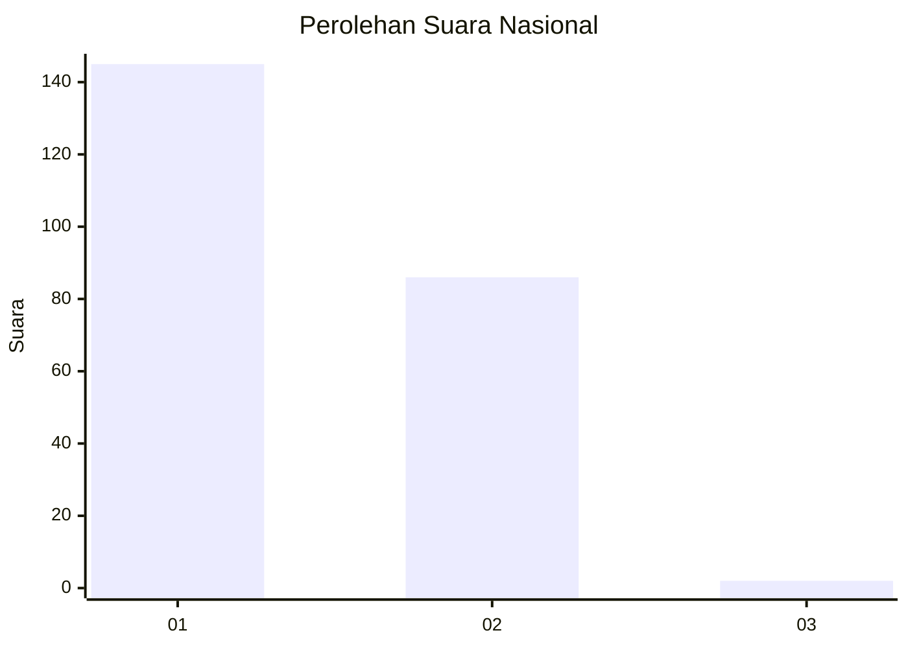
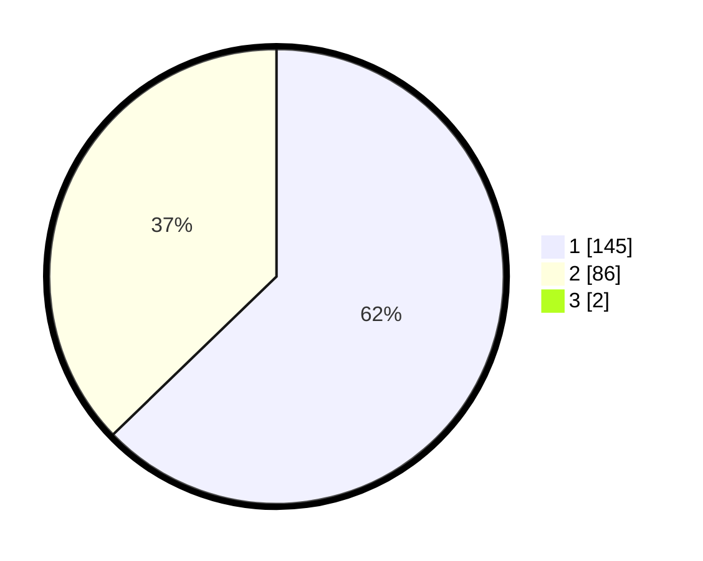

# Hasil

## Grafik

## Tabel

| No. | Nama Paslon    | Suara | Suara (raw) | Persentase |
|:--- |:-------------- | -----:| -----------:| ----------:|
| 1   | ANIES MUHAIMIN | 145   | [145][p-1]  | 62,23      |
| 2   | PRABOWO GIBRAN | 86    | [86][p-2]   | 36,91      |
| 3   | GANJAR MAHFUD  | 2     | [2][p-3]    | 0,86       |

[p-1]: https://github.com/gigit-pemilu/pemilu-2024/blob/main/pilpres/hitung-suara/sub/21-kepulauan-riau/sub/71-kota-batam/sub/02-batu-ampar/sub/1001-tanjung-sengkuang/sub/009-tps/sub/paslon-1.txt
[p-2]: https://github.com/gigit-pemilu/pemilu-2024/blob/main/pilpres/hitung-suara/sub/21-kepulauan-riau/sub/71-kota-batam/sub/02-batu-ampar/sub/1001-tanjung-sengkuang/sub/009-tps/sub/paslon-2.txt
[p-3]: https://github.com/gigit-pemilu/pemilu-2024/blob/main/pilpres/hitung-suara/sub/21-kepulauan-riau/sub/71-kota-batam/sub/02-batu-ampar/sub/1001-tanjung-sengkuang/sub/009-tps/sub/paslon-3.txt

## Foto C Plano

https://sirekap-obj-formc.kpu.go.id/6eae/pemilu/ppwp/21/71/02/10/01/2171021001009-20240215-021223--fd7b0e42-17f8-441d-ae19-9580ad9db3c4.jpg

https://sirekap-obj-formc.kpu.go.id/6eae/pemilu/ppwp/21/71/02/10/01/2171021001009-20240215-021303--3f8b6df0-43bd-42c1-b75d-4aace9da0a8d.jpg

https://sirekap-obj-formc.kpu.go.id/6eae/pemilu/ppwp/21/71/02/10/01/2171021001009-20240215-021429--b8385ac9-2abb-49a9-95da-af6c8f0750ad.jpg

## Metadata

| Key        | Value               |
| ---------- | ------------------- |
| Time Stamp | 2024-02-16 10:30:29 |

