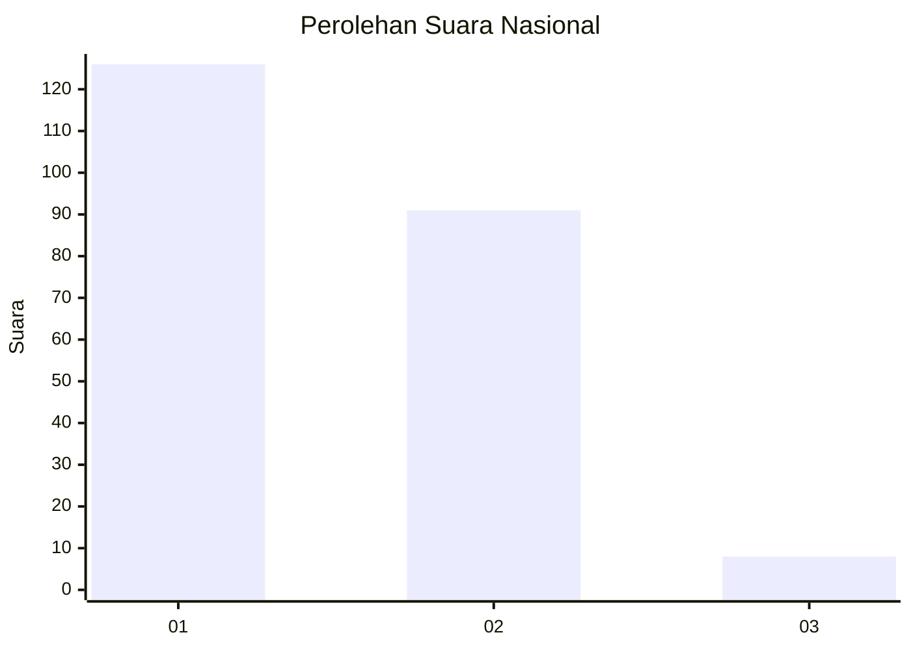
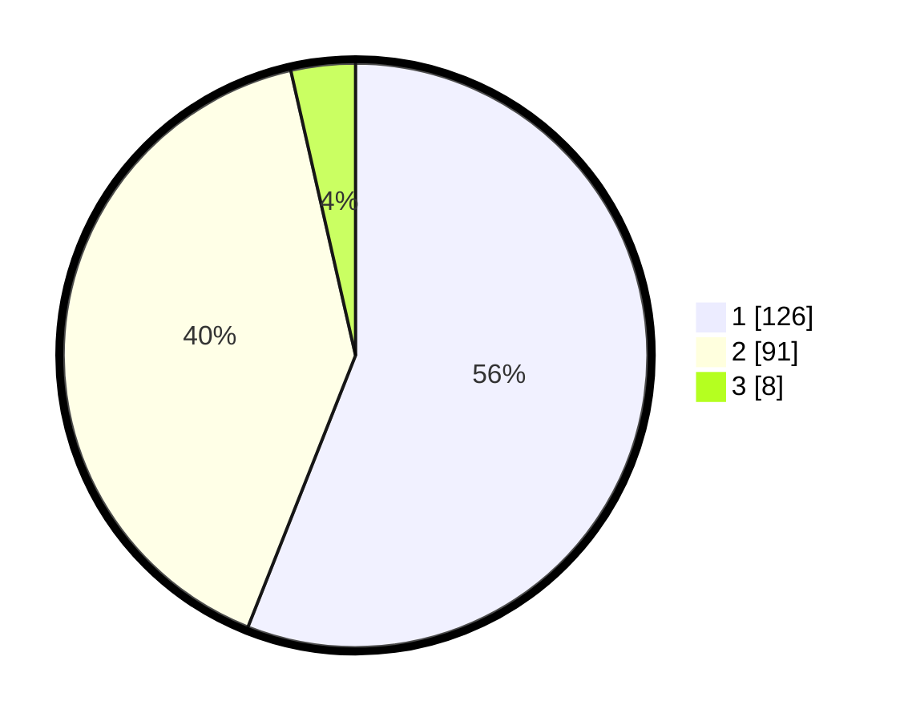

# Hasil

## Grafik

## Tabel

| No. | Nama Paslon    | Suara | Suara (raw) | Persentase |
|:--- |:-------------- | -----:| -----------:| ----------:|
| 1   | ANIES MUHAIMIN | 126   | [126][p-1]  | 56,00      |
| 2   | PRABOWO GIBRAN | 91    | [91][p-2]   | 40,44      |
| 3   | GANJAR MAHFUD  | 8     | [8][p-3]    | 3,56       |

[p-1]: https://github.com/gigit-pemilu/pemilu-2024/blob/main/pilpres/hitung-suara/sub/21-kepulauan-riau/sub/71-kota-batam/sub/02-batu-ampar/sub/1001-tanjung-sengkuang/sub/010-tps/sub/paslon-1.txt
[p-2]: https://github.com/gigit-pemilu/pemilu-2024/blob/main/pilpres/hitung-suara/sub/21-kepulauan-riau/sub/71-kota-batam/sub/02-batu-ampar/sub/1001-tanjung-sengkuang/sub/010-tps/sub/paslon-2.txt
[p-3]: https://github.com/gigit-pemilu/pemilu-2024/blob/main/pilpres/hitung-suara/sub/21-kepulauan-riau/sub/71-kota-batam/sub/02-batu-ampar/sub/1001-tanjung-sengkuang/sub/010-tps/sub/paslon-3.txt

## Foto C Plano

https://sirekap-obj-formc.kpu.go.id/9320/pemilu/ppwp/21/71/02/10/01/2171021001010-20240214-213552--db32af3b-6158-4a2e-bae3-d53ea70f57f7.jpg

https://sirekap-obj-formc.kpu.go.id/9320/pemilu/ppwp/21/71/02/10/01/2171021001010-20240214-213644--a1efc141-4d6f-40c3-9008-6adb8b631d67.jpg

https://sirekap-obj-formc.kpu.go.id/9320/pemilu/ppwp/21/71/02/10/01/2171021001010-20240214-213733--9aca3369-725c-4f05-b89c-b2471a772409.jpg

## Metadata

| Key        | Value               |
| ---------- | ------------------- |
| Time Stamp | 2024-02-26 03:00:00 |

