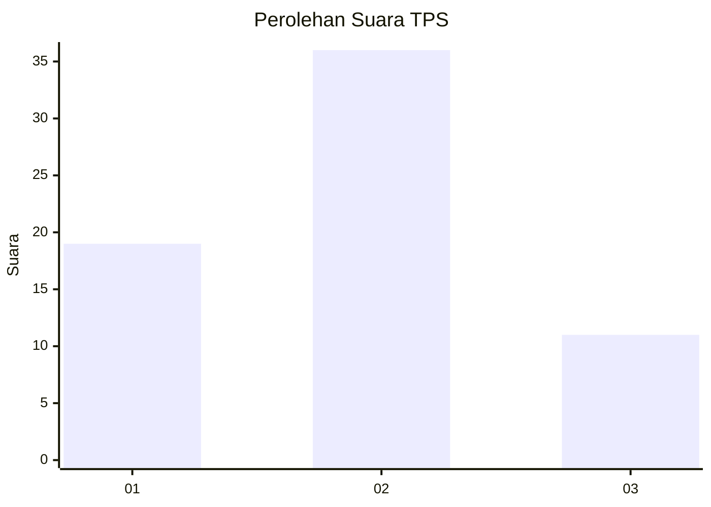
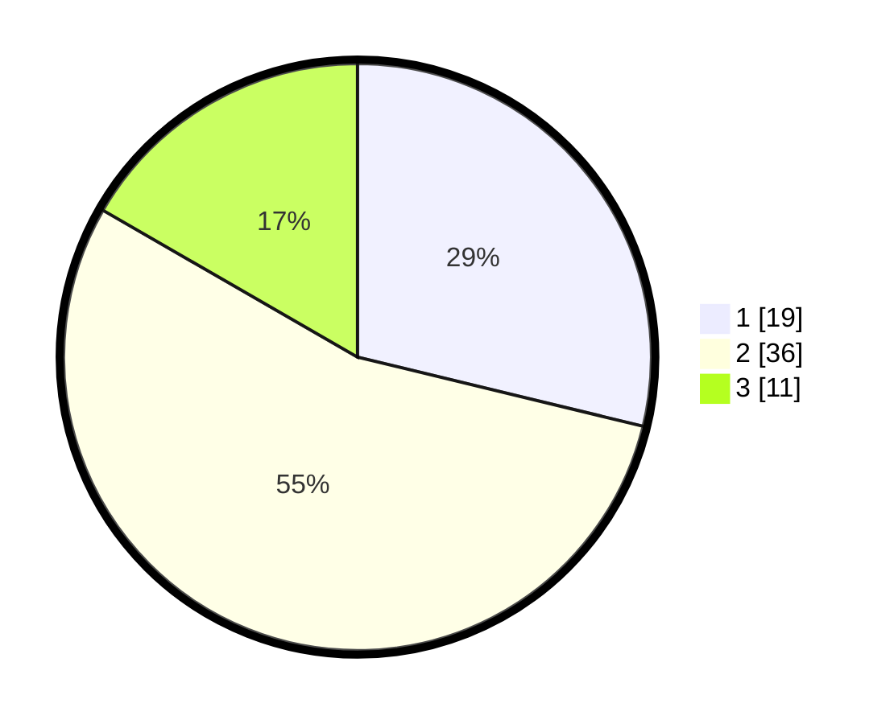

# Hasil

## Grafik

## Tabel

| No. | Nama Paslon    | Suara | Suara (raw) | Persentase |
|:--- |:-------------- | -----:| -----------:| ----------:|
| 1   | ANIES MUHAIMIN | 19    | [19][p-1]   | 28,79      |
| 2   | PRABOWO GIBRAN | 36    | [36][p-2]   | 54,55      |
| 3   | GANJAR MAHFUD  | 11    | [11][p-3]   | 16,67      |

[p-1]: https://github.com/gigit-pemilu/pemilu-2024-21-kepulauan-riau/blob/main/pilpres/hitung-suara/sub/21-kepulauan-riau/sub/71-kota-batam/sub/02-batu-ampar/sub/1004-kampung-seraya/sub/023-tps/sub/paslon-1.txt
[p-2]: https://github.com/gigit-pemilu/pemilu-2024-21-kepulauan-riau/blob/main/pilpres/hitung-suara/sub/21-kepulauan-riau/sub/71-kota-batam/sub/02-batu-ampar/sub/1004-kampung-seraya/sub/023-tps/sub/paslon-2.txt
[p-3]: https://github.com/gigit-pemilu/pemilu-2024-21-kepulauan-riau/blob/main/pilpres/hitung-suara/sub/21-kepulauan-riau/sub/71-kota-batam/sub/02-batu-ampar/sub/1004-kampung-seraya/sub/023-tps/sub/paslon-3.txt

## Foto C Plano

https://sirekap-obj-formc.kpu.go.id/895e/pemilu/ppwp/21/71/02/10/04/2171021004023-20240214-213321--b41a2a1d-c380-498a-80d4-93694acc7ef6.jpg

https://sirekap-obj-formc.kpu.go.id/895e/pemilu/ppwp/21/71/02/10/04/2171021004023-20240214-213418--5f611351-c155-41ab-85bc-4bcb8098b830.jpg

https://sirekap-obj-formc.kpu.go.id/895e/pemilu/ppwp/21/71/02/10/04/2171021004023-20240214-213958--5623c6a5-ffd5-4005-add0-316064a7307d.jpg

## Metadata

| Key        | Value               |
| ---------- | ------------------- |
| Time Stamp | 2024-02-16 10:30:29 |

