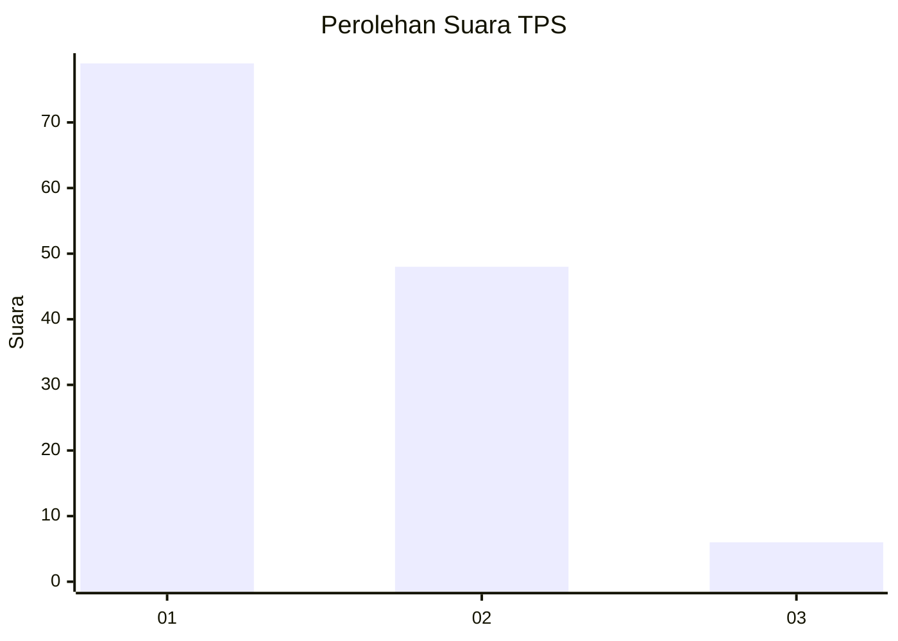
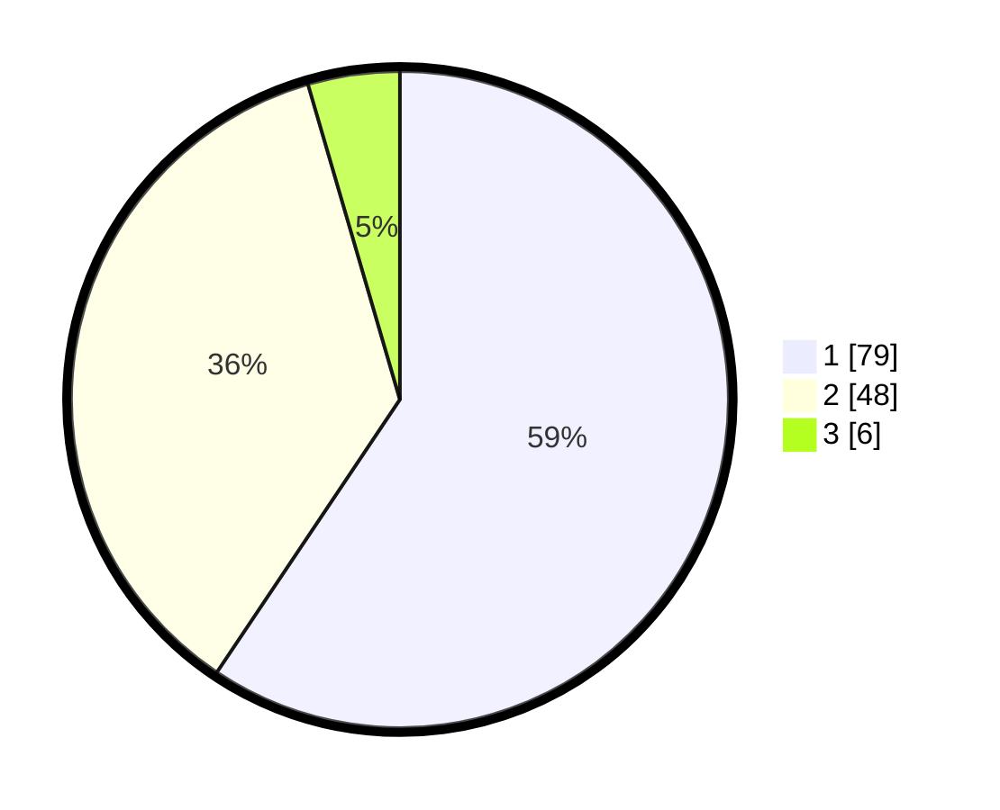

# Hasil

## Grafik

## Tabel

| No. | Nama Paslon    | Suara | Suara (raw) | Persentase |
|:--- |:-------------- | -----:| -----------:| ----------:|
| 1   | ANIES MUHAIMIN | 79    | [79][p-1]   | 59,40      |
| 2   | PRABOWO GIBRAN | 48    | [48][p-2]   | 36,09      |
| 3   | GANJAR MAHFUD  | 6     | [6][p-3]    | 4,51       |

[p-1]: https://github.com/gigit-pemilu/pemilu-2024-21-kepulauan-riau/blob/main/pilpres/hitung-suara/sub/21-kepulauan-riau/sub/71-kota-batam/sub/03-sekupang/sub/1001-sungai-harapan/sub/004-tps/sub/paslon-1.txt
[p-2]: https://github.com/gigit-pemilu/pemilu-2024-21-kepulauan-riau/blob/main/pilpres/hitung-suara/sub/21-kepulauan-riau/sub/71-kota-batam/sub/03-sekupang/sub/1001-sungai-harapan/sub/004-tps/sub/paslon-2.txt
[p-3]: https://github.com/gigit-pemilu/pemilu-2024-21-kepulauan-riau/blob/main/pilpres/hitung-suara/sub/21-kepulauan-riau/sub/71-kota-batam/sub/03-sekupang/sub/1001-sungai-harapan/sub/004-tps/sub/paslon-3.txt

## Foto C Plano

https://sirekap-obj-formc.kpu.go.id/c1fa/pemilu/ppwp/21/71/03/10/01/2171031001004-20240214-192002--7c15b793-723a-4ac1-9772-91b334bd41fd.jpg

https://sirekap-obj-formc.kpu.go.id/c1fa/pemilu/ppwp/21/71/03/10/01/2171031001004-20240214-191953--36f60fee-f0c1-4a01-ac7e-1e48f62e0026.jpg

https://sirekap-obj-formc.kpu.go.id/c1fa/pemilu/ppwp/21/71/03/10/01/2171031001004-20240214-192046--bb33cc8b-0cb7-4053-bf67-574bafb549ba.jpg

## Metadata

| Key        | Value               |
| ---------- | ------------------- |
| Time Stamp | 2024-02-17 13:37:34 |

