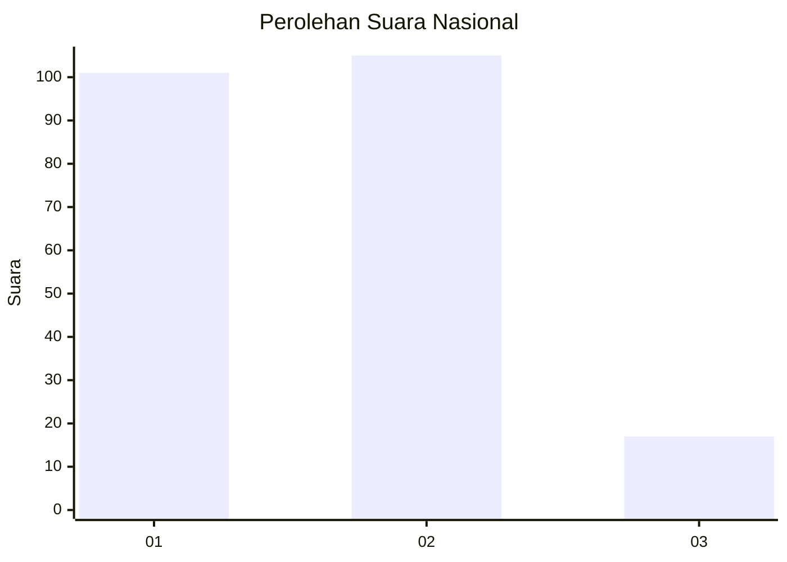
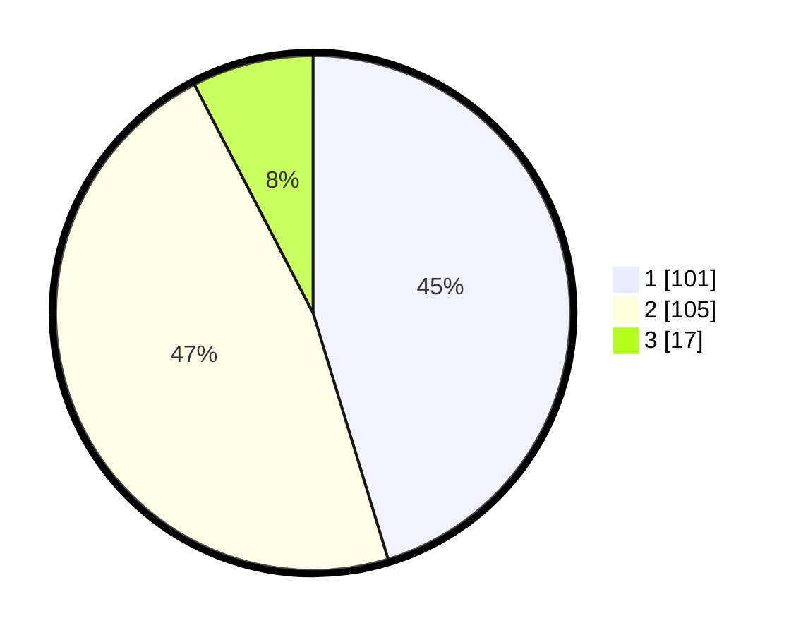

# Hasil

## Grafik

## Tabel

| No. | Nama Paslon    | Suara | Suara (raw) | Persentase |
|:--- |:-------------- | -----:| -----------:| ----------:|
| 1   | ANIES MUHAIMIN | 101   | [101][p-1]  | 45,29      |
| 2   | PRABOWO GIBRAN | 105   | [105][p-2]  | 47,09      |
| 3   | GANJAR MAHFUD  | 17    | [17][p-3]   | 7,62       |

[p-1]: https://github.com/gigit-pemilu/pemilu-2024/blob/main/pilpres/hitung-suara/sub/21-kepulauan-riau/sub/71-kota-batam/sub/03-sekupang/sub/1001-sungai-harapan/sub/008-tps/sub/paslon-1.txt
[p-2]: https://github.com/gigit-pemilu/pemilu-2024/blob/main/pilpres/hitung-suara/sub/21-kepulauan-riau/sub/71-kota-batam/sub/03-sekupang/sub/1001-sungai-harapan/sub/008-tps/sub/paslon-2.txt
[p-3]: https://github.com/gigit-pemilu/pemilu-2024/blob/main/pilpres/hitung-suara/sub/21-kepulauan-riau/sub/71-kota-batam/sub/03-sekupang/sub/1001-sungai-harapan/sub/008-tps/sub/paslon-3.txt

## Foto C Plano

https://sirekap-obj-formc.kpu.go.id/f1d8/pemilu/ppwp/21/71/03/10/01/2171031001008-20240215-043946--2f77c34a-b877-4189-a1dd-7a76abf24d1b.jpg

https://sirekap-obj-formc.kpu.go.id/f1d8/pemilu/ppwp/21/71/03/10/01/2171031001008-20240215-175842--57aa6274-cf4a-4e74-9436-dce9500632d7.jpg

https://sirekap-obj-formc.kpu.go.id/f1d8/pemilu/ppwp/21/71/03/10/01/2171031001008-20240215-175847--e201c362-8194-46e0-a89a-2760e3c79e86.jpg

## Metadata

| Key        | Value               |
| ---------- | ------------------- |
| Time Stamp | 2024-02-16 11:00:29 |

