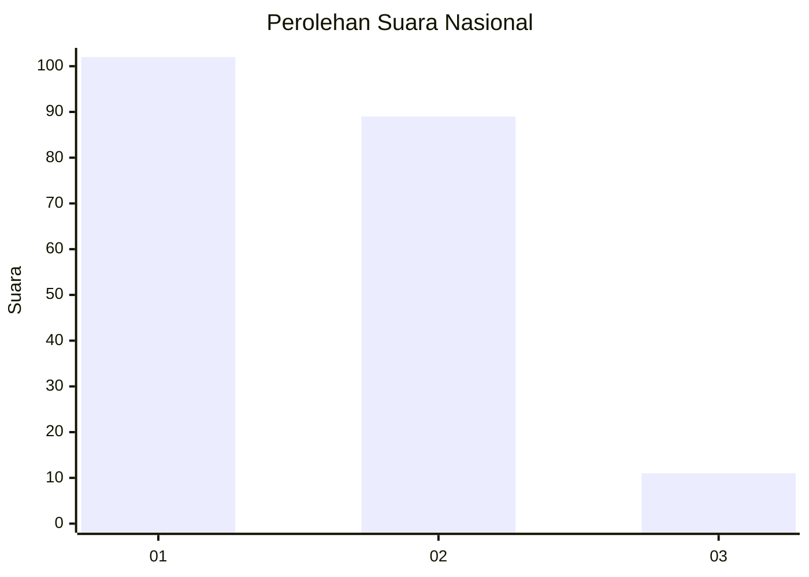
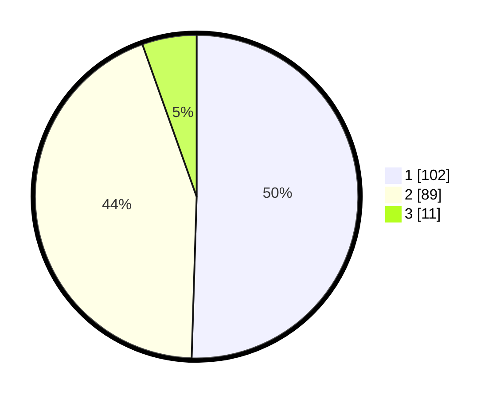

# Hasil

## Grafik

## Tabel

| No. | Nama Paslon    | Suara | Suara (raw) | Persentase |
|:--- |:-------------- | -----:| -----------:| ----------:|
| 1   | ANIES MUHAIMIN | 102   | [102][p-1]  | 50,50      |
| 2   | PRABOWO GIBRAN | 89    | [89][p-2]   | 44,06      |
| 3   | GANJAR MAHFUD  | 11    | [11][p-3]   | 5,45       |

[p-1]: https://github.com/gigit-pemilu/pemilu-2024/blob/main/pilpres/hitung-suara/sub/21-kepulauan-riau/sub/71-kota-batam/sub/03-sekupang/sub/1001-sungai-harapan/sub/009-tps/sub/paslon-1.txt
[p-2]: https://github.com/gigit-pemilu/pemilu-2024/blob/main/pilpres/hitung-suara/sub/21-kepulauan-riau/sub/71-kota-batam/sub/03-sekupang/sub/1001-sungai-harapan/sub/009-tps/sub/paslon-2.txt
[p-3]: https://github.com/gigit-pemilu/pemilu-2024/blob/main/pilpres/hitung-suara/sub/21-kepulauan-riau/sub/71-kota-batam/sub/03-sekupang/sub/1001-sungai-harapan/sub/009-tps/sub/paslon-3.txt

## Foto C Plano

https://sirekap-obj-formc.kpu.go.id/29c1/pemilu/ppwp/21/71/03/10/01/2171031001009-20240214-214610--f4f5cade-d9c9-4fb4-a53f-4c4a3647120b.jpg

https://sirekap-obj-formc.kpu.go.id/29c1/pemilu/ppwp/21/71/03/10/01/2171031001009-20240214-214712--0826efb0-edda-41c8-963d-627259705841.jpg

https://sirekap-obj-formc.kpu.go.id/29c1/pemilu/ppwp/21/71/03/10/01/2171031001009-20240214-214740--81c8e535-9df6-42ee-94be-607bd008a3f1.jpg

## Metadata

| Key        | Value               |
| ---------- | ------------------- |
| Time Stamp | 2024-02-16 11:00:29 |

