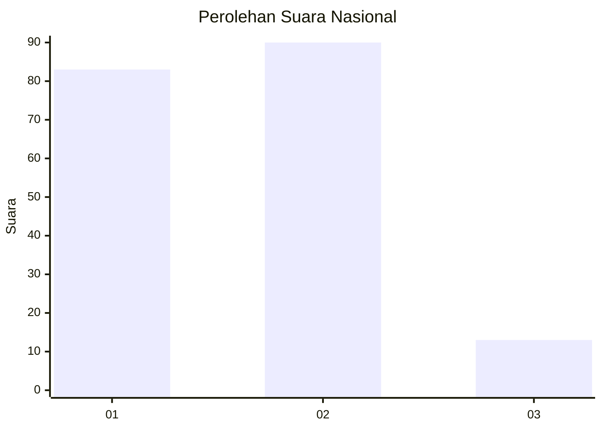
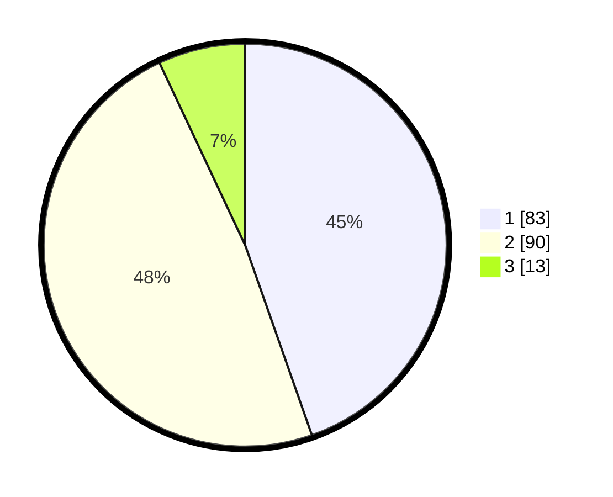

# Hasil

## Grafik

## Tabel

| No. | Nama Paslon    | Suara | Suara (raw) | Persentase |
|:--- |:-------------- | -----:| -----------:| ----------:|
| 1   | ANIES MUHAIMIN | 83    | [83][p-1]   | 44,62      |
| 2   | PRABOWO GIBRAN | 90    | [90][p-2]   | 48,39      |
| 3   | GANJAR MAHFUD  | 13    | [13][p-3]   | 6,99       |

[p-1]: https://github.com/gigit-pemilu/pemilu-2024/blob/main/pilpres/hitung-suara/sub/21-kepulauan-riau/sub/71-kota-batam/sub/03-sekupang/sub/1001-sungai-harapan/sub/010-tps/sub/paslon-1.txt
[p-2]: https://github.com/gigit-pemilu/pemilu-2024/blob/main/pilpres/hitung-suara/sub/21-kepulauan-riau/sub/71-kota-batam/sub/03-sekupang/sub/1001-sungai-harapan/sub/010-tps/sub/paslon-2.txt
[p-3]: https://github.com/gigit-pemilu/pemilu-2024/blob/main/pilpres/hitung-suara/sub/21-kepulauan-riau/sub/71-kota-batam/sub/03-sekupang/sub/1001-sungai-harapan/sub/010-tps/sub/paslon-3.txt

## Foto C Plano

https://sirekap-obj-formc.kpu.go.id/832a/pemilu/ppwp/21/71/03/10/01/2171031001010-20240215-014142--5b6d59d0-5135-4070-9f4d-78635f55dac3.jpg

https://sirekap-obj-formc.kpu.go.id/832a/pemilu/ppwp/21/71/03/10/01/2171031001010-20240215-014249--845ece25-9f96-45fd-94c7-c1f08e383a3a.jpg

https://sirekap-obj-formc.kpu.go.id/832a/pemilu/ppwp/21/71/03/10/01/2171031001010-20240215-014537--ee7a1d4e-f126-42cb-984f-974fdeb643c2.jpg

## Metadata

| Key        | Value               |
| ---------- | ------------------- |
| Time Stamp | 2024-02-15 15:00:29 |

