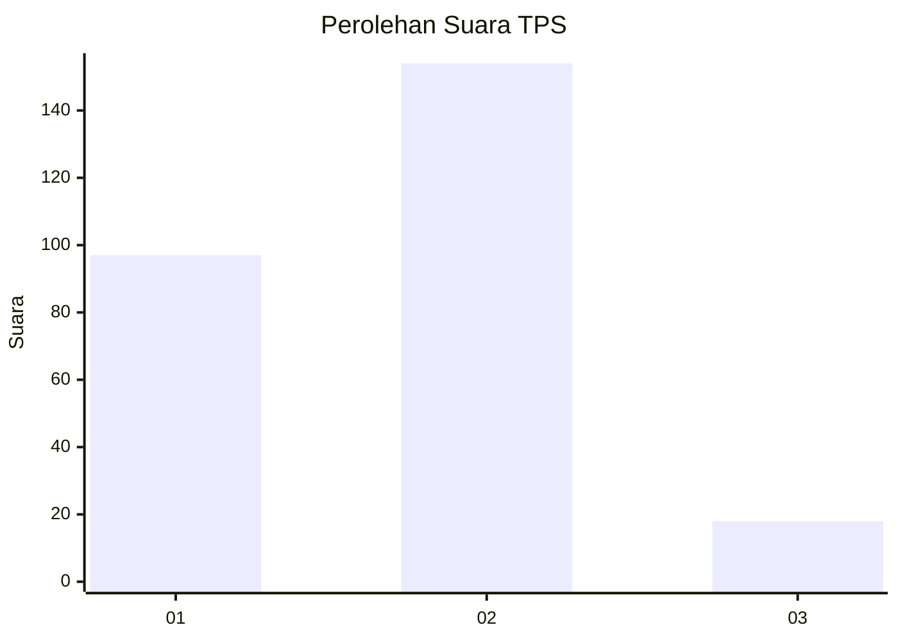
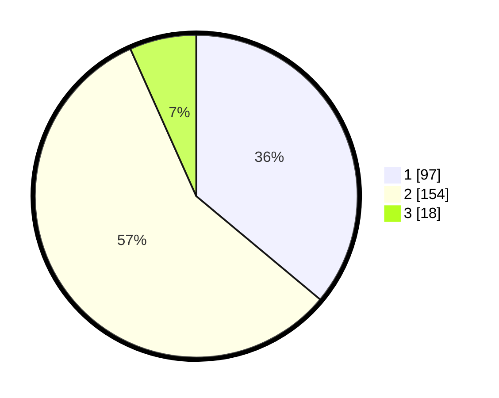

# Hasil

## Grafik

## Tabel

| No. | Nama Paslon    | Suara | Suara (raw) | Persentase |
|:--- |:-------------- | -----:| -----------:| ----------:|
| 1   | ANIES MUHAIMIN | 97    | [97][p-1]   | 36,06      |
| 2   | PRABOWO GIBRAN | 154   | [154][p-2]  | 57,25      |
| 3   | GANJAR MAHFUD  | 18    | [18][p-3]   | 6,69       |

[p-1]: https://github.com/gigit-pemilu/pemilu-2024-21-kepulauan-riau/blob/main/pilpres/hitung-suara/sub/21-kepulauan-riau/sub/71-kota-batam/sub/03-sekupang/sub/1003-tanjung-riau/sub/045-tps/sub/paslon-1.txt
[p-2]: https://github.com/gigit-pemilu/pemilu-2024-21-kepulauan-riau/blob/main/pilpres/hitung-suara/sub/21-kepulauan-riau/sub/71-kota-batam/sub/03-sekupang/sub/1003-tanjung-riau/sub/045-tps/sub/paslon-2.txt
[p-3]: https://github.com/gigit-pemilu/pemilu-2024-21-kepulauan-riau/blob/main/pilpres/hitung-suara/sub/21-kepulauan-riau/sub/71-kota-batam/sub/03-sekupang/sub/1003-tanjung-riau/sub/045-tps/sub/paslon-3.txt

## Foto C Plano

https://sirekap-obj-formc.kpu.go.id/1b88/pemilu/ppwp/21/71/03/10/03/2171031003045-20240216-220420--471c3d6d-a334-4ef0-982b-ea60a1a91bb0.jpg

https://sirekap-obj-formc.kpu.go.id/1b88/pemilu/ppwp/21/71/03/10/03/2171031003045-20240216-221607--4bc53f1a-94ad-4eb9-90e0-0e51f7ad0f24.jpg

https://sirekap-obj-formc.kpu.go.id/1b88/pemilu/ppwp/21/71/03/10/03/2171031003045-20240216-221423--336cac37-b13b-4c06-a353-52815c0f4e67.jpg

## Metadata

| Key        | Value               |
| ---------- | ------------------- |
| Time Stamp | 2024-02-17 13:37:34 |

