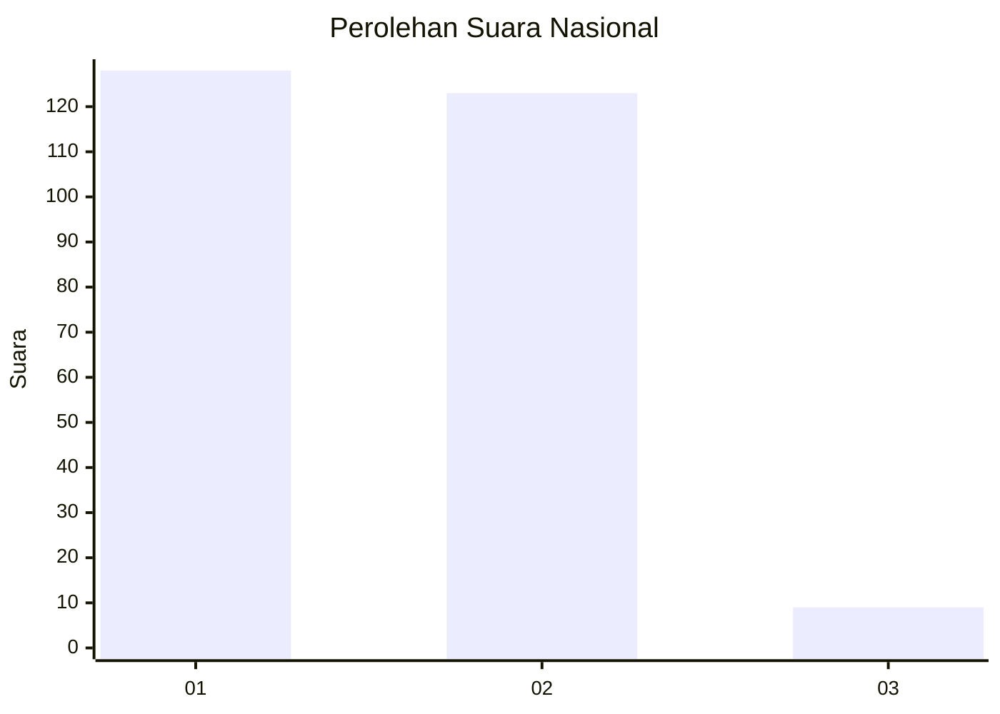
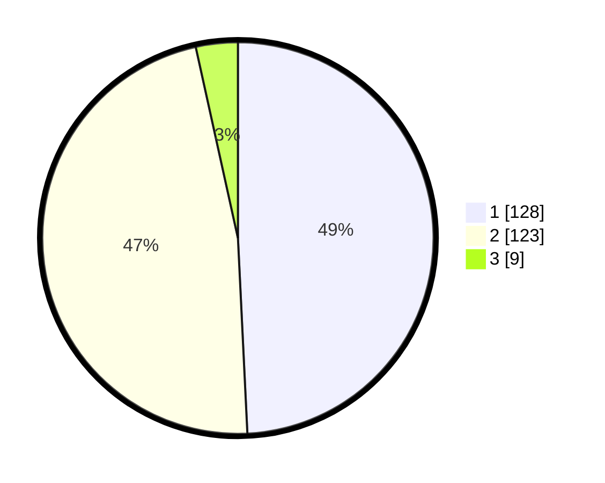

# Hasil

## Grafik

## Tabel

| No. | Nama Paslon    | Suara | Suara (raw) | Persentase |
|:--- |:-------------- | -----:| -----------:| ----------:|
| 1   | ANIES MUHAIMIN | 128   | [128][p-1]  | 49,23      |
| 2   | PRABOWO GIBRAN | 123   | [123][p-2]  | 47,31      |
| 3   | GANJAR MAHFUD  | 9     | [9][p-3]    | 3,46       |

[p-1]: https://github.com/gigit-pemilu/pemilu-2024/blob/main/pilpres/hitung-suara/sub/21-kepulauan-riau/sub/71-kota-batam/sub/03-sekupang/sub/1006-tiban-baru/sub/016-tps/sub/paslon-1.txt
[p-2]: https://github.com/gigit-pemilu/pemilu-2024/blob/main/pilpres/hitung-suara/sub/21-kepulauan-riau/sub/71-kota-batam/sub/03-sekupang/sub/1006-tiban-baru/sub/016-tps/sub/paslon-2.txt
[p-3]: https://github.com/gigit-pemilu/pemilu-2024/blob/main/pilpres/hitung-suara/sub/21-kepulauan-riau/sub/71-kota-batam/sub/03-sekupang/sub/1006-tiban-baru/sub/016-tps/sub/paslon-3.txt

## Foto C Plano

https://sirekap-obj-formc.kpu.go.id/ce74/pemilu/ppwp/21/71/03/10/06/2171031006016-20240214-195227--8557636e-7f43-4e48-b741-fc8ff3b514a5.jpg

https://sirekap-obj-formc.kpu.go.id/ce74/pemilu/ppwp/21/71/03/10/06/2171031006016-20240214-195418--40135b40-65ce-446d-b6fa-4771e16429dc.jpg

https://sirekap-obj-formc.kpu.go.id/ce74/pemilu/ppwp/21/71/03/10/06/2171031006016-20240214-195524--4995f06c-51c2-45be-a0c6-86075c13d5aa.jpg

## Metadata

| Key        | Value               |
| ---------- | ------------------- |
| Time Stamp | 2024-02-16 14:30:33 |

