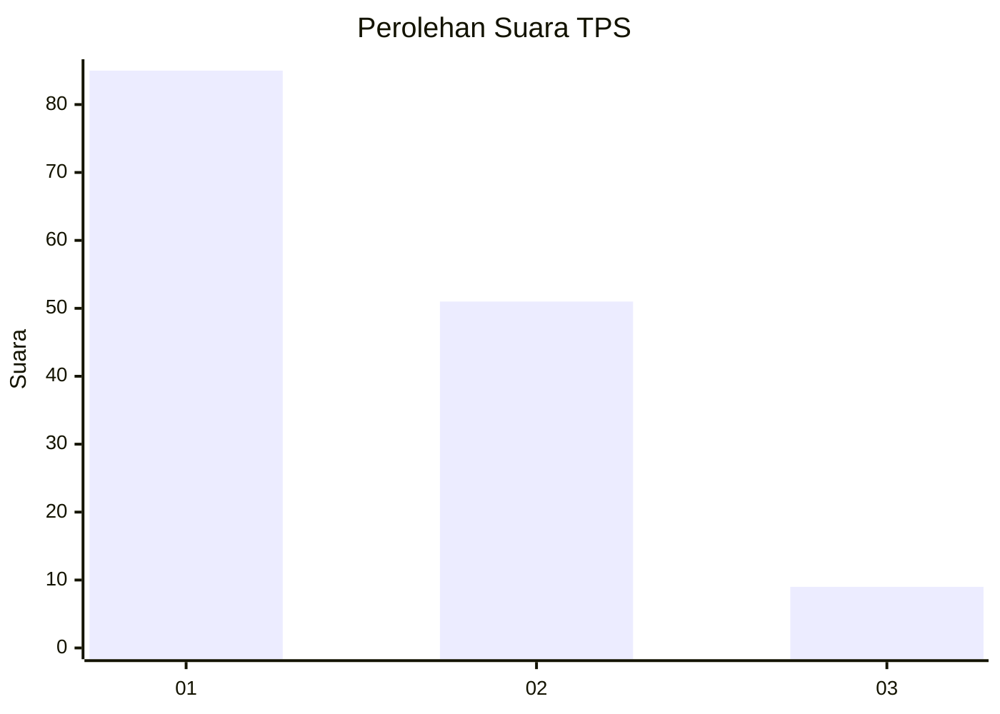
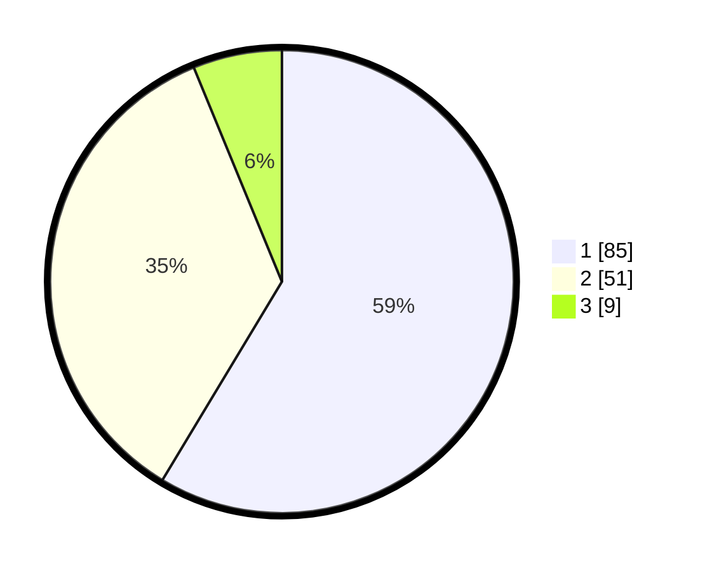

# Hasil

## Grafik

## Tabel

| No. | Nama Paslon    | Suara | Suara (raw) | Persentase |
|:--- |:-------------- | -----:| -----------:| ----------:|
| 1   | ANIES MUHAIMIN | 85    | [85][p-1]   | 58,62      |
| 2   | PRABOWO GIBRAN | 51    | [51][p-2]   | 35,17      |
| 3   | GANJAR MAHFUD  | 9     | [9][p-3]    | 6,21       |

[p-1]: https://github.com/gigit-pemilu/pemilu-2024-21-kepulauan-riau/blob/main/pilpres/hitung-suara/sub/21-kepulauan-riau/sub/71-kota-batam/sub/03-sekupang/sub/1006-tiban-baru/sub/022-tps/sub/paslon-1.txt
[p-2]: https://github.com/gigit-pemilu/pemilu-2024-21-kepulauan-riau/blob/main/pilpres/hitung-suara/sub/21-kepulauan-riau/sub/71-kota-batam/sub/03-sekupang/sub/1006-tiban-baru/sub/022-tps/sub/paslon-2.txt
[p-3]: https://github.com/gigit-pemilu/pemilu-2024-21-kepulauan-riau/blob/main/pilpres/hitung-suara/sub/21-kepulauan-riau/sub/71-kota-batam/sub/03-sekupang/sub/1006-tiban-baru/sub/022-tps/sub/paslon-3.txt

## Foto C Plano

https://sirekap-obj-formc.kpu.go.id/a1fd/pemilu/ppwp/21/71/03/10/06/2171031006022-20240214-214415--d66f6233-ffb3-4aed-b1de-5ff6fa8f431c.jpg

https://sirekap-obj-formc.kpu.go.id/a1fd/pemilu/ppwp/21/71/03/10/06/2171031006022-20240214-214542--12eb69e4-3019-42a3-9b31-ab4e3705fa4c.jpg

https://sirekap-obj-formc.kpu.go.id/a1fd/pemilu/ppwp/21/71/03/10/06/2171031006022-20240214-214559--6cedb3e2-bf64-4fad-bdec-d1ad8b92e522.jpg

## Metadata

| Key        | Value               |
| ---------- | ------------------- |
| Time Stamp | 2024-02-15 15:00:29 |

