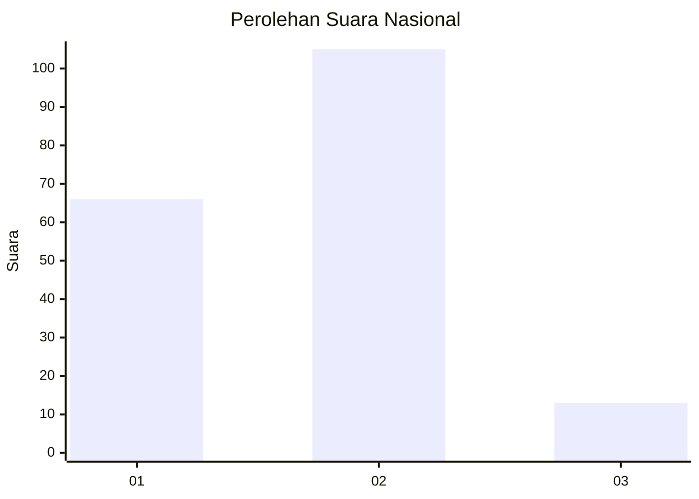
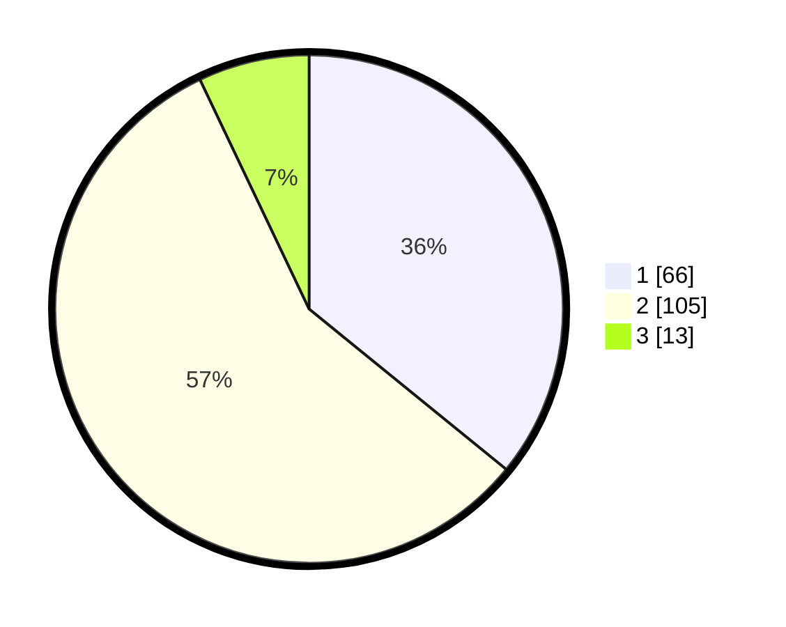

# Hasil

## Grafik

## Tabel

| No. | Nama Paslon    | Suara | Suara (raw) | Persentase |
|:--- |:-------------- | -----:| -----------:| ----------:|
| 1   | ANIES MUHAIMIN | 66    | [66][p-1]   | 35,87      |
| 2   | PRABOWO GIBRAN | 105   | [105][p-2]  | 57,07      |
| 3   | GANJAR MAHFUD  | 13    | [13][p-3]   | 7,07       |

[p-1]: https://github.com/gigit-pemilu/pemilu-2024/blob/main/pilpres/hitung-suara/sub/21-kepulauan-riau/sub/71-kota-batam/sub/03-sekupang/sub/1007-tiban-lama/sub/011-tps/sub/paslon-1.txt
[p-2]: https://github.com/gigit-pemilu/pemilu-2024/blob/main/pilpres/hitung-suara/sub/21-kepulauan-riau/sub/71-kota-batam/sub/03-sekupang/sub/1007-tiban-lama/sub/011-tps/sub/paslon-2.txt
[p-3]: https://github.com/gigit-pemilu/pemilu-2024/blob/main/pilpres/hitung-suara/sub/21-kepulauan-riau/sub/71-kota-batam/sub/03-sekupang/sub/1007-tiban-lama/sub/011-tps/sub/paslon-3.txt

## Foto C Plano

https://sirekap-obj-formc.kpu.go.id/16b8/pemilu/ppwp/21/71/03/10/07/2171031007011-20240214-221541--a3a9f5f0-db7c-4a1f-93c5-8a6dc9308c4a.jpg

https://sirekap-obj-formc.kpu.go.id/16b8/pemilu/ppwp/21/71/03/10/07/2171031007011-20240214-221507--ed39b2e0-6fbd-4ea0-88f8-33beccab142d.jpg

https://sirekap-obj-formc.kpu.go.id/16b8/pemilu/ppwp/21/71/03/10/07/2171031007011-20240214-221648--760a8f5e-4ce1-41ef-9500-2fed44ac9696.jpg

## Metadata

| Key        | Value               |
| ---------- | ------------------- |
| Time Stamp | 2024-02-16 14:30:33 |

