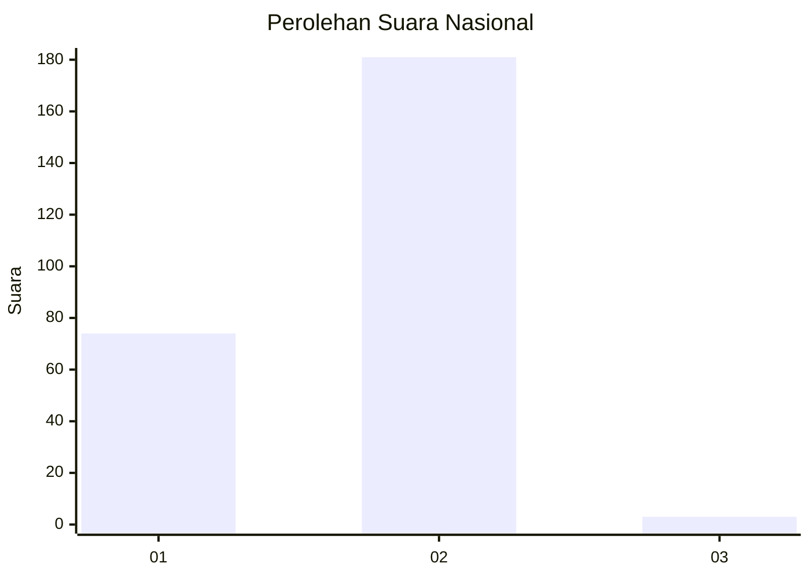
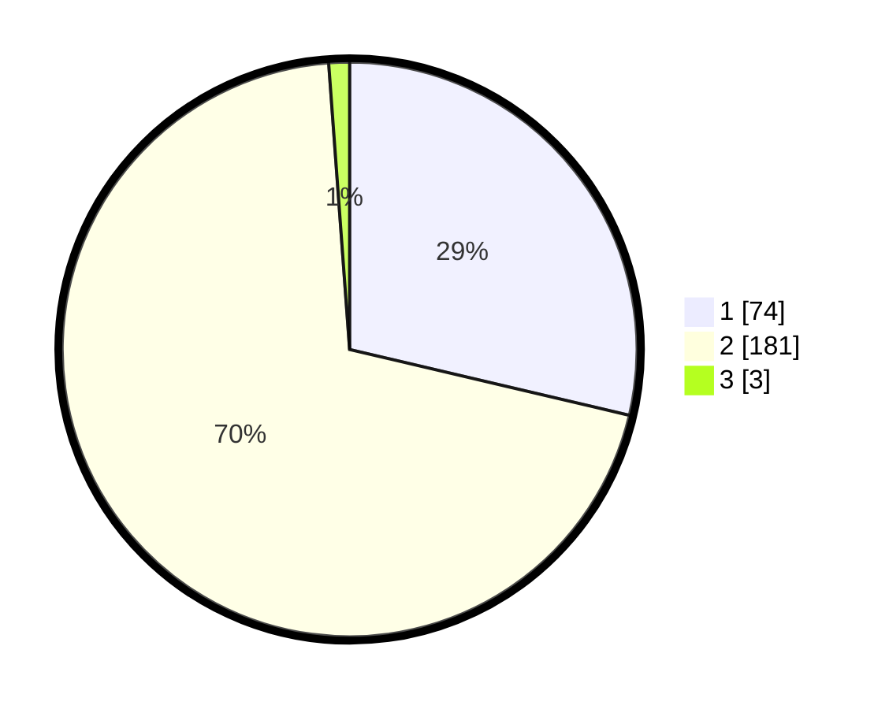

# Hasil

## Grafik

## Tabel

| No. | Nama Paslon    | Suara | Suara (raw) | Persentase |
|:--- |:-------------- | -----:| -----------:| ----------:|
| 1   | ANIES MUHAIMIN | 74    | [74][p-1]   | 28,68      |
| 2   | PRABOWO GIBRAN | 181   | [181][p-2]  | 70,16      |
| 3   | GANJAR MAHFUD  | 3     | [3][p-3]    | 1,16       |

[p-1]: https://github.com/gigit-pemilu/pemilu-2024/blob/main/pilpres/hitung-suara/sub/21-kepulauan-riau/sub/71-kota-batam/sub/03-sekupang/sub/1008-patam-lestari/sub/006-tps/sub/paslon-1.txt
[p-2]: https://github.com/gigit-pemilu/pemilu-2024/blob/main/pilpres/hitung-suara/sub/21-kepulauan-riau/sub/71-kota-batam/sub/03-sekupang/sub/1008-patam-lestari/sub/006-tps/sub/paslon-2.txt
[p-3]: https://github.com/gigit-pemilu/pemilu-2024/blob/main/pilpres/hitung-suara/sub/21-kepulauan-riau/sub/71-kota-batam/sub/03-sekupang/sub/1008-patam-lestari/sub/006-tps/sub/paslon-3.txt

## Foto C Plano

https://sirekap-obj-formc.kpu.go.id/ff1e/pemilu/ppwp/21/71/03/10/08/2171031008006-20240214-203727--2f45a1ba-aeac-4a3a-abee-3663c19e90f2.jpg

https://sirekap-obj-formc.kpu.go.id/ff1e/pemilu/ppwp/21/71/03/10/08/2171031008006-20240214-203803--ee357a12-63c0-4025-897d-40f917b0e7ed.jpg

https://sirekap-obj-formc.kpu.go.id/ff1e/pemilu/ppwp/21/71/03/10/08/2171031008006-20240214-203928--3858ad64-a6cc-4ce6-9a08-dbf0d7a48c0c.jpg

## Metadata

| Key        | Value               |
| ---------- | ------------------- |
| Time Stamp | 2024-02-15 15:00:29 |

