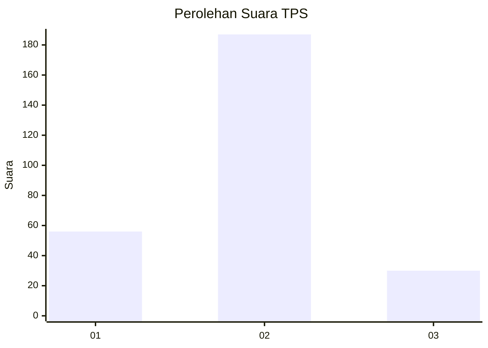
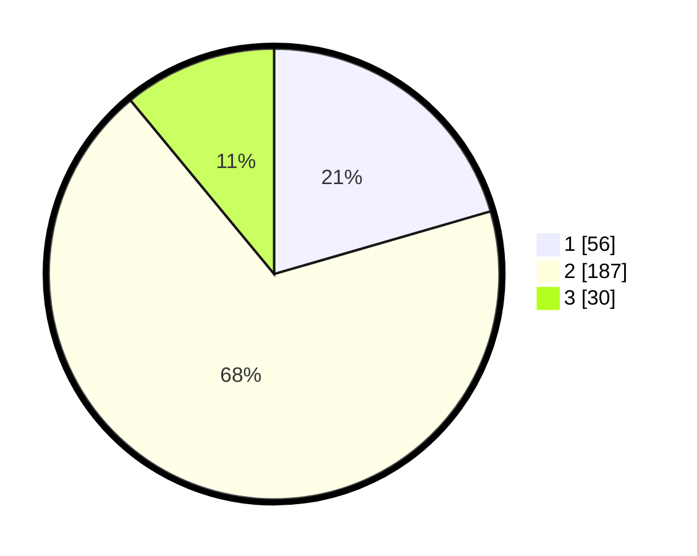

# Hasil

## Grafik

## Tabel

| No. | Nama Paslon    | Suara | Suara (raw) | Persentase |
|:--- |:-------------- | -----:| -----------:| ----------:|
| 1   | ANIES MUHAIMIN | 56    | [56][p-1]   | 20,51      |
| 2   | PRABOWO GIBRAN | 187   | [187][p-2]  | 68,50      |
| 3   | GANJAR MAHFUD  | 30    | [30][p-3]   | 10,99      |

[p-1]: https://github.com/gigit-pemilu/pemilu-2024-21-kepulauan-riau/blob/main/pilpres/hitung-suara/sub/21-kepulauan-riau/sub/71-kota-batam/sub/03-sekupang/sub/1008-patam-lestari/sub/056-tps/sub/paslon-1.txt
[p-2]: https://github.com/gigit-pemilu/pemilu-2024-21-kepulauan-riau/blob/main/pilpres/hitung-suara/sub/21-kepulauan-riau/sub/71-kota-batam/sub/03-sekupang/sub/1008-patam-lestari/sub/056-tps/sub/paslon-2.txt
[p-3]: https://github.com/gigit-pemilu/pemilu-2024-21-kepulauan-riau/blob/main/pilpres/hitung-suara/sub/21-kepulauan-riau/sub/71-kota-batam/sub/03-sekupang/sub/1008-patam-lestari/sub/056-tps/sub/paslon-3.txt

## Foto C Plano

https://sirekap-obj-formc.kpu.go.id/cb7a/pemilu/ppwp/21/71/03/10/08/2171031008056-20240214-205310--f0043440-0126-48f5-aae4-9929baccafeb.jpg

https://sirekap-obj-formc.kpu.go.id/cb7a/pemilu/ppwp/21/71/03/10/08/2171031008056-20240214-203145--2e52e44c-c773-4ad4-901d-f18c8fbbfc66.jpg

https://sirekap-obj-formc.kpu.go.id/cb7a/pemilu/ppwp/21/71/03/10/08/2171031008056-20240214-204232--836cf947-aa79-4002-af34-964da9682b5f.jpg

## Metadata

| Key        | Value               |
| ---------- | ------------------- |
| Time Stamp | 2024-02-19 06:16:00 |

