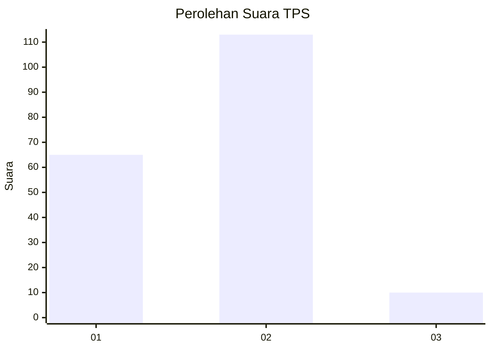
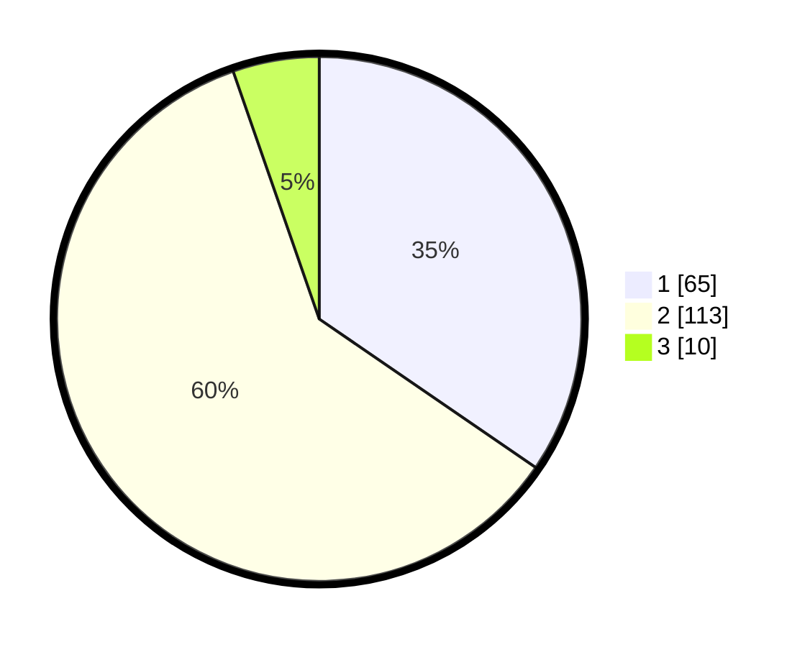

# Hasil

## Grafik

## Tabel

| No. | Nama Paslon    | Suara | Suara (raw) | Persentase |
|:--- |:-------------- | -----:| -----------:| ----------:|
| 1   | ANIES MUHAIMIN | 65    | [65][p-1]   | 34,57      |
| 2   | PRABOWO GIBRAN | 113   | [113][p-2]  | 60,11      |
| 3   | GANJAR MAHFUD  | 10    | [10][p-3]   | 5,32       |

[p-1]: https://github.com/gigit-pemilu/pemilu-2024-21-kepulauan-riau/blob/main/pilpres/hitung-suara/sub/21-kepulauan-riau/sub/71-kota-batam/sub/04-nongsa/sub/1001-sambau/sub/002-tps/sub/paslon-1.txt
[p-2]: https://github.com/gigit-pemilu/pemilu-2024-21-kepulauan-riau/blob/main/pilpres/hitung-suara/sub/21-kepulauan-riau/sub/71-kota-batam/sub/04-nongsa/sub/1001-sambau/sub/002-tps/sub/paslon-2.txt
[p-3]: https://github.com/gigit-pemilu/pemilu-2024-21-kepulauan-riau/blob/main/pilpres/hitung-suara/sub/21-kepulauan-riau/sub/71-kota-batam/sub/04-nongsa/sub/1001-sambau/sub/002-tps/sub/paslon-3.txt

## Foto C Plano

https://sirekap-obj-formc.kpu.go.id/02b8/pemilu/ppwp/21/71/04/10/01/2171041001002-20240217-201759--6da31070-3f27-4b72-bff6-0a9f6ed82897.jpg

https://sirekap-obj-formc.kpu.go.id/02b8/pemilu/ppwp/21/71/04/10/01/2171041001002-20240217-202502--20c39164-2fde-4133-93a6-b4c7495371a4.jpg

https://sirekap-obj-formc.kpu.go.id/02b8/pemilu/ppwp/21/71/04/10/01/2171041001002-20240217-202341--18181dc5-8085-4785-8459-6f0f6c05deb3.jpg

## Metadata

| Key        | Value               |
| ---------- | ------------------- |
| Time Stamp | 2024-02-25 22:00:00 |

