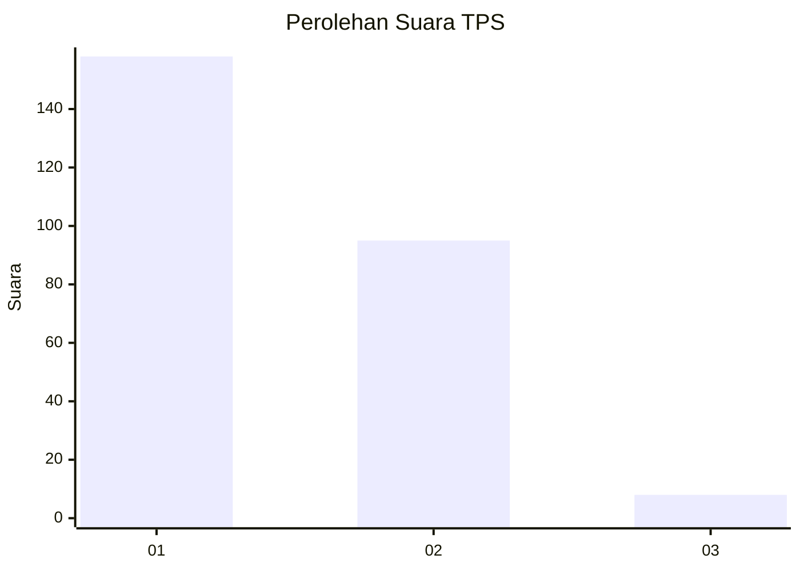
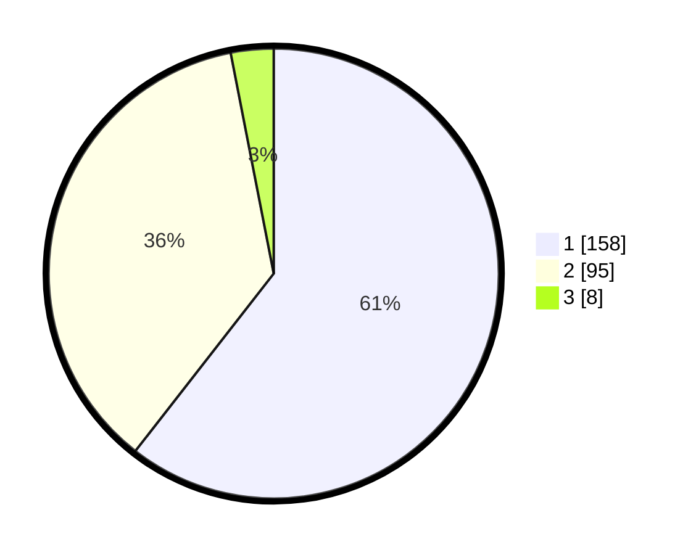

# Hasil

## Grafik

## Tabel

| No. | Nama Paslon    | Suara | Suara (raw) | Persentase |
|:--- |:-------------- | -----:| -----------:| ----------:|
| 1   | ANIES MUHAIMIN | 158   | [158][p-1]  | 60,54      |
| 2   | PRABOWO GIBRAN | 95    | [95][p-2]   | 36,40      |
| 3   | GANJAR MAHFUD  | 8     | [8][p-3]    | 3,07       |

[p-1]: https://github.com/gigit-pemilu/pemilu-2024-21-kepulauan-riau/blob/main/pilpres/hitung-suara/sub/21-kepulauan-riau/sub/71-kota-batam/sub/04-nongsa/sub/1001-sambau/sub/005-tps/sub/paslon-1.txt
[p-2]: https://github.com/gigit-pemilu/pemilu-2024-21-kepulauan-riau/blob/main/pilpres/hitung-suara/sub/21-kepulauan-riau/sub/71-kota-batam/sub/04-nongsa/sub/1001-sambau/sub/005-tps/sub/paslon-2.txt
[p-3]: https://github.com/gigit-pemilu/pemilu-2024-21-kepulauan-riau/blob/main/pilpres/hitung-suara/sub/21-kepulauan-riau/sub/71-kota-batam/sub/04-nongsa/sub/1001-sambau/sub/005-tps/sub/paslon-3.txt

## Foto C Plano

https://sirekap-obj-formc.kpu.go.id/1f38/pemilu/ppwp/21/71/04/10/01/2171041001005-20240217-203459--71873cf7-027d-4305-8f9c-75e2c0640047.jpg

https://sirekap-obj-formc.kpu.go.id/1f38/pemilu/ppwp/21/71/04/10/01/2171041001005-20240217-203620--48bfedb3-3127-49ed-b1e1-46fa334f57a1.jpg

https://sirekap-obj-formc.kpu.go.id/1f38/pemilu/ppwp/21/71/04/10/01/2171041001005-20240217-203717--7c65d8d3-0790-4d03-ac25-e8d31ff223e0.jpg

## Metadata

| Key        | Value               |
| ---------- | ------------------- |
| Time Stamp | 2024-02-24 22:31:28 |

