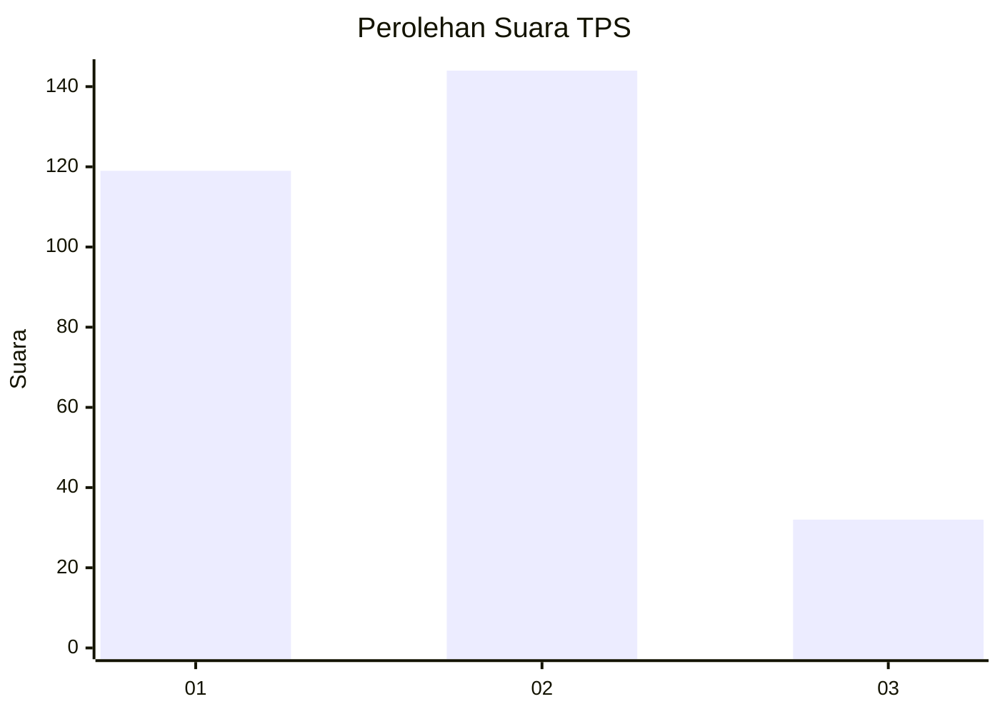
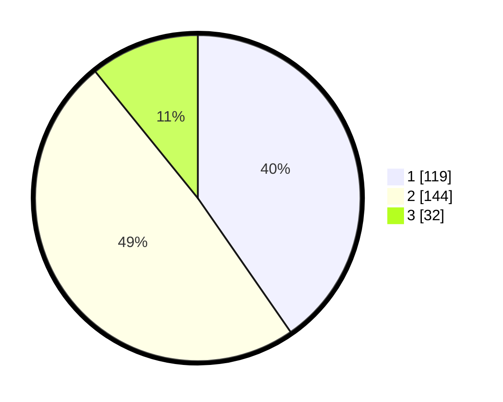

# Hasil

## Grafik

## Tabel

| No. | Nama Paslon    | Suara | Suara (raw) | Persentase |
|:--- |:-------------- | -----:| -----------:| ----------:|
| 1   | ANIES MUHAIMIN | 119   | [119][p-1]  | 40,34      |
| 2   | PRABOWO GIBRAN | 144   | [144][p-2]  | 48,81      |
| 3   | GANJAR MAHFUD  | 32    | [32][p-3]   | 10,85      |

[p-1]: https://github.com/gigit-pemilu/pemilu-2024-21-kepulauan-riau/blob/main/pilpres/hitung-suara/sub/21-kepulauan-riau/sub/71-kota-batam/sub/04-nongsa/sub/1001-sambau/sub/015-tps/sub/paslon-1.txt
[p-2]: https://github.com/gigit-pemilu/pemilu-2024-21-kepulauan-riau/blob/main/pilpres/hitung-suara/sub/21-kepulauan-riau/sub/71-kota-batam/sub/04-nongsa/sub/1001-sambau/sub/015-tps/sub/paslon-2.txt
[p-3]: https://github.com/gigit-pemilu/pemilu-2024-21-kepulauan-riau/blob/main/pilpres/hitung-suara/sub/21-kepulauan-riau/sub/71-kota-batam/sub/04-nongsa/sub/1001-sambau/sub/015-tps/sub/paslon-3.txt

## Foto C Plano

https://sirekap-obj-formc.kpu.go.id/80f7/pemilu/ppwp/21/71/04/10/01/2171041001015-20240217-211340--e99211ab-cd2d-49c1-a300-14e25eb1bcca.jpg

https://sirekap-obj-formc.kpu.go.id/80f7/pemilu/ppwp/21/71/04/10/01/2171041001015-20240217-211437--d91fefa7-8dcb-4cc1-a94e-38c9881cfc89.jpg

https://sirekap-obj-formc.kpu.go.id/80f7/pemilu/ppwp/21/71/04/10/01/2171041001015-20240217-211530--df4f009b-c99c-4f14-9615-b2130a59d5e6.jpg

## Metadata

| Key        | Value               |
| ---------- | ------------------- |
| Time Stamp | 2024-02-24 22:31:28 |

