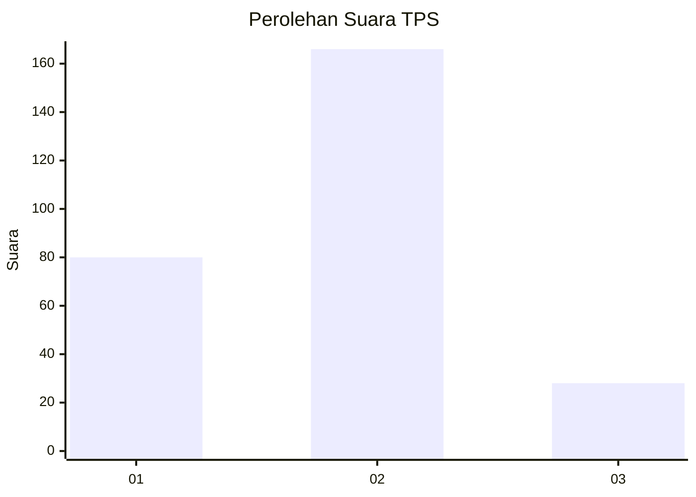
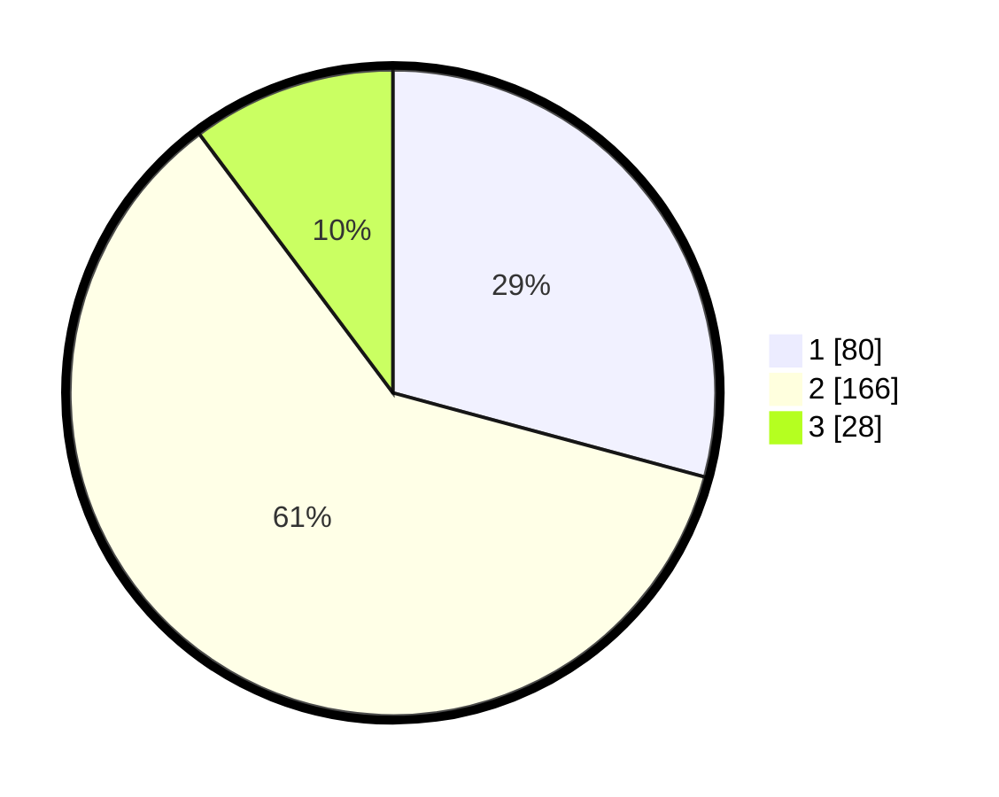

# Hasil

## Grafik

## Tabel

| No. | Nama Paslon    | Suara | Suara (raw) | Persentase |
|:--- |:-------------- | -----:| -----------:| ----------:|
| 1   | ANIES MUHAIMIN | 80    | [80][p-1]   | 29,20      |
| 2   | PRABOWO GIBRAN | 166   | [166][p-2]  | 60,58      |
| 3   | GANJAR MAHFUD  | 28    | [28][p-3]   | 10,22      |

[p-1]: https://github.com/gigit-pemilu/pemilu-2024-21-kepulauan-riau/blob/main/pilpres/hitung-suara/sub/21-kepulauan-riau/sub/71-kota-batam/sub/04-nongsa/sub/1001-sambau/sub/031-tps/sub/paslon-1.txt
[p-2]: https://github.com/gigit-pemilu/pemilu-2024-21-kepulauan-riau/blob/main/pilpres/hitung-suara/sub/21-kepulauan-riau/sub/71-kota-batam/sub/04-nongsa/sub/1001-sambau/sub/031-tps/sub/paslon-2.txt
[p-3]: https://github.com/gigit-pemilu/pemilu-2024-21-kepulauan-riau/blob/main/pilpres/hitung-suara/sub/21-kepulauan-riau/sub/71-kota-batam/sub/04-nongsa/sub/1001-sambau/sub/031-tps/sub/paslon-3.txt

## Foto C Plano

https://sirekap-obj-formc.kpu.go.id/fa82/pemilu/ppwp/21/71/04/10/01/2171041001031-20240218-101435--14094d2b-74c6-4a33-8a7d-6c8d1e926de8.jpg

https://sirekap-obj-formc.kpu.go.id/fa82/pemilu/ppwp/21/71/04/10/01/2171041001031-20240218-101528--24da8b33-0319-4271-ae5a-11442f0378cd.jpg

https://sirekap-obj-formc.kpu.go.id/fa82/pemilu/ppwp/21/71/04/10/01/2171041001031-20240218-101641--a6a01b94-e9fd-4978-b9cb-f8e2fc268f0a.jpg

## Metadata

| Key        | Value               |
| ---------- | ------------------- |
| Time Stamp | 2024-02-24 22:31:28 |

