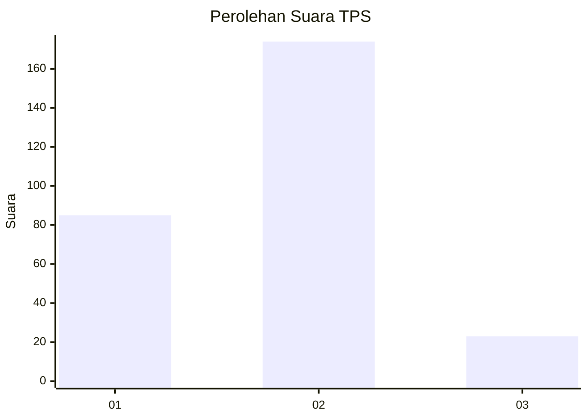
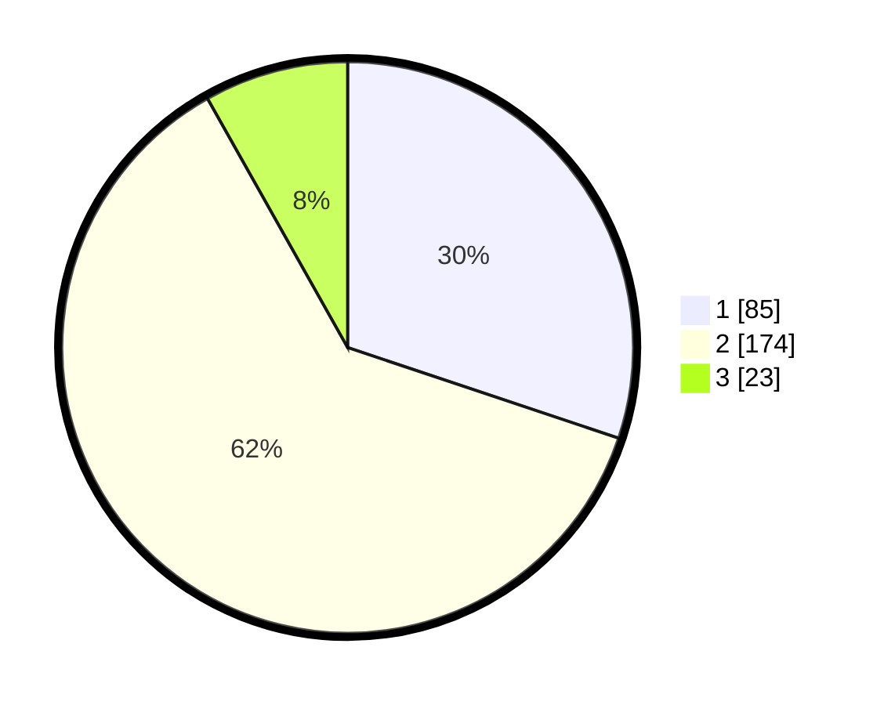

# Hasil

## Grafik

## Tabel

| No. | Nama Paslon    | Suara | Suara (raw) | Persentase |
|:--- |:-------------- | -----:| -----------:| ----------:|
| 1   | ANIES MUHAIMIN | 85    | [85][p-1]   | 30,14      |
| 2   | PRABOWO GIBRAN | 174   | [174][p-2]  | 61,70      |
| 3   | GANJAR MAHFUD  | 23    | [23][p-3]   | 8,16       |

[p-1]: https://github.com/gigit-pemilu/pemilu-2024-21-kepulauan-riau/blob/main/pilpres/hitung-suara/sub/21-kepulauan-riau/sub/71-kota-batam/sub/04-nongsa/sub/1001-sambau/sub/035-tps/sub/paslon-1.txt
[p-2]: https://github.com/gigit-pemilu/pemilu-2024-21-kepulauan-riau/blob/main/pilpres/hitung-suara/sub/21-kepulauan-riau/sub/71-kota-batam/sub/04-nongsa/sub/1001-sambau/sub/035-tps/sub/paslon-2.txt
[p-3]: https://github.com/gigit-pemilu/pemilu-2024-21-kepulauan-riau/blob/main/pilpres/hitung-suara/sub/21-kepulauan-riau/sub/71-kota-batam/sub/04-nongsa/sub/1001-sambau/sub/035-tps/sub/paslon-3.txt

## Foto C Plano

https://sirekap-obj-formc.kpu.go.id/0bc2/pemilu/ppwp/21/71/04/10/01/2171041001035-20240218-102512--a2360631-1d04-49cc-b768-ef3a2f916b1f.jpg

https://sirekap-obj-formc.kpu.go.id/0bc2/pemilu/ppwp/21/71/04/10/01/2171041001035-20240218-102807--d25fe1ea-1aa0-4042-9c7b-2279b6195532.jpg

https://sirekap-obj-formc.kpu.go.id/0bc2/pemilu/ppwp/21/71/04/10/01/2171041001035-20240218-102903--d84c4166-4a8b-42e2-ac5a-c98e5c53c507.jpg

## Metadata

| Key        | Value               |
| ---------- | ------------------- |
| Time Stamp | 2024-02-24 22:31:28 |

