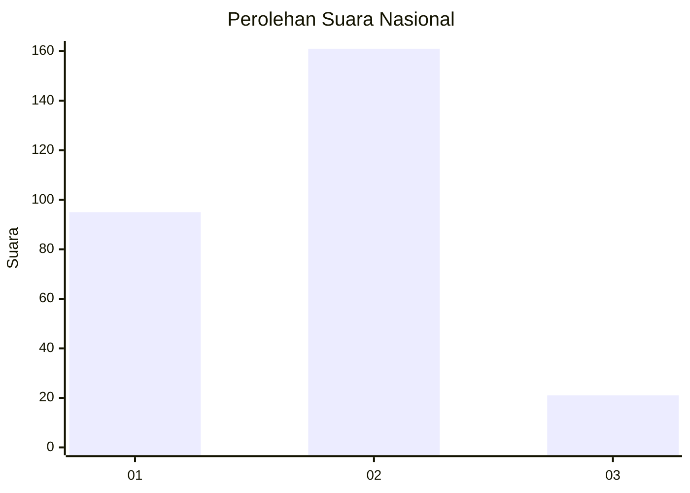
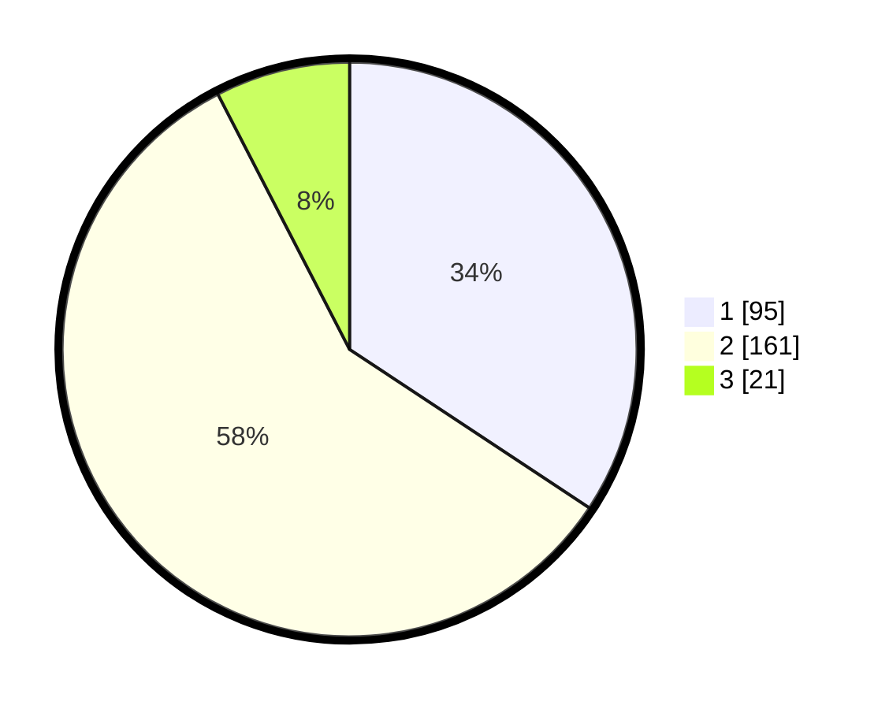

# Hasil

## Grafik

## Tabel

| No. | Nama Paslon    | Suara | Suara (raw) | Persentase |
|:--- |:-------------- | -----:| -----------:| ----------:|
| 1   | ANIES MUHAIMIN | 95    | [95][p-1]   | 34,30      |
| 2   | PRABOWO GIBRAN | 161   | [161][p-2]  | 58,12      |
| 3   | GANJAR MAHFUD  | 21    | [21][p-3]   | 7,58       |

[p-1]: https://github.com/gigit-pemilu/pemilu-2024/blob/main/pilpres/hitung-suara/sub/21-kepulauan-riau/sub/71-kota-batam/sub/04-nongsa/sub/1001-sambau/sub/036-tps/sub/paslon-1.txt
[p-2]: https://github.com/gigit-pemilu/pemilu-2024/blob/main/pilpres/hitung-suara/sub/21-kepulauan-riau/sub/71-kota-batam/sub/04-nongsa/sub/1001-sambau/sub/036-tps/sub/paslon-2.txt
[p-3]: https://github.com/gigit-pemilu/pemilu-2024/blob/main/pilpres/hitung-suara/sub/21-kepulauan-riau/sub/71-kota-batam/sub/04-nongsa/sub/1001-sambau/sub/036-tps/sub/paslon-3.txt

## Foto C Plano

https://sirekap-obj-formc.kpu.go.id/741b/pemilu/ppwp/21/71/04/10/01/2171041001036-20240218-104029--1feb88e4-e6af-4cb7-872f-3f8fbc4736f4.jpg

https://sirekap-obj-formc.kpu.go.id/741b/pemilu/ppwp/21/71/04/10/01/2171041001036-20240218-104132--ecb301dc-6019-4ae5-b779-e2a1c11d1b18.jpg

https://sirekap-obj-formc.kpu.go.id/741b/pemilu/ppwp/21/71/04/10/01/2171041001036-20240218-104238--fe4f3d38-2ca7-4e36-a5bd-d8ea7b944745.jpg

## Metadata

| Key        | Value               |
| ---------- | ------------------- |
| Time Stamp | 2024-02-25 16:00:00 |

