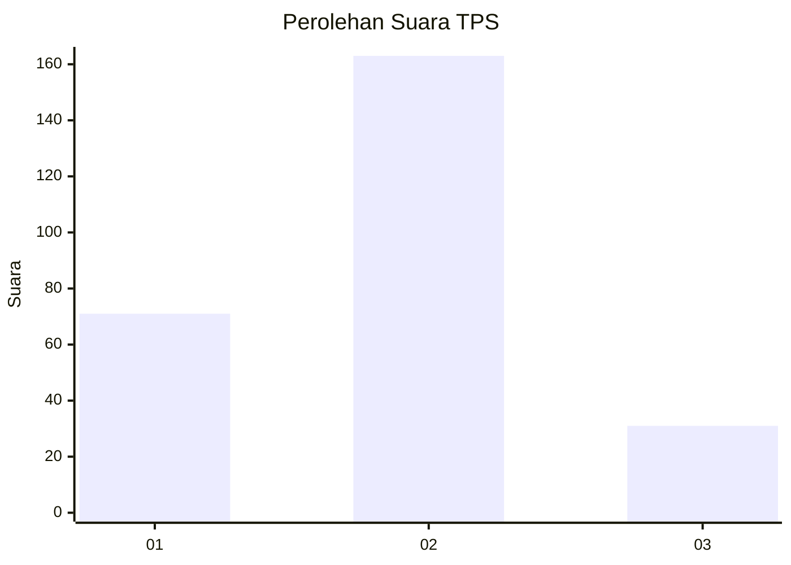
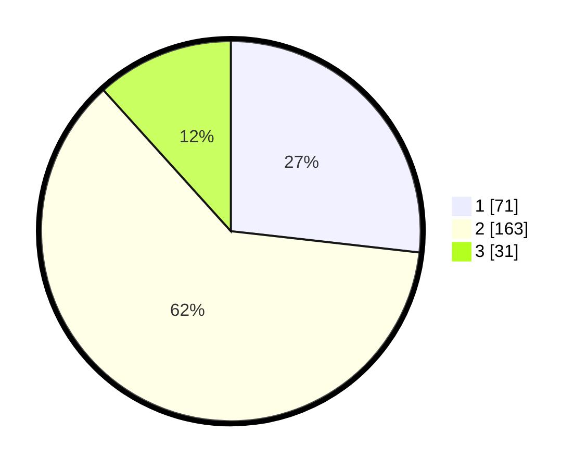

# Hasil

## Grafik

## Tabel

| No. | Nama Paslon    | Suara | Suara (raw) | Persentase |
|:--- |:-------------- | -----:| -----------:| ----------:|
| 1   | ANIES MUHAIMIN | 71    | [71][p-1]   | 26,79      |
| 2   | PRABOWO GIBRAN | 163   | [163][p-2]  | 61,51      |
| 3   | GANJAR MAHFUD  | 31    | [31][p-3]   | 11,70      |

[p-1]: https://github.com/gigit-pemilu/pemilu-2024-21-kepulauan-riau/blob/main/pilpres/hitung-suara/sub/21-kepulauan-riau/sub/71-kota-batam/sub/04-nongsa/sub/1001-sambau/sub/037-tps/sub/paslon-1.txt
[p-2]: https://github.com/gigit-pemilu/pemilu-2024-21-kepulauan-riau/blob/main/pilpres/hitung-suara/sub/21-kepulauan-riau/sub/71-kota-batam/sub/04-nongsa/sub/1001-sambau/sub/037-tps/sub/paslon-2.txt
[p-3]: https://github.com/gigit-pemilu/pemilu-2024-21-kepulauan-riau/blob/main/pilpres/hitung-suara/sub/21-kepulauan-riau/sub/71-kota-batam/sub/04-nongsa/sub/1001-sambau/sub/037-tps/sub/paslon-3.txt

## Foto C Plano

https://sirekap-obj-formc.kpu.go.id/02ee/pemilu/ppwp/21/71/04/10/01/2171041001037-20240218-104401--14176188-2621-47b7-b1ed-b1c940de799f.jpg

https://sirekap-obj-formc.kpu.go.id/02ee/pemilu/ppwp/21/71/04/10/01/2171041001037-20240218-104506--07d02e1b-ca7f-4e8e-a40e-ff7603f8508f.jpg

https://sirekap-obj-formc.kpu.go.id/02ee/pemilu/ppwp/21/71/04/10/01/2171041001037-20240218-104602--920899d8-83b2-478d-82a0-9d19c1664d7e.jpg

## Metadata

| Key        | Value               |
| ---------- | ------------------- |
| Time Stamp | 2024-02-25 12:00:00 |

