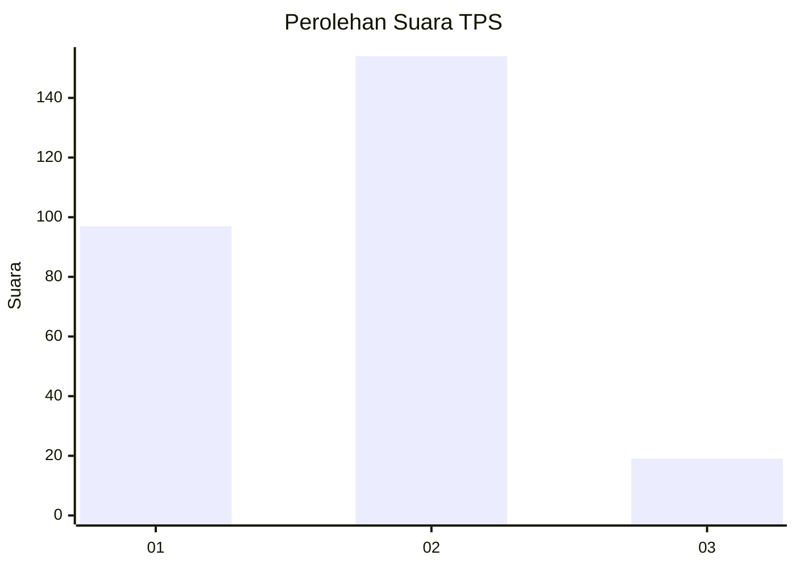
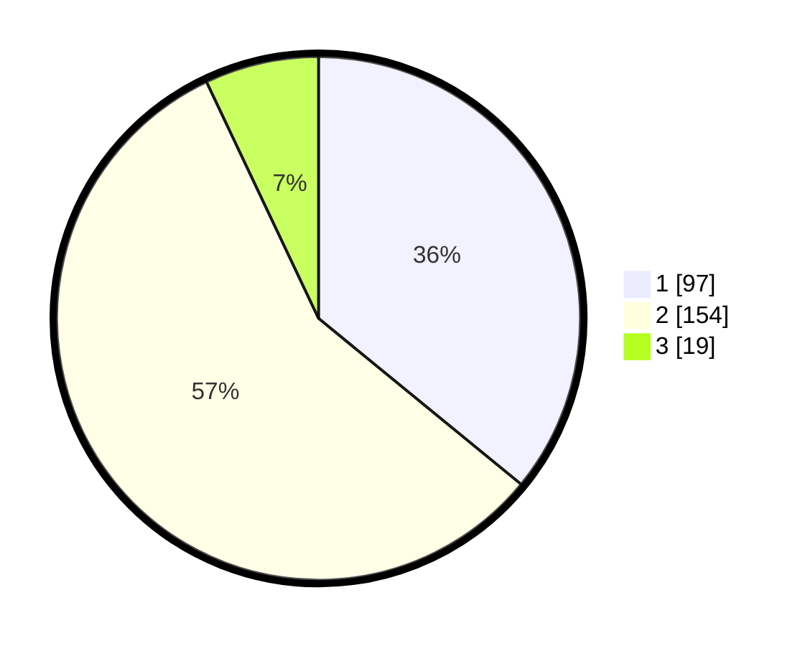

# Hasil

## Grafik

## Tabel

| No. | Nama Paslon    | Suara | Suara (raw) | Persentase |
|:--- |:-------------- | -----:| -----------:| ----------:|
| 1   | ANIES MUHAIMIN | 97    | [97][p-1]   | 35,93      |
| 2   | PRABOWO GIBRAN | 154   | [154][p-2]  | 57,04      |
| 3   | GANJAR MAHFUD  | 19    | [19][p-3]   | 7,04       |

[p-1]: https://github.com/gigit-pemilu/pemilu-2024-21-kepulauan-riau/blob/main/pilpres/hitung-suara/sub/21-kepulauan-riau/sub/71-kota-batam/sub/04-nongsa/sub/1002-batu-besar/sub/012-tps/sub/paslon-1.txt
[p-2]: https://github.com/gigit-pemilu/pemilu-2024-21-kepulauan-riau/blob/main/pilpres/hitung-suara/sub/21-kepulauan-riau/sub/71-kota-batam/sub/04-nongsa/sub/1002-batu-besar/sub/012-tps/sub/paslon-2.txt
[p-3]: https://github.com/gigit-pemilu/pemilu-2024-21-kepulauan-riau/blob/main/pilpres/hitung-suara/sub/21-kepulauan-riau/sub/71-kota-batam/sub/04-nongsa/sub/1002-batu-besar/sub/012-tps/sub/paslon-3.txt

## Foto C Plano

https://sirekap-obj-formc.kpu.go.id/f381/pemilu/ppwp/21/71/04/10/02/2171041002012-20240215-041622--244ba207-a984-4818-89bb-5037f735c481.jpg

https://sirekap-obj-formc.kpu.go.id/f381/pemilu/ppwp/21/71/04/10/02/2171041002012-20240214-231632--fb19b702-7133-4d91-99e2-05725da822aa.jpg

https://sirekap-obj-formc.kpu.go.id/f381/pemilu/ppwp/21/71/04/10/02/2171041002012-20240215-041803--386484c6-e517-45dd-b039-2b7c51f35fa1.jpg

## Metadata

| Key        | Value               |
| ---------- | ------------------- |
| Time Stamp | 2024-02-17 12:00:00 |

