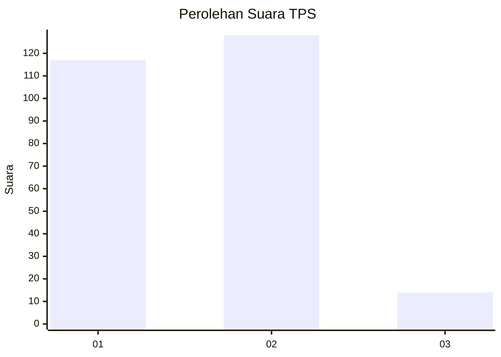
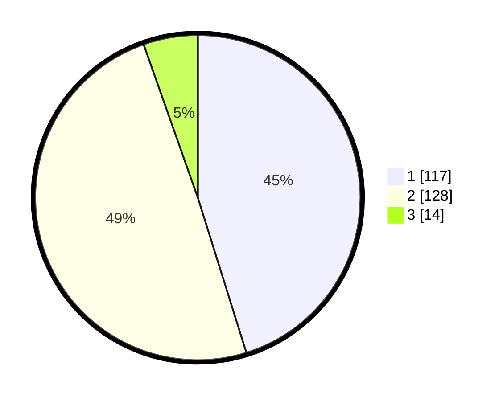

# Hasil

## Grafik

## Tabel

| No. | Nama Paslon    | Suara | Suara (raw) | Persentase |
|:--- |:-------------- | -----:| -----------:| ----------:|
| 1   | ANIES MUHAIMIN | 117   | [117][p-1]  | 45,17      |
| 2   | PRABOWO GIBRAN | 128   | [128][p-2]  | 49,42      |
| 3   | GANJAR MAHFUD  | 14    | [14][p-3]   | 5,41       |

[p-1]: https://github.com/gigit-pemilu/pemilu-2024-21-kepulauan-riau/blob/main/pilpres/hitung-suara/sub/21-kepulauan-riau/sub/71-kota-batam/sub/04-nongsa/sub/1002-batu-besar/sub/081-tps/sub/paslon-1.txt
[p-2]: https://github.com/gigit-pemilu/pemilu-2024-21-kepulauan-riau/blob/main/pilpres/hitung-suara/sub/21-kepulauan-riau/sub/71-kota-batam/sub/04-nongsa/sub/1002-batu-besar/sub/081-tps/sub/paslon-2.txt
[p-3]: https://github.com/gigit-pemilu/pemilu-2024-21-kepulauan-riau/blob/main/pilpres/hitung-suara/sub/21-kepulauan-riau/sub/71-kota-batam/sub/04-nongsa/sub/1002-batu-besar/sub/081-tps/sub/paslon-3.txt

## Foto C Plano

https://sirekap-obj-formc.kpu.go.id/755c/pemilu/ppwp/21/71/04/10/02/2171041002081-20240216-153416--0557d47f-8422-4378-a57b-671ded1df935.jpg

https://sirekap-obj-formc.kpu.go.id/755c/pemilu/ppwp/21/71/04/10/02/2171041002081-20240216-153144--a823e45f-eb2d-4959-9798-ec50c8b8f3ca.jpg

https://sirekap-obj-formc.kpu.go.id/755c/pemilu/ppwp/21/71/04/10/02/2171041002081-20240216-153303--8763845d-f48c-4a0e-a2cc-bd9d5a7c51a1.jpg

## Metadata

| Key        | Value               |
| ---------- | ------------------- |
| Time Stamp | 2024-02-19 10:00:00 |

