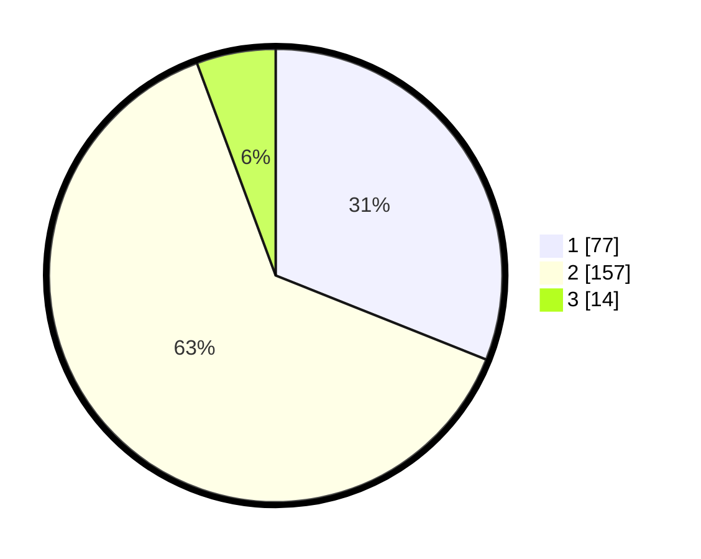

# Hasil

## Grafik

## Tabel

| No. | Nama Paslon    | Suara | Suara (raw) | Persentase |
|:--- |:-------------- | -----:| -----------:| ----------:|
| 1   | ANIES MUHAIMIN | 77    | [77][p-1]   | 31,05      |
| 2   | PRABOWO GIBRAN | 157   | [157][p-2]  | 63,31      |
| 3   | GANJAR MAHFUD  | 14    | [14][p-3]   | 5,65       |

[p-1]: https://github.com/gigit-pemilu/pemilu-2024-21-kepulauan-riau/blob/main/pilpres/hitung-suara/sub/21-kepulauan-riau/sub/71-kota-batam/sub/05-bulang/sub/1001-bulang-lintang/sub/005-tps/sub/paslon-1.txt
[p-2]: https://github.com/gigit-pemilu/pemilu-2024-21-kepulauan-riau/blob/main/pilpres/hitung-suara/sub/21-kepulauan-riau/sub/71-kota-batam/sub/05-bulang/sub/1001-bulang-lintang/sub/005-tps/sub/paslon-2.txt
[p-3]: https://github.com/gigit-pemilu/pemilu-2024-21-kepulauan-riau/blob/main/pilpres/hitung-suara/sub/21-kepulauan-riau/sub/71-kota-batam/sub/05-bulang/sub/1001-bulang-lintang/sub/005-tps/sub/paslon-3.txt

## Foto C Plano

https://sirekap-obj-formc.kpu.go.id/d884/pemilu/ppwp/21/71/05/10/01/2171051001005-20240215-020745--0b46a195-7a2c-42f6-985e-1a0bd9604f66.jpg

https://sirekap-obj-formc.kpu.go.id/d884/pemilu/ppwp/21/71/05/10/01/2171051001005-20240215-020802--418893d6-2d7a-4e72-9dea-1d71614260b2.jpg

https://sirekap-obj-formc.kpu.go.id/d884/pemilu/ppwp/21/71/05/10/01/2171051001005-20240215-020851--94644ed0-ff27-4e70-a4fd-417a622cfcb3.jpg

## Metadata

| Key        | Value               |
| ---------- | ------------------- |
| Time Stamp | 2024-02-15 12:00:28 |

