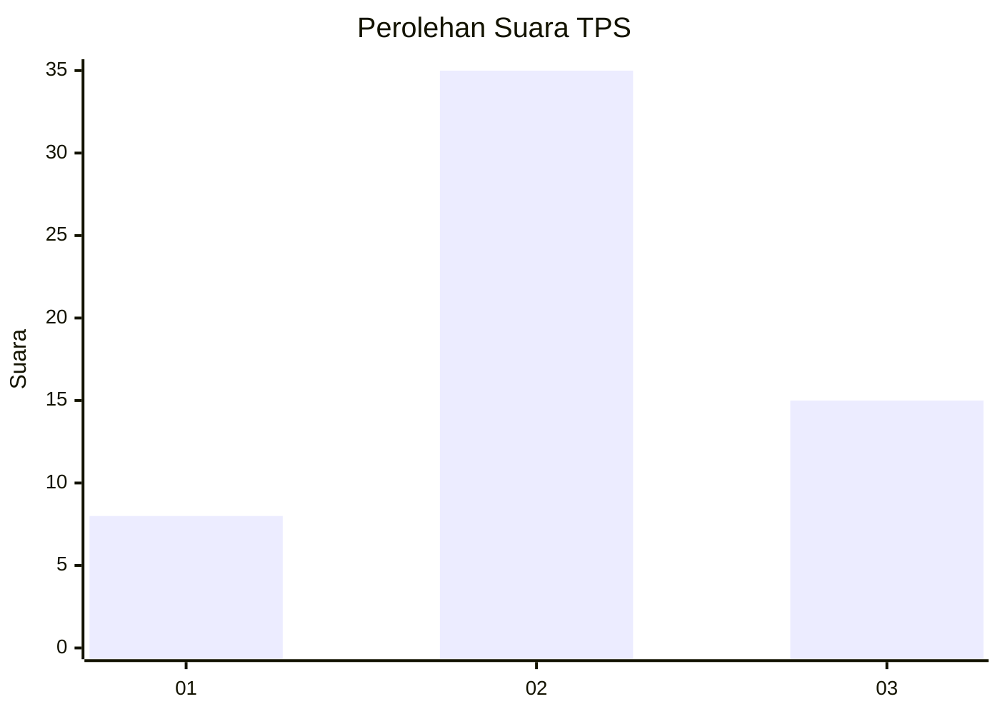
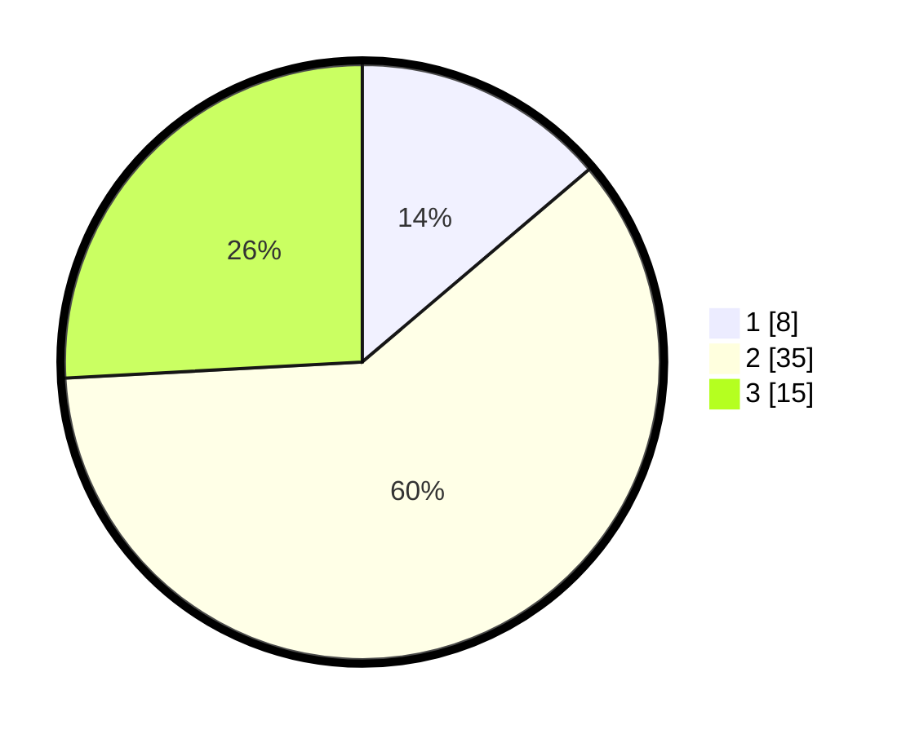

# Hasil

## Grafik

## Tabel

| No. | Nama Paslon    | Suara | Suara (raw) | Persentase |
|:--- |:-------------- | -----:| -----------:| ----------:|
| 1   | ANIES MUHAIMIN | 8     | [8][p-1]    | 13,79      |
| 2   | PRABOWO GIBRAN | 35    | [35][p-2]   | 60,34      |
| 3   | GANJAR MAHFUD  | 15    | [15][p-3]   | 25,86      |

[p-1]: https://github.com/gigit-pemilu/pemilu-2024-21-kepulauan-riau/blob/main/pilpres/hitung-suara/sub/21-kepulauan-riau/sub/71-kota-batam/sub/05-bulang/sub/1001-bulang-lintang/sub/006-tps/sub/paslon-1.txt
[p-2]: https://github.com/gigit-pemilu/pemilu-2024-21-kepulauan-riau/blob/main/pilpres/hitung-suara/sub/21-kepulauan-riau/sub/71-kota-batam/sub/05-bulang/sub/1001-bulang-lintang/sub/006-tps/sub/paslon-2.txt
[p-3]: https://github.com/gigit-pemilu/pemilu-2024-21-kepulauan-riau/blob/main/pilpres/hitung-suara/sub/21-kepulauan-riau/sub/71-kota-batam/sub/05-bulang/sub/1001-bulang-lintang/sub/006-tps/sub/paslon-3.txt

## Foto C Plano

https://sirekap-obj-formc.kpu.go.id/99e9/pemilu/ppwp/21/71/05/10/01/2171051001006-20240214-141049--3d2aee42-3add-4219-9681-7f897198fd71.jpg

https://sirekap-obj-formc.kpu.go.id/99e9/pemilu/ppwp/21/71/05/10/01/2171051001006-20240214-141208--d82ba17e-01cd-4348-8e37-00dd4b66579e.jpg

https://sirekap-obj-formc.kpu.go.id/99e9/pemilu/ppwp/21/71/05/10/01/2171051001006-20240214-141325--98697b20-222b-408f-83ca-f855fcfdfc72.jpg

## Metadata

| Key        | Value               |
| ---------- | ------------------- |
| Time Stamp | 2024-02-15 12:00:28 |

## DATA PEMILIH TETAP

Jumlah pemilih dalam DPT: **75**.
 * L: **40**.
 * P: **35**.

## DATA PENGGUNA HAK PILIH

Jumlah pengguna hak pilih dalam DPT: **58**.
 * L: **31**.
 * P: **27**.

Jumlah pengguna hak pilih dalam DPTb: **0**.
 * L: **0**.
 * P: **0**.

Jumlah pengguna hak pilih dalam DPK: **0**.
 * L: **0**.
 * P: **0**.

Jumlah pengguna hak pilih: **58**.
 * L: **31**.
 * P: **27**.

## JUMLAH SUARA SAH DAN TIDAK SAH

JUMLAH SELURUH SUARA SAH: **58**.

JUMLAH SUARA TIDAK SAH: **0**.

JUMLAH SELURUH SUARA SAH DAN SUARA TIDAK SAH: **58**.

