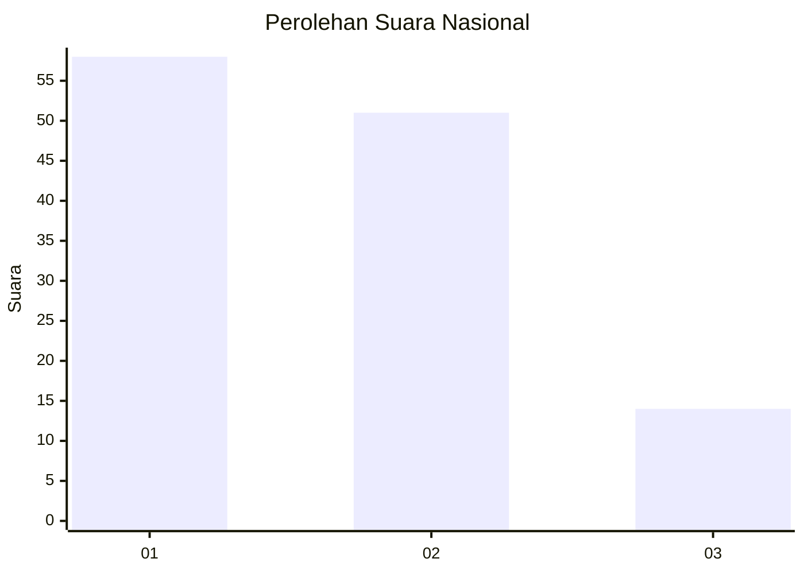
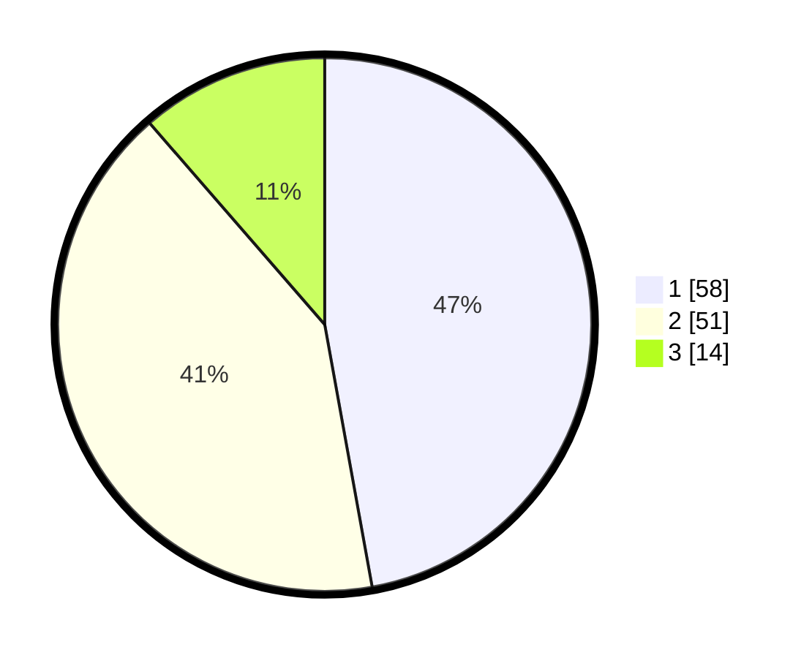

# Hasil

## Grafik

## Tabel

| No. | Nama Paslon    | Suara | Suara (raw) | Persentase |
|:--- |:-------------- | -----:| -----------:| ----------:|
| 1   | ANIES MUHAIMIN | 58    | [58][p-1]   | 47,15      |
| 2   | PRABOWO GIBRAN | 51    | [51][p-2]   | 41,46      |
| 3   | GANJAR MAHFUD  | 14    | [14][p-3]   | 11,38      |

[p-1]: https://github.com/gigit-pemilu/pemilu-2024/blob/main/pilpres/hitung-suara/sub/21-kepulauan-riau/sub/71-kota-batam/sub/06-lubuk-baja/sub/1001-kampung-pelita/sub/002-tps/sub/paslon-1.txt
[p-2]: https://github.com/gigit-pemilu/pemilu-2024/blob/main/pilpres/hitung-suara/sub/21-kepulauan-riau/sub/71-kota-batam/sub/06-lubuk-baja/sub/1001-kampung-pelita/sub/002-tps/sub/paslon-2.txt
[p-3]: https://github.com/gigit-pemilu/pemilu-2024/blob/main/pilpres/hitung-suara/sub/21-kepulauan-riau/sub/71-kota-batam/sub/06-lubuk-baja/sub/1001-kampung-pelita/sub/002-tps/sub/paslon-3.txt

## Foto C Plano

https://sirekap-obj-formc.kpu.go.id/f008/pemilu/ppwp/21/71/06/10/01/2171061001002-20240214-232504--18b4d4bb-6310-4c70-8803-1d93993433b5.jpg

https://sirekap-obj-formc.kpu.go.id/f008/pemilu/ppwp/21/71/06/10/01/2171061001002-20240214-205429--ecc19734-825e-4777-ba62-5c050f171a02.jpg

https://sirekap-obj-formc.kpu.go.id/f008/pemilu/ppwp/21/71/06/10/01/2171061001002-20240214-212243--b22f0cad-b3db-4cf4-a981-4953d8f8d5e8.jpg

## Metadata

| Key        | Value               |
| ---------- | ------------------- |
| Time Stamp | 2024-02-16 21:01:00 |

