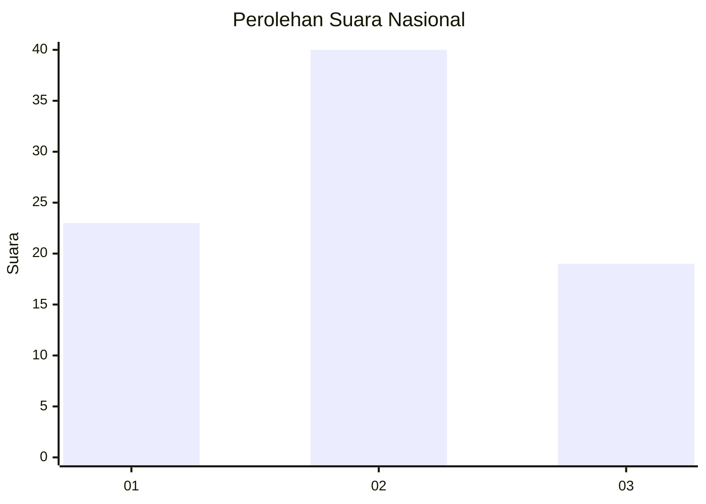
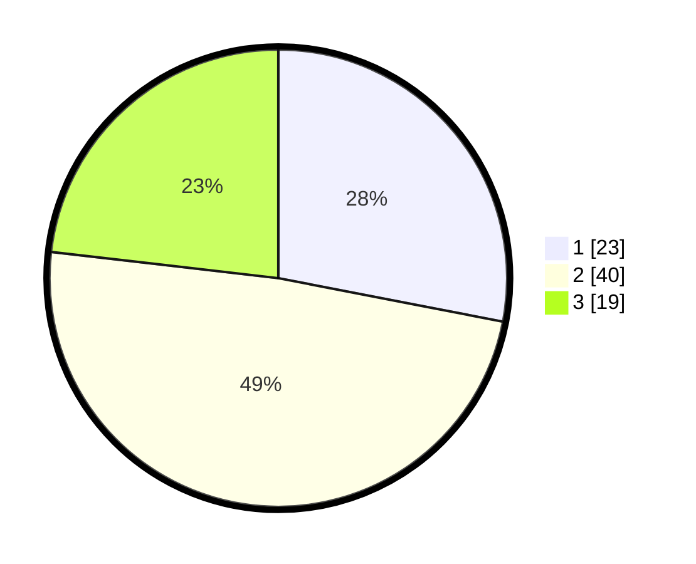

# Hasil

## Grafik

## Tabel

| No. | Nama Paslon    | Suara | Suara (raw) | Persentase |
|:--- |:-------------- | -----:| -----------:| ----------:|
| 1   | ANIES MUHAIMIN | 23    | [23][p-1]   | 28,05      |
| 2   | PRABOWO GIBRAN | 40    | [40][p-2]   | 48,78      |
| 3   | GANJAR MAHFUD  | 19    | [19][p-3]   | 23,17      |

[p-1]: https://github.com/gigit-pemilu/pemilu-2024/blob/main/pilpres/hitung-suara/sub/21-kepulauan-riau/sub/71-kota-batam/sub/06-lubuk-baja/sub/1001-kampung-pelita/sub/007-tps/sub/paslon-1.txt
[p-2]: https://github.com/gigit-pemilu/pemilu-2024/blob/main/pilpres/hitung-suara/sub/21-kepulauan-riau/sub/71-kota-batam/sub/06-lubuk-baja/sub/1001-kampung-pelita/sub/007-tps/sub/paslon-2.txt
[p-3]: https://github.com/gigit-pemilu/pemilu-2024/blob/main/pilpres/hitung-suara/sub/21-kepulauan-riau/sub/71-kota-batam/sub/06-lubuk-baja/sub/1001-kampung-pelita/sub/007-tps/sub/paslon-3.txt

## Foto C Plano

https://sirekap-obj-formc.kpu.go.id/85a3/pemilu/ppwp/21/71/06/10/01/2171061001007-20240214-210514--30adccfd-1606-4c73-8533-095351357c63.jpg

https://sirekap-obj-formc.kpu.go.id/85a3/pemilu/ppwp/21/71/06/10/01/2171061001007-20240214-210629--99751622-21e2-4e74-8fcd-1331cea65f83.jpg

https://sirekap-obj-formc.kpu.go.id/85a3/pemilu/ppwp/21/71/06/10/01/2171061001007-20240214-210812--bd25fd9e-136c-4dc2-9425-fee7c74ccabb.jpg

## Metadata

| Key        | Value               |
| ---------- | ------------------- |
| Time Stamp | 2024-02-15 12:00:28 |

## DATA PEMILIH TETAP

Jumlah pemilih dalam DPT: **283**.
 * L: **135**.
 * P: **148**.

## DATA PENGGUNA HAK PILIH

Jumlah pengguna hak pilih dalam DPT: **75**.
 * L: **37**.
 * P: **38**.

Jumlah pengguna hak pilih dalam DPTb: **2**.
 * L: **1**.
 * P: **1**.

Jumlah pengguna hak pilih dalam DPK: **5**.
 * L: **2**.
 * P: **3**.

Jumlah pengguna hak pilih: **82**.
 * L: **40**.
 * P: **42**.

## JUMLAH SUARA SAH DAN TIDAK SAH

JUMLAH SELURUH SUARA SAH: **82**.

JUMLAH SUARA TIDAK SAH: **0**.

JUMLAH SELURUH SUARA SAH DAN SUARA TIDAK SAH: **82**.

