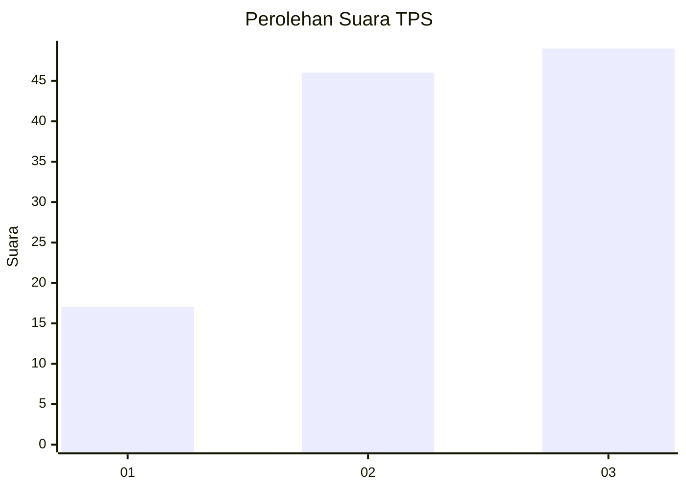
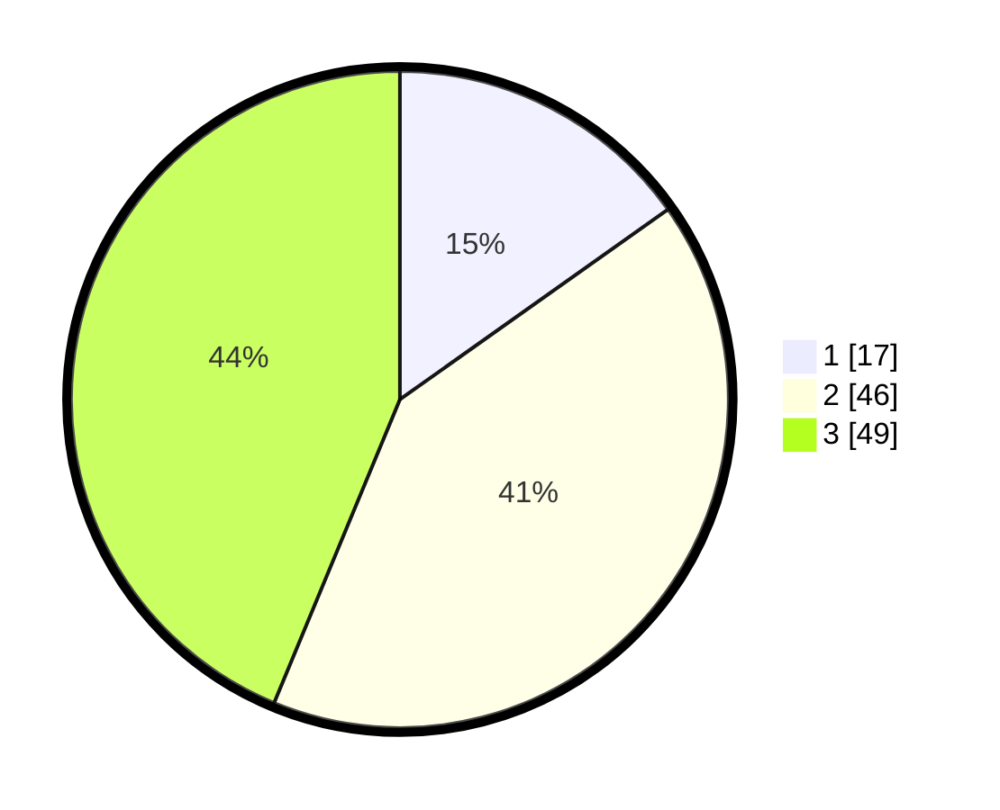

# Hasil

## Grafik

## Tabel

| No. | Nama Paslon    | Suara | Suara (raw) | Persentase |
|:--- |:-------------- | -----:| -----------:| ----------:|
| 1   | ANIES MUHAIMIN | 17    | [17][p-1]   | 15,18      |
| 2   | PRABOWO GIBRAN | 46    | [46][p-2]   | 41,07      |
| 3   | GANJAR MAHFUD  | 49    | [49][p-3]   | 43,75      |

[p-1]: https://github.com/gigit-pemilu/pemilu-2024-21-kepulauan-riau/blob/main/pilpres/hitung-suara/sub/21-kepulauan-riau/sub/71-kota-batam/sub/06-lubuk-baja/sub/1003-lubuk-baja-kota/sub/003-tps/sub/paslon-1.txt
[p-2]: https://github.com/gigit-pemilu/pemilu-2024-21-kepulauan-riau/blob/main/pilpres/hitung-suara/sub/21-kepulauan-riau/sub/71-kota-batam/sub/06-lubuk-baja/sub/1003-lubuk-baja-kota/sub/003-tps/sub/paslon-2.txt
[p-3]: https://github.com/gigit-pemilu/pemilu-2024-21-kepulauan-riau/blob/main/pilpres/hitung-suara/sub/21-kepulauan-riau/sub/71-kota-batam/sub/06-lubuk-baja/sub/1003-lubuk-baja-kota/sub/003-tps/sub/paslon-3.txt

## Foto C Plano

https://sirekap-obj-formc.kpu.go.id/b2c9/pemilu/ppwp/21/71/06/10/03/2171061003003-20240215-164941--0dea16be-6100-4704-a9ee-21cd19054c11.jpg

https://sirekap-obj-formc.kpu.go.id/b2c9/pemilu/ppwp/21/71/06/10/03/2171061003003-20240215-164952--f66c595c-8a83-4a85-a752-a048389a6392.jpg

https://sirekap-obj-formc.kpu.go.id/b2c9/pemilu/ppwp/21/71/06/10/03/2171061003003-20240215-165014--252fa713-e15b-4755-b948-7095bf844460.jpg

## Metadata

| Key        | Value               |
| ---------- | ------------------- |
| Time Stamp | 2024-02-19 11:00:00 |

