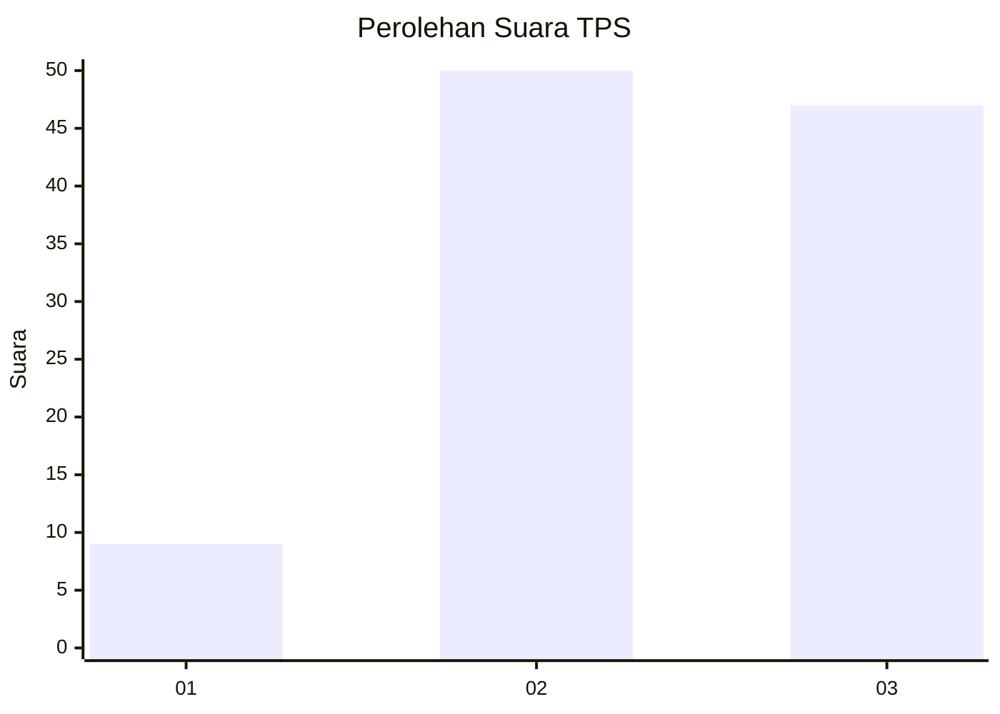
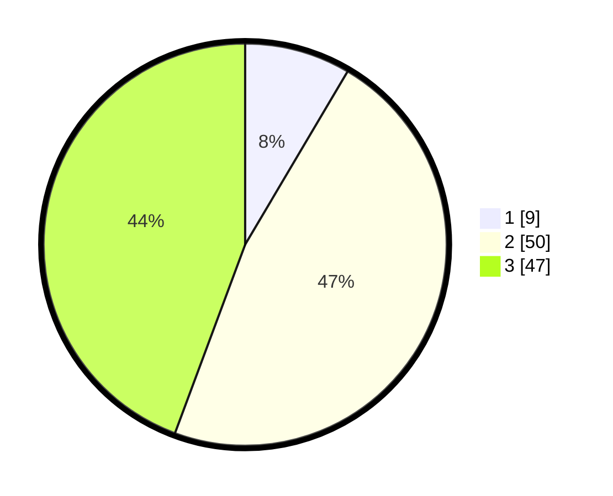

# Hasil

## Grafik

## Tabel

| No. | Nama Paslon    | Suara | Suara (raw) | Persentase |
|:--- |:-------------- | -----:| -----------:| ----------:|
| 1   | ANIES MUHAIMIN | 9     | [9][p-1]    | 8,49       |
| 2   | PRABOWO GIBRAN | 50    | [50][p-2]   | 47,17      |
| 3   | GANJAR MAHFUD  | 47    | [47][p-3]   | 44,34      |

[p-1]: https://github.com/gigit-pemilu/pemilu-2024-21-kepulauan-riau/blob/main/pilpres/hitung-suara/sub/21-kepulauan-riau/sub/71-kota-batam/sub/06-lubuk-baja/sub/1004-batu-selicin/sub/031-tps/sub/paslon-1.txt
[p-2]: https://github.com/gigit-pemilu/pemilu-2024-21-kepulauan-riau/blob/main/pilpres/hitung-suara/sub/21-kepulauan-riau/sub/71-kota-batam/sub/06-lubuk-baja/sub/1004-batu-selicin/sub/031-tps/sub/paslon-2.txt
[p-3]: https://github.com/gigit-pemilu/pemilu-2024-21-kepulauan-riau/blob/main/pilpres/hitung-suara/sub/21-kepulauan-riau/sub/71-kota-batam/sub/06-lubuk-baja/sub/1004-batu-selicin/sub/031-tps/sub/paslon-3.txt

## Foto C Plano

https://sirekap-obj-formc.kpu.go.id/de9b/pemilu/ppwp/21/71/06/10/04/2171061004031-20240214-155403--cdd2659b-cf03-42bd-9e02-ea76db663fb5.jpg

https://sirekap-obj-formc.kpu.go.id/de9b/pemilu/ppwp/21/71/06/10/04/2171061004031-20240214-155455--746cd19b-0934-4482-a6ee-9fb681a214b8.jpg

https://sirekap-obj-formc.kpu.go.id/de9b/pemilu/ppwp/21/71/06/10/04/2171061004031-20240214-155541--96158028-4643-4ba6-9da7-65094ca4652e.jpg

## Metadata

| Key        | Value               |
| ---------- | ------------------- |
| Time Stamp | 2024-02-16 21:01:00 |

