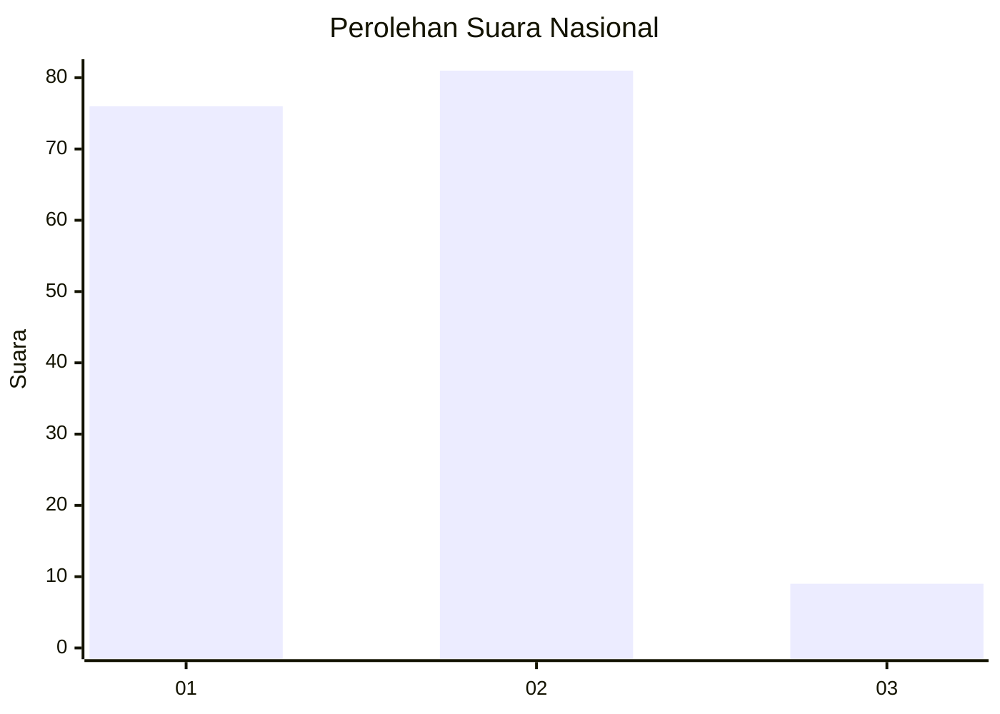
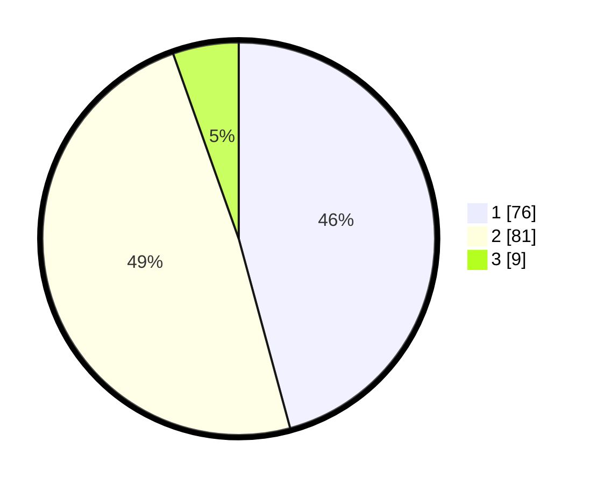

# Hasil

## Grafik

## Tabel

| No. | Nama Paslon    | Suara | Suara (raw) | Persentase |
|:--- |:-------------- | -----:| -----------:| ----------:|
| 1   | ANIES MUHAIMIN | 76    | [76][p-1]   | 45,78      |
| 2   | PRABOWO GIBRAN | 81    | [81][p-2]   | 48,80      |
| 3   | GANJAR MAHFUD  | 9     | [9][p-3]    | 5,42       |

[p-1]: https://github.com/gigit-pemilu/pemilu-2024/blob/main/pilpres/hitung-suara/sub/21-kepulauan-riau/sub/71-kota-batam/sub/06-lubuk-baja/sub/1005-tanjung-uma/sub/007-tps/sub/paslon-1.txt
[p-2]: https://github.com/gigit-pemilu/pemilu-2024/blob/main/pilpres/hitung-suara/sub/21-kepulauan-riau/sub/71-kota-batam/sub/06-lubuk-baja/sub/1005-tanjung-uma/sub/007-tps/sub/paslon-2.txt
[p-3]: https://github.com/gigit-pemilu/pemilu-2024/blob/main/pilpres/hitung-suara/sub/21-kepulauan-riau/sub/71-kota-batam/sub/06-lubuk-baja/sub/1005-tanjung-uma/sub/007-tps/sub/paslon-3.txt

## Foto C Plano

https://sirekap-obj-formc.kpu.go.id/5456/pemilu/ppwp/21/71/06/10/05/2171061005007-20240218-181222--41c031c9-e839-4778-ae7e-9bd56a67c184.jpg

https://sirekap-obj-formc.kpu.go.id/5456/pemilu/ppwp/21/71/06/10/05/2171061005007-20240215-023956--c1e52dc6-2662-4c2f-9f69-f373c82365f0.jpg

https://sirekap-obj-formc.kpu.go.id/5456/pemilu/ppwp/21/71/06/10/05/2171061005007-20240215-023823--87c2b973-efb3-46b5-9f99-67a5469cbb8c.jpg

## Metadata

| Key        | Value               |
| ---------- | ------------------- |
| Time Stamp | 2024-02-19 06:16:00 |

