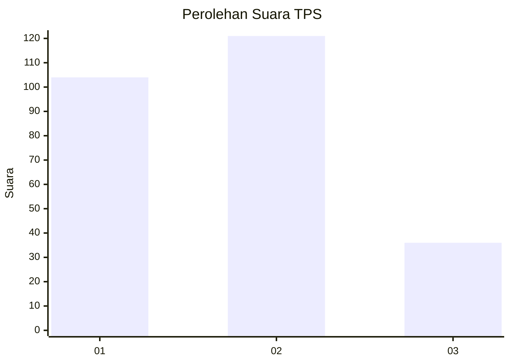
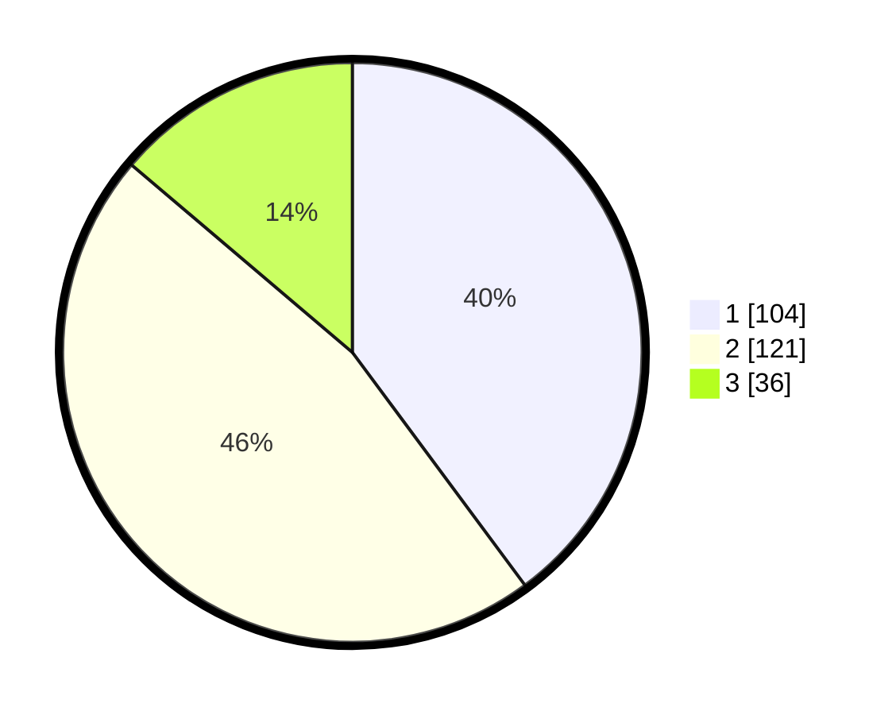

# Hasil

## Grafik

## Tabel

| No. | Nama Paslon    | Suara | Suara (raw) | Persentase |
|:--- |:-------------- | -----:| -----------:| ----------:|
| 1   | ANIES MUHAIMIN | 104   | [104][p-1]  | 39,85      |
| 2   | PRABOWO GIBRAN | 121   | [121][p-2]  | 46,36      |
| 3   | GANJAR MAHFUD  | 36    | [36][p-3]   | 13,79      |

[p-1]: https://github.com/gigit-pemilu/pemilu-2024-21-kepulauan-riau/blob/main/pilpres/hitung-suara/sub/21-kepulauan-riau/sub/71-kota-batam/sub/06-lubuk-baja/sub/1005-tanjung-uma/sub/067-tps/sub/paslon-1.txt
[p-2]: https://github.com/gigit-pemilu/pemilu-2024-21-kepulauan-riau/blob/main/pilpres/hitung-suara/sub/21-kepulauan-riau/sub/71-kota-batam/sub/06-lubuk-baja/sub/1005-tanjung-uma/sub/067-tps/sub/paslon-2.txt
[p-3]: https://github.com/gigit-pemilu/pemilu-2024-21-kepulauan-riau/blob/main/pilpres/hitung-suara/sub/21-kepulauan-riau/sub/71-kota-batam/sub/06-lubuk-baja/sub/1005-tanjung-uma/sub/067-tps/sub/paslon-3.txt

## Foto C Plano

https://sirekap-obj-formc.kpu.go.id/1d58/pemilu/ppwp/21/71/06/10/05/2171061005067-20240215-005937--248087a0-dbe3-458f-b02e-e59f0d8579eb.jpg

https://sirekap-obj-formc.kpu.go.id/1d58/pemilu/ppwp/21/71/06/10/05/2171061005067-20240215-005944--d12eb04a-e5eb-4cf5-ad33-3b9c51e2f4b5.jpg

https://sirekap-obj-formc.kpu.go.id/1d58/pemilu/ppwp/21/71/06/10/05/2171061005067-20240216-155942--250b327b-9ffb-44f2-ad78-86d75885b3f6.jpg

## Metadata

| Key        | Value               |
| ---------- | ------------------- |
| Time Stamp | 2024-02-19 11:00:00 |

