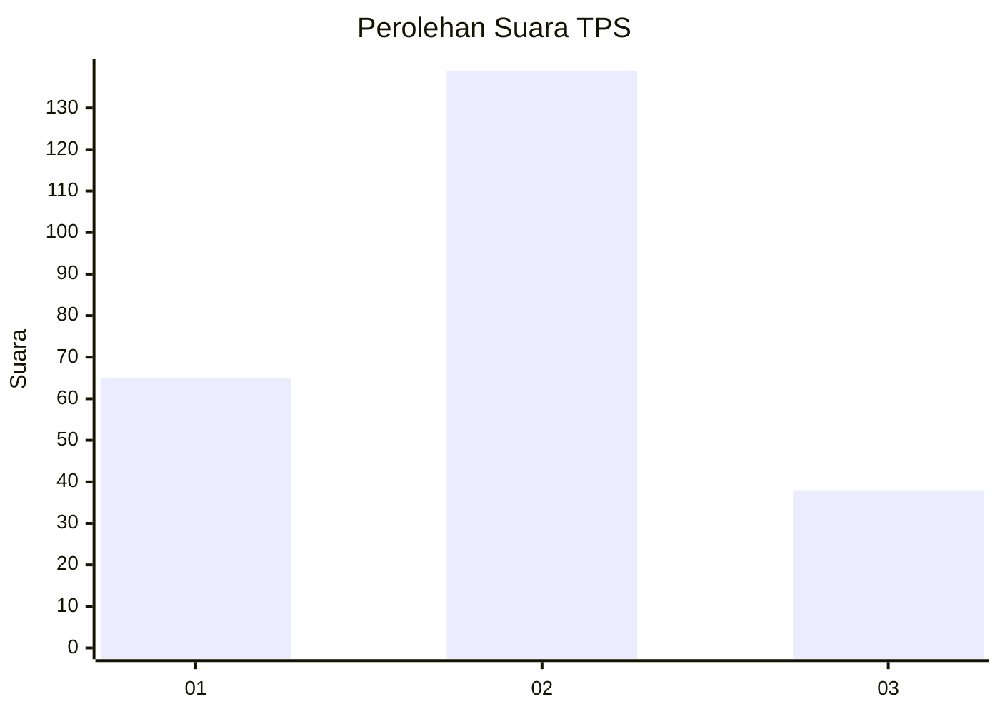
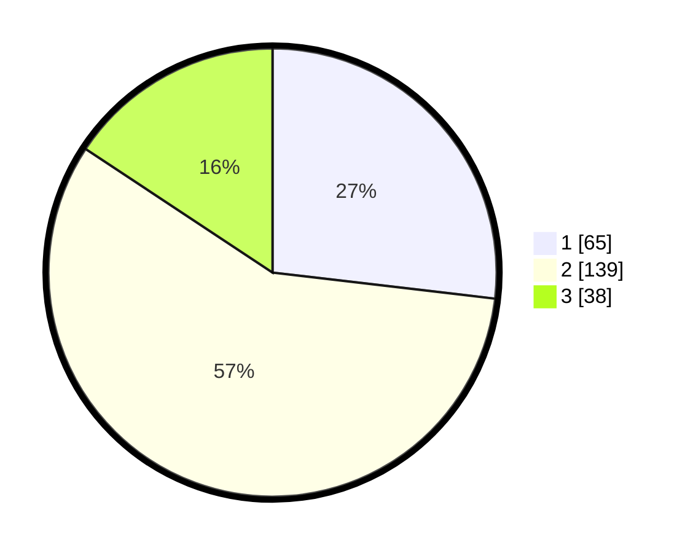

# Hasil

## Grafik

## Tabel

| No. | Nama Paslon    | Suara | Suara (raw) | Persentase |
|:--- |:-------------- | -----:| -----------:| ----------:|
| 1   | ANIES MUHAIMIN | 65    | [65][p-1]   | 26,86      |
| 2   | PRABOWO GIBRAN | 139   | [139][p-2]  | 57,44      |
| 3   | GANJAR MAHFUD  | 38    | [38][p-3]   | 15,70      |

[p-1]: https://github.com/gigit-pemilu/pemilu-2024-21-kepulauan-riau/blob/main/pilpres/hitung-suara/sub/21-kepulauan-riau/sub/71-kota-batam/sub/07-sei-beduk/sub/1001-muka-kuning/sub/013-tps/sub/paslon-1.txt
[p-2]: https://github.com/gigit-pemilu/pemilu-2024-21-kepulauan-riau/blob/main/pilpres/hitung-suara/sub/21-kepulauan-riau/sub/71-kota-batam/sub/07-sei-beduk/sub/1001-muka-kuning/sub/013-tps/sub/paslon-2.txt
[p-3]: https://github.com/gigit-pemilu/pemilu-2024-21-kepulauan-riau/blob/main/pilpres/hitung-suara/sub/21-kepulauan-riau/sub/71-kota-batam/sub/07-sei-beduk/sub/1001-muka-kuning/sub/013-tps/sub/paslon-3.txt

## Foto C Plano

https://sirekap-obj-formc.kpu.go.id/ef39/pemilu/ppwp/21/71/07/10/01/2171071001013-20240215-051740--f2942ec8-8209-456a-ada0-4ca34bd50fe1.jpg

https://sirekap-obj-formc.kpu.go.id/ef39/pemilu/ppwp/21/71/07/10/01/2171071001013-20240215-051944--ab3ead85-62ca-4e99-ae23-2a955e965e38.jpg

https://sirekap-obj-formc.kpu.go.id/ef39/pemilu/ppwp/21/71/07/10/01/2171071001013-20240215-051827--97a9d1f1-fd7c-4017-917b-3d163a090b10.jpg

## Metadata

| Key        | Value               |
| ---------- | ------------------- |
| Time Stamp | 2024-02-19 11:00:00 |

