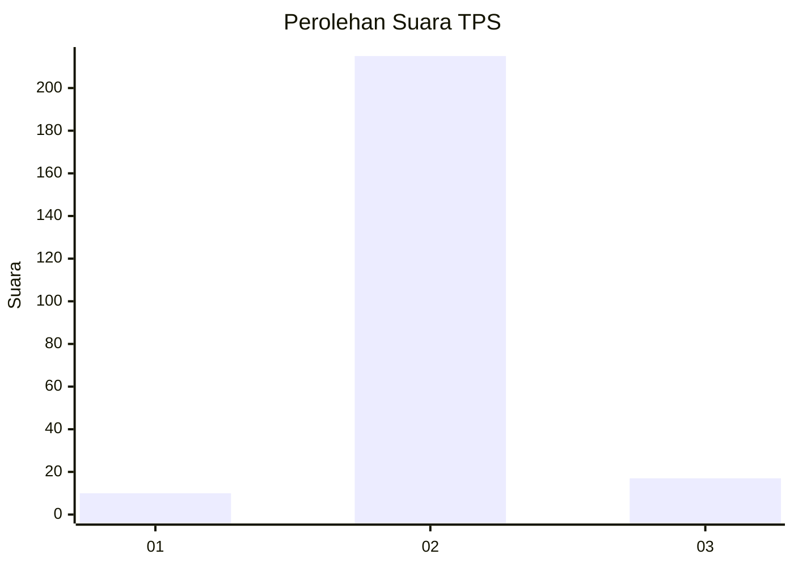
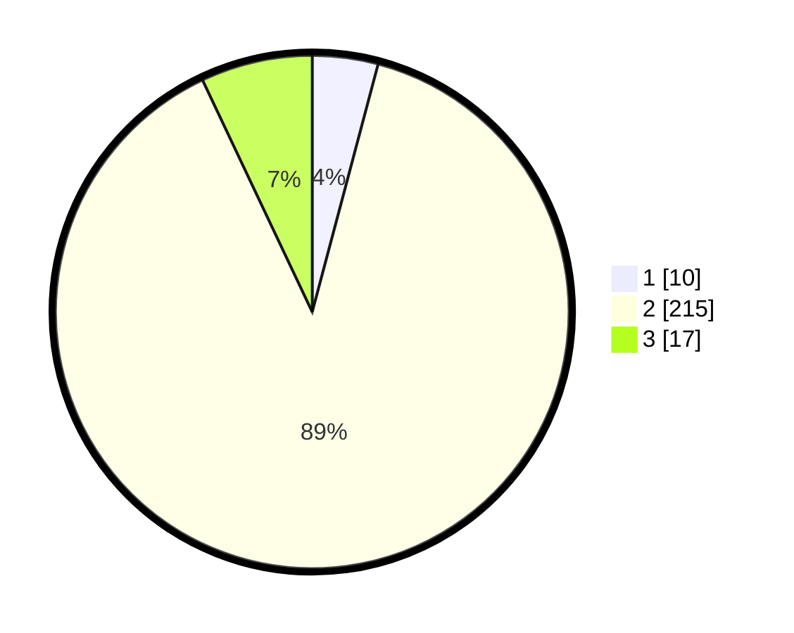

# Hasil

## Grafik

## Tabel

| No. | Nama Paslon    | Suara | Suara (raw) | Persentase |
|:--- |:-------------- | -----:| -----------:| ----------:|
| 1   | ANIES MUHAIMIN | 10    | [10][p-1]   | 4,13       |
| 2   | PRABOWO GIBRAN | 215   | [215][p-2]  | 88,84      |
| 3   | GANJAR MAHFUD  | 17    | [17][p-3]   | 7,02       |

[p-1]: https://github.com/gigit-pemilu/pemilu-2024-21-kepulauan-riau/blob/main/pilpres/hitung-suara/sub/21-kepulauan-riau/sub/71-kota-batam/sub/07-sei-beduk/sub/1001-muka-kuning/sub/902-tps/sub/paslon-1.txt
[p-2]: https://github.com/gigit-pemilu/pemilu-2024-21-kepulauan-riau/blob/main/pilpres/hitung-suara/sub/21-kepulauan-riau/sub/71-kota-batam/sub/07-sei-beduk/sub/1001-muka-kuning/sub/902-tps/sub/paslon-2.txt
[p-3]: https://github.com/gigit-pemilu/pemilu-2024-21-kepulauan-riau/blob/main/pilpres/hitung-suara/sub/21-kepulauan-riau/sub/71-kota-batam/sub/07-sei-beduk/sub/1001-muka-kuning/sub/902-tps/sub/paslon-3.txt

## Foto C Plano

https://sirekap-obj-formc.kpu.go.id/2f6f/pemilu/ppwp/21/71/07/10/01/2171071001902-20240214-233306--08af9a03-af88-401f-92e2-bd72ab0d24d6.jpg

https://sirekap-obj-formc.kpu.go.id/2f6f/pemilu/ppwp/21/71/07/10/01/2171071001902-20240215-000159--d75cc480-cea2-4738-add9-0bd4b450afb0.jpg

https://sirekap-obj-formc.kpu.go.id/2f6f/pemilu/ppwp/21/71/07/10/01/2171071001902-20240214-233323--dbb26460-642d-451c-b19c-44641bac2ea8.jpg

## Metadata

| Key        | Value               |
| ---------- | ------------------- |
| Time Stamp | 2024-02-19 11:00:00 |

