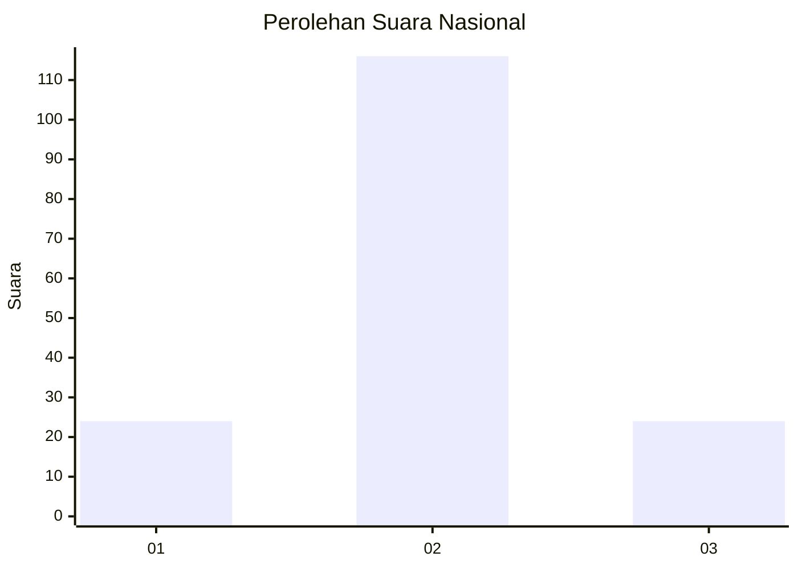

# Hasil

## Grafik

## Tabel

| No. | Nama Paslon    | Suara | Suara (raw) | Persentase |
|:--- |:-------------- | -----:| -----------:| ----------:|
| 1   | ANIES MUHAIMIN | 24    | [24][p-1]   | 14,63      |
| 2   | PRABOWO GIBRAN | 116   | [116][p-2]  | 70,73      |
| 3   | GANJAR MAHFUD  | 24    | [24][p-3]   | 14,63      |

[p-1]: https://github.com/gigit-pemilu/pemilu-2024/blob/main/pilpres/hitung-suara/sub/21-kepulauan-riau/sub/71-kota-batam/sub/07-sei-beduk/sub/1002-duriangkang/sub/001-tps/sub/paslon-1.txt
[p-2]: https://github.com/gigit-pemilu/pemilu-2024/blob/main/pilpres/hitung-suara/sub/21-kepulauan-riau/sub/71-kota-batam/sub/07-sei-beduk/sub/1002-duriangkang/sub/001-tps/sub/paslon-2.txt
[p-3]: https://github.com/gigit-pemilu/pemilu-2024/blob/main/pilpres/hitung-suara/sub/21-kepulauan-riau/sub/71-kota-batam/sub/07-sei-beduk/sub/1002-duriangkang/sub/001-tps/sub/paslon-3.txt

## Foto C Plano

https://sirekap-obj-formc.kpu.go.id/4d1d/pemilu/ppwp/21/71/07/10/02/2171071002001-20240214-215419--1d7b648e-bbd1-4282-9ef6-80c13490d900.jpg

https://sirekap-obj-formc.kpu.go.id/4d1d/pemilu/ppwp/21/71/07/10/02/2171071002001-20240214-215511--48a98a24-98a5-4dc5-8103-0a8c94dc5f89.jpg

https://sirekap-obj-formc.kpu.go.id/4d1d/pemilu/ppwp/21/71/07/10/02/2171071002001-20240214-215735--c6ea76f5-1726-44f3-a102-40cf780b0255.jpg

## Metadata

| Key        | Value               |
| ---------- | ------------------- |
| Time Stamp | 2024-02-16 22:01:00 |

