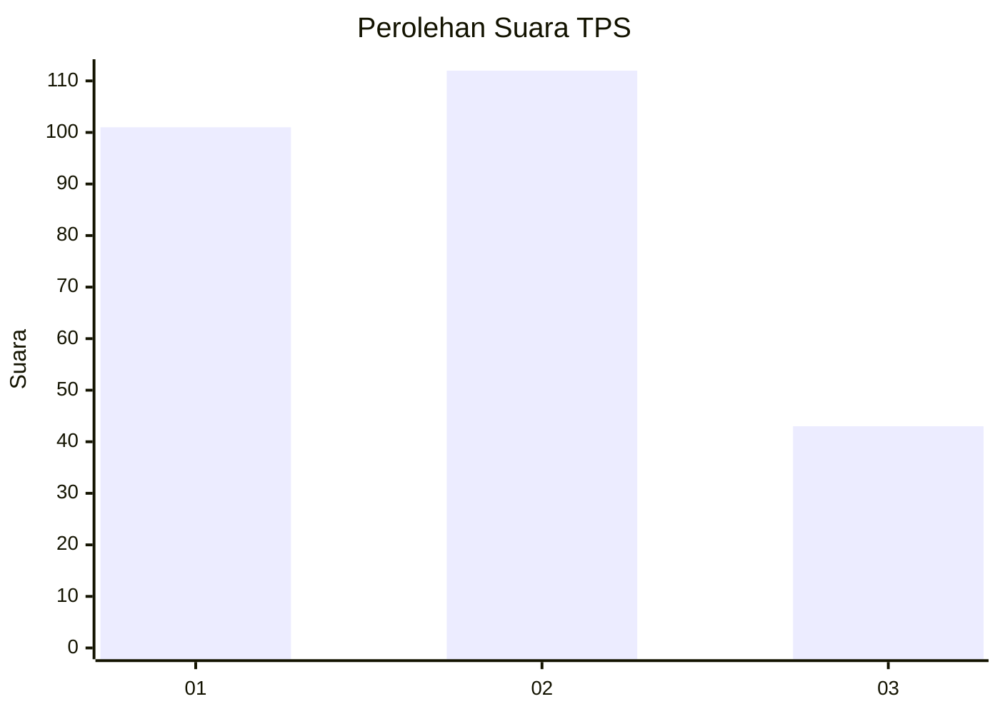
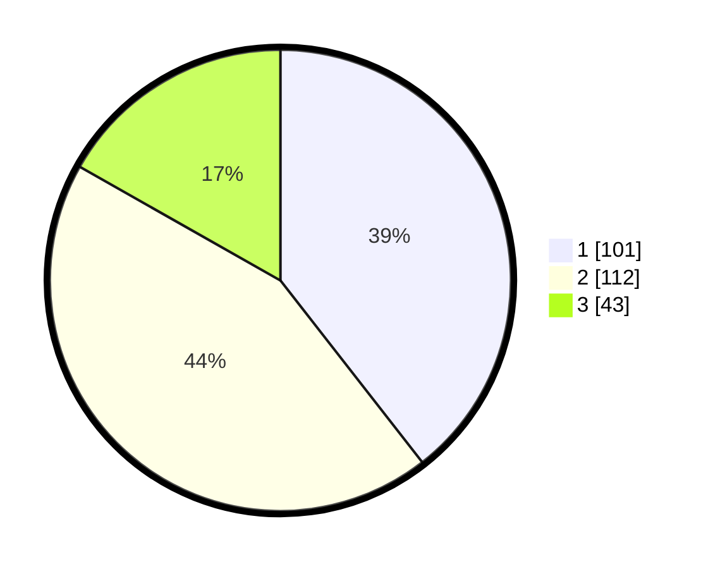

# Hasil

## Grafik

## Tabel

| No. | Nama Paslon    | Suara | Suara (raw) | Persentase |
|:--- |:-------------- | -----:| -----------:| ----------:|
| 1   | ANIES MUHAIMIN | 101   | [101][p-1]  | 39,45      |
| 2   | PRABOWO GIBRAN | 112   | [112][p-2]  | 43,75      |
| 3   | GANJAR MAHFUD  | 43    | [43][p-3]   | 16,80      |

[p-1]: https://github.com/gigit-pemilu/pemilu-2024-21-kepulauan-riau/blob/main/pilpres/hitung-suara/sub/21-kepulauan-riau/sub/71-kota-batam/sub/07-sei-beduk/sub/1002-duriangkang/sub/023-tps/sub/paslon-1.txt
[p-2]: https://github.com/gigit-pemilu/pemilu-2024-21-kepulauan-riau/blob/main/pilpres/hitung-suara/sub/21-kepulauan-riau/sub/71-kota-batam/sub/07-sei-beduk/sub/1002-duriangkang/sub/023-tps/sub/paslon-2.txt
[p-3]: https://github.com/gigit-pemilu/pemilu-2024-21-kepulauan-riau/blob/main/pilpres/hitung-suara/sub/21-kepulauan-riau/sub/71-kota-batam/sub/07-sei-beduk/sub/1002-duriangkang/sub/023-tps/sub/paslon-3.txt

## Foto C Plano

https://sirekap-obj-formc.kpu.go.id/37f1/pemilu/ppwp/21/71/07/10/02/2171071002023-20240214-231121--8bd5b7b3-493f-48f2-a9bb-90c414bfc3aa.jpg

https://sirekap-obj-formc.kpu.go.id/37f1/pemilu/ppwp/21/71/07/10/02/2171071002023-20240214-231422--8b0c268a-f6a3-4ab3-8f13-2c04e7f62dae.jpg

https://sirekap-obj-formc.kpu.go.id/37f1/pemilu/ppwp/21/71/07/10/02/2171071002023-20240214-231524--42a5e2c9-8fe3-4d97-9735-f2aa47824dfc.jpg

## Metadata

| Key        | Value               |
| ---------- | ------------------- |
| Time Stamp | 2024-02-16 21:01:00 |

