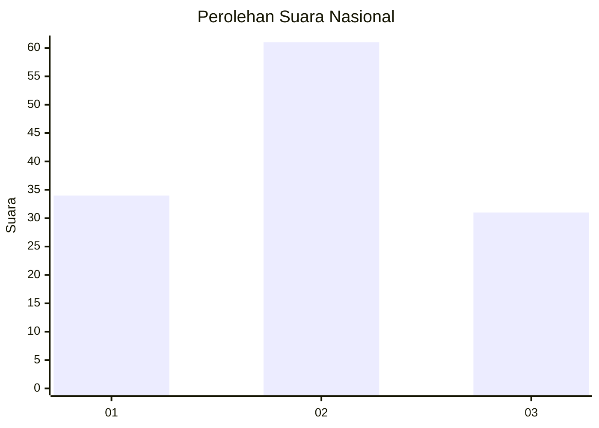
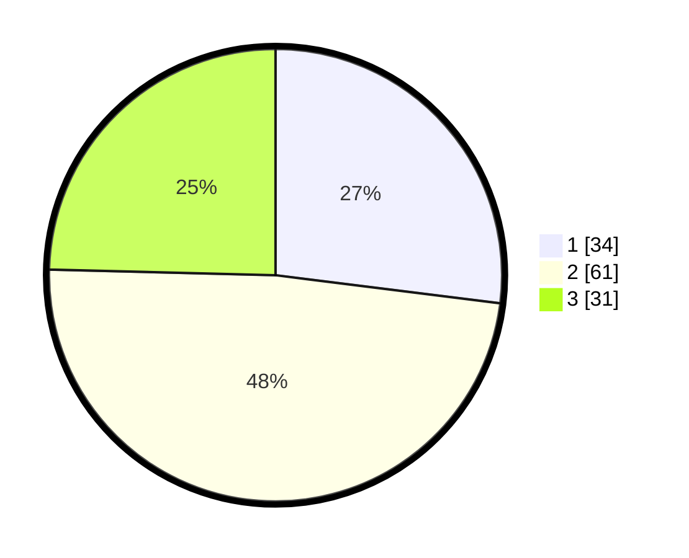

# Hasil

## Grafik

## Tabel

| No. | Nama Paslon    | Suara | Suara (raw) | Persentase |
|:--- |:-------------- | -----:| -----------:| ----------:|
| 1   | ANIES MUHAIMIN | 34    | [34][p-1]   | 26,98      |
| 2   | PRABOWO GIBRAN | 61    | [61][p-2]   | 48,41      |
| 3   | GANJAR MAHFUD  | 31    | [31][p-3]   | 24,60      |

[p-1]: https://github.com/gigit-pemilu/pemilu-2024/blob/main/pilpres/hitung-suara/sub/21-kepulauan-riau/sub/71-kota-batam/sub/07-sei-beduk/sub/1003-mangsang/sub/069-tps/sub/paslon-1.txt
[p-2]: https://github.com/gigit-pemilu/pemilu-2024/blob/main/pilpres/hitung-suara/sub/21-kepulauan-riau/sub/71-kota-batam/sub/07-sei-beduk/sub/1003-mangsang/sub/069-tps/sub/paslon-2.txt
[p-3]: https://github.com/gigit-pemilu/pemilu-2024/blob/main/pilpres/hitung-suara/sub/21-kepulauan-riau/sub/71-kota-batam/sub/07-sei-beduk/sub/1003-mangsang/sub/069-tps/sub/paslon-3.txt

## Foto C Plano

https://sirekap-obj-formc.kpu.go.id/6eb9/pemilu/ppwp/21/71/07/10/03/2171071003069-20240215-092913--ec47fcb9-b827-4aea-bc87-7164725451dc.jpg

https://sirekap-obj-formc.kpu.go.id/6eb9/pemilu/ppwp/21/71/07/10/03/2171071003069-20240215-092336--8c52112c-73b0-4480-8225-d4a62d8558cb.jpg

https://sirekap-obj-formc.kpu.go.id/6eb9/pemilu/ppwp/21/71/07/10/03/2171071003069-20240215-092904--178ce185-78c7-4465-8bfe-cbd4c093c6fc.jpg

## Metadata

| Key        | Value               |
| ---------- | ------------------- |
| Time Stamp | 2024-02-19 11:00:00 |

