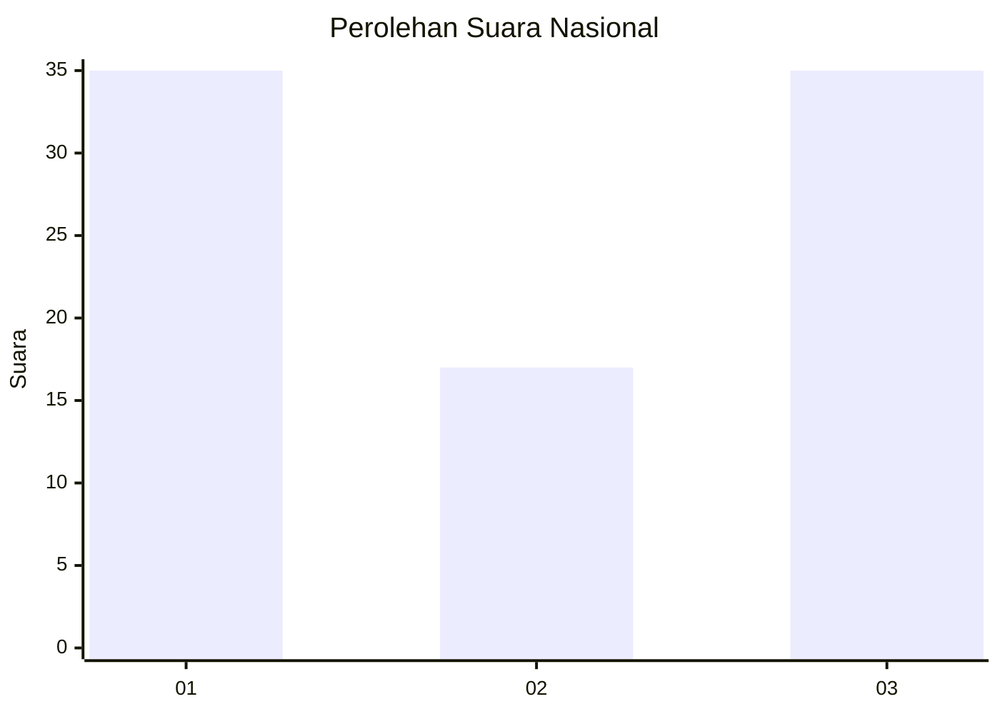
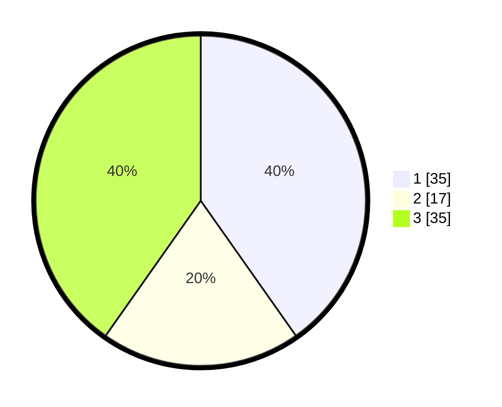

# Hasil

## Grafik

## Tabel

| No. | Nama Paslon    | Suara | Suara (raw) | Persentase |
|:--- |:-------------- | -----:| -----------:| ----------:|
| 1   | ANIES MUHAIMIN | 35    | [35][p-1]   | 40,23      |
| 2   | PRABOWO GIBRAN | 17    | [17][p-2]   | 19,54      |
| 3   | GANJAR MAHFUD  | 35    | [35][p-3]   | 40,23      |

[p-1]: https://github.com/gigit-pemilu/pemilu-2024/blob/main/pilpres/hitung-suara/sub/21-kepulauan-riau/sub/71-kota-batam/sub/07-sei-beduk/sub/1004-tanjung-piayu/sub/014-tps/sub/paslon-1.txt
[p-2]: https://github.com/gigit-pemilu/pemilu-2024/blob/main/pilpres/hitung-suara/sub/21-kepulauan-riau/sub/71-kota-batam/sub/07-sei-beduk/sub/1004-tanjung-piayu/sub/014-tps/sub/paslon-2.txt
[p-3]: https://github.com/gigit-pemilu/pemilu-2024/blob/main/pilpres/hitung-suara/sub/21-kepulauan-riau/sub/71-kota-batam/sub/07-sei-beduk/sub/1004-tanjung-piayu/sub/014-tps/sub/paslon-3.txt

## Foto C Plano

https://sirekap-obj-formc.kpu.go.id/bda8/pemilu/ppwp/21/71/07/10/04/2171071004014-20240215-015044--f46e30ae-ca03-46f0-a80c-7fda3ed03d0d.jpg

https://sirekap-obj-formc.kpu.go.id/bda8/pemilu/ppwp/21/71/07/10/04/2171071004014-20240215-015552--b237b32b-a1db-404f-ad98-b1050537f440.jpg

https://sirekap-obj-formc.kpu.go.id/bda8/pemilu/ppwp/21/71/07/10/04/2171071004014-20240215-015207--088054f4-bd72-4e67-893e-a8986a14d802.jpg

## Metadata

| Key        | Value               |
| ---------- | ------------------- |
| Time Stamp | 2024-02-26 10:00:00 |

