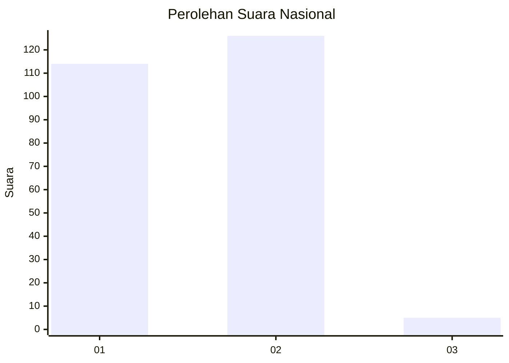
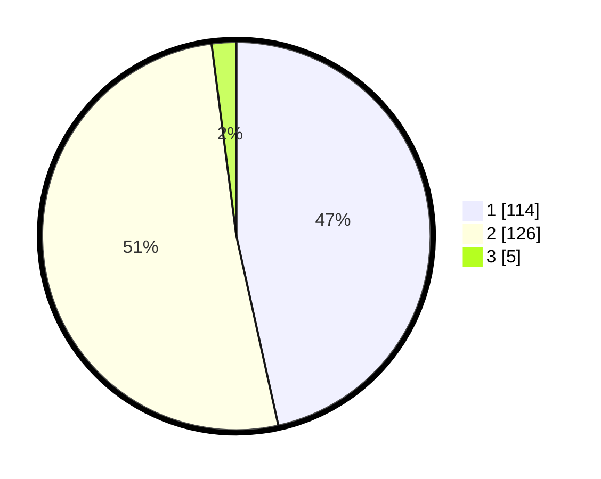

# Hasil

## Grafik

## Tabel

| No. | Nama Paslon    | Suara | Suara (raw) | Persentase |
|:--- |:-------------- | -----:| -----------:| ----------:|
| 1   | ANIES MUHAIMIN | 114   | [114][p-1]  | 46,53      |
| 2   | PRABOWO GIBRAN | 126   | [126][p-2]  | 51,43      |
| 3   | GANJAR MAHFUD  | 5     | [5][p-3]    | 2,04       |

[p-1]: https://github.com/gigit-pemilu/pemilu-2024/blob/main/pilpres/hitung-suara/sub/21-kepulauan-riau/sub/71-kota-batam/sub/08-galang/sub/1001-sijantung/sub/004-tps/sub/paslon-1.txt
[p-2]: https://github.com/gigit-pemilu/pemilu-2024/blob/main/pilpres/hitung-suara/sub/21-kepulauan-riau/sub/71-kota-batam/sub/08-galang/sub/1001-sijantung/sub/004-tps/sub/paslon-2.txt
[p-3]: https://github.com/gigit-pemilu/pemilu-2024/blob/main/pilpres/hitung-suara/sub/21-kepulauan-riau/sub/71-kota-batam/sub/08-galang/sub/1001-sijantung/sub/004-tps/sub/paslon-3.txt

## Foto C Plano

https://sirekap-obj-formc.kpu.go.id/f2a1/pemilu/ppwp/21/71/08/10/01/2171081001004-20240215-082314--ad757927-ac41-432d-aadb-416a71158774.jpg

https://sirekap-obj-formc.kpu.go.id/f2a1/pemilu/ppwp/21/71/08/10/01/2171081001004-20240215-082414--7a4c8a72-38d0-4bc4-9906-6adf73619ff0.jpg

https://sirekap-obj-formc.kpu.go.id/f2a1/pemilu/ppwp/21/71/08/10/01/2171081001004-20240215-082522--c3d2de9f-5413-4149-b42d-c738ee79ac1a.jpg

## Metadata

| Key        | Value               |
| ---------- | ------------------- |
| Time Stamp | 2024-02-16 22:01:00 |

