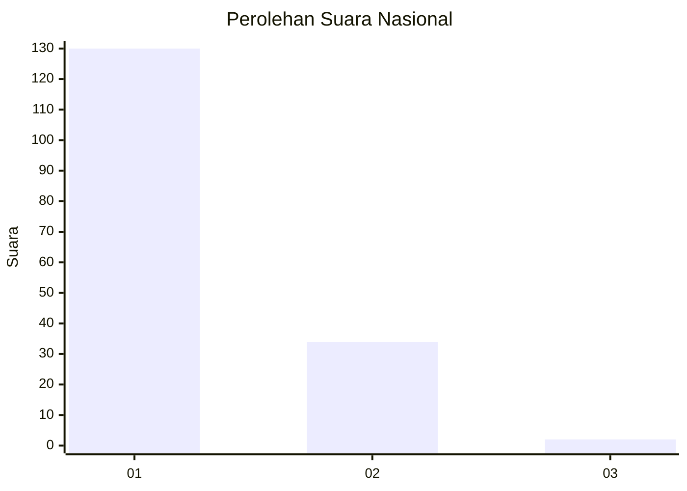
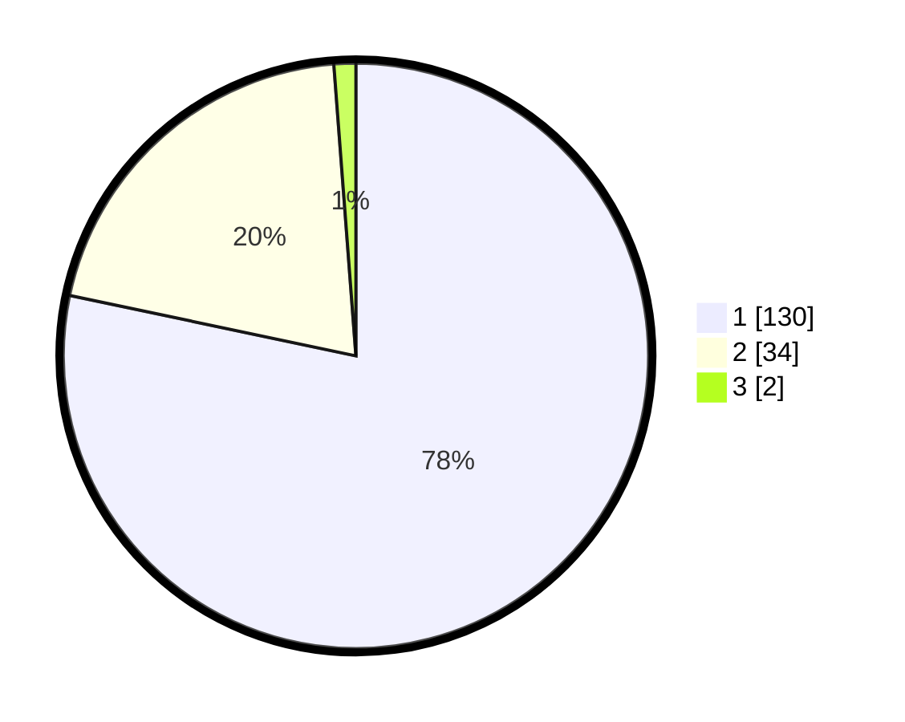

# Hasil

## Grafik

## Tabel

| No. | Nama Paslon    | Suara | Suara (raw) | Persentase |
|:--- |:-------------- | -----:| -----------:| ----------:|
| 1   | ANIES MUHAIMIN | 130   | [130][p-1]  | 78,31      |
| 2   | PRABOWO GIBRAN | 34    | [34][p-2]   | 20,48      |
| 3   | GANJAR MAHFUD  | 2     | [2][p-3]    | 1,20       |

[p-1]: https://github.com/gigit-pemilu/pemilu-2024/blob/main/pilpres/hitung-suara/sub/21-kepulauan-riau/sub/71-kota-batam/sub/08-galang/sub/1002-karas/sub/001-tps/sub/paslon-1.txt
[p-2]: https://github.com/gigit-pemilu/pemilu-2024/blob/main/pilpres/hitung-suara/sub/21-kepulauan-riau/sub/71-kota-batam/sub/08-galang/sub/1002-karas/sub/001-tps/sub/paslon-2.txt
[p-3]: https://github.com/gigit-pemilu/pemilu-2024/blob/main/pilpres/hitung-suara/sub/21-kepulauan-riau/sub/71-kota-batam/sub/08-galang/sub/1002-karas/sub/001-tps/sub/paslon-3.txt

## Foto C Plano

https://sirekap-obj-formc.kpu.go.id/d251/pemilu/ppwp/21/71/08/10/02/2171081002001-20240220-084806--f8184ef7-77cf-432a-8c9b-fd52f794b6b1.jpg

https://sirekap-obj-formc.kpu.go.id/d251/pemilu/ppwp/21/71/08/10/02/2171081002001-20240220-084853--4bc23714-06c3-488a-a8a7-fff85ce63101.jpg

https://sirekap-obj-formc.kpu.go.id/d251/pemilu/ppwp/21/71/08/10/02/2171081002001-20240220-084955--f107af61-126c-4cc5-a63d-dcb73fc0dac4.jpg

## Metadata

| Key        | Value               |
| ---------- | ------------------- |
| Time Stamp | 2024-02-24 22:31:28 |

