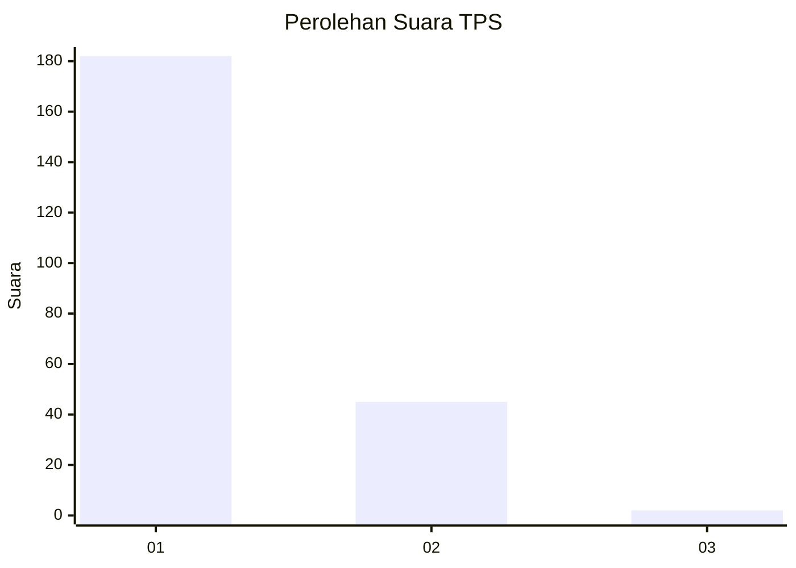
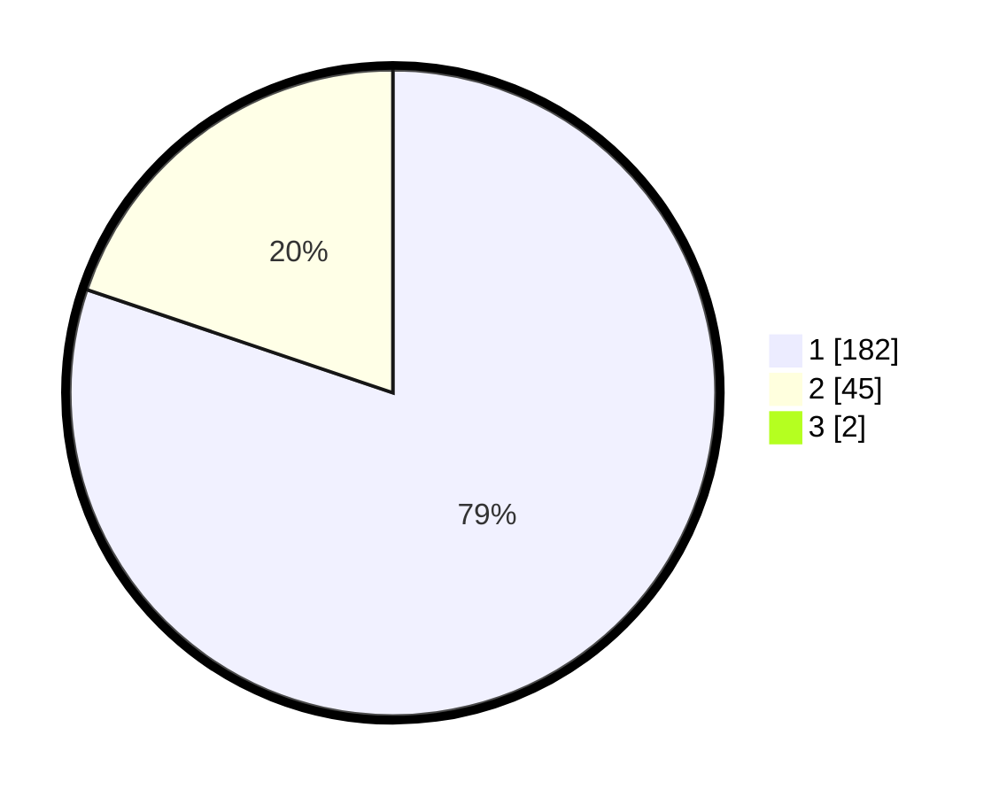

# Hasil

## Grafik

## Tabel

| No. | Nama Paslon    | Suara | Suara (raw) | Persentase |
|:--- |:-------------- | -----:| -----------:| ----------:|
| 1   | ANIES MUHAIMIN | 182   | [182][p-1]  | 79,48      |
| 2   | PRABOWO GIBRAN | 45    | [45][p-2]   | 19,65      |
| 3   | GANJAR MAHFUD  | 2     | [2][p-3]    | 0,87       |

[p-1]: https://github.com/gigit-pemilu/pemilu-2024-21-kepulauan-riau/blob/main/pilpres/hitung-suara/sub/21-kepulauan-riau/sub/71-kota-batam/sub/08-galang/sub/1002-karas/sub/003-tps/sub/paslon-1.txt
[p-2]: https://github.com/gigit-pemilu/pemilu-2024-21-kepulauan-riau/blob/main/pilpres/hitung-suara/sub/21-kepulauan-riau/sub/71-kota-batam/sub/08-galang/sub/1002-karas/sub/003-tps/sub/paslon-2.txt
[p-3]: https://github.com/gigit-pemilu/pemilu-2024-21-kepulauan-riau/blob/main/pilpres/hitung-suara/sub/21-kepulauan-riau/sub/71-kota-batam/sub/08-galang/sub/1002-karas/sub/003-tps/sub/paslon-3.txt

## Foto C Plano

https://sirekap-obj-formc.kpu.go.id/b131/pemilu/ppwp/21/71/08/10/02/2171081002003-20240219-145414--876b0194-b183-490e-9fae-e64c5dfd38ec.jpg

https://sirekap-obj-formc.kpu.go.id/b131/pemilu/ppwp/21/71/08/10/02/2171081002003-20240219-143747--1245de43-80e2-43ee-8cb8-ff0b85b1e615.jpg

https://sirekap-obj-formc.kpu.go.id/b131/pemilu/ppwp/21/71/08/10/02/2171081002003-20240219-144347--b4b5631d-0252-4358-b8dd-caad886eeb0e.jpg

## Metadata

| Key        | Value               |
| ---------- | ------------------- |
| Time Stamp | 2024-02-25 13:00:00 |

