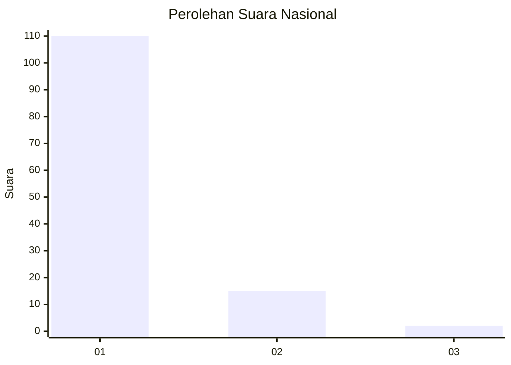
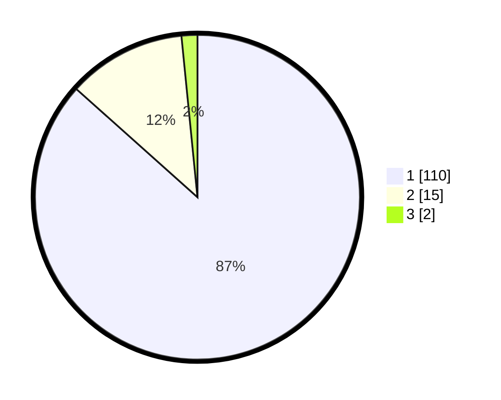

# Hasil

## Grafik

## Tabel

| No. | Nama Paslon    | Suara | Suara (raw) | Persentase |
|:--- |:-------------- | -----:| -----------:| ----------:|
| 1   | ANIES MUHAIMIN | 110   | [110][p-1]  | 86,61      |
| 2   | PRABOWO GIBRAN | 15    | [15][p-2]   | 11,81      |
| 3   | GANJAR MAHFUD  | 2     | [2][p-3]    | 1,57       |

[p-1]: https://github.com/gigit-pemilu/pemilu-2024/blob/main/pilpres/hitung-suara/sub/21-kepulauan-riau/sub/71-kota-batam/sub/08-galang/sub/1002-karas/sub/005-tps/sub/paslon-1.txt
[p-2]: https://github.com/gigit-pemilu/pemilu-2024/blob/main/pilpres/hitung-suara/sub/21-kepulauan-riau/sub/71-kota-batam/sub/08-galang/sub/1002-karas/sub/005-tps/sub/paslon-2.txt
[p-3]: https://github.com/gigit-pemilu/pemilu-2024/blob/main/pilpres/hitung-suara/sub/21-kepulauan-riau/sub/71-kota-batam/sub/08-galang/sub/1002-karas/sub/005-tps/sub/paslon-3.txt

## Foto C Plano

https://sirekap-obj-formc.kpu.go.id/c579/pemilu/ppwp/21/71/08/10/02/2171081002005-20240220-144912--9238e7b6-7e4b-4107-9494-cf67550530a4.jpg

https://sirekap-obj-formc.kpu.go.id/c579/pemilu/ppwp/21/71/08/10/02/2171081002005-20240220-144953--05c8f379-ff9b-4213-b9ef-c9ba65cb139d.jpg

https://sirekap-obj-formc.kpu.go.id/c579/pemilu/ppwp/21/71/08/10/02/2171081002005-20240220-145040--7f056e05-68e5-4adf-b341-5b637eeccfeb.jpg

## Metadata

| Key        | Value               |
| ---------- | ------------------- |
| Time Stamp | 2024-02-26 10:00:00 |

