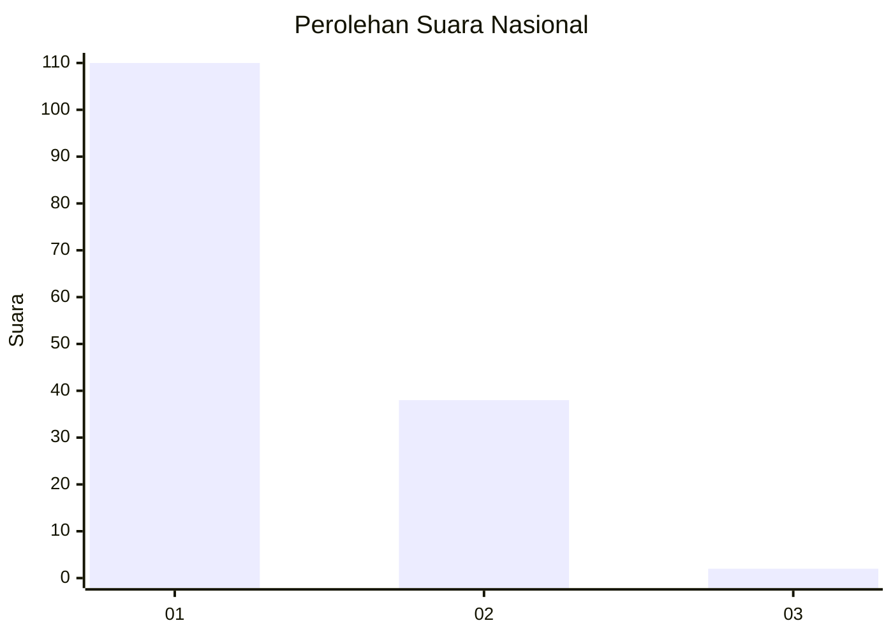
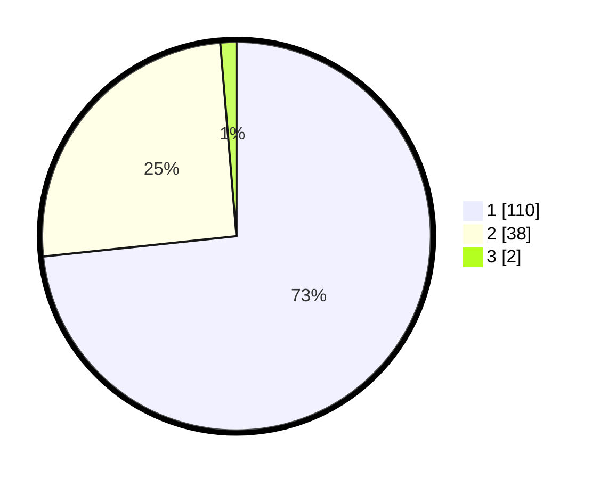

# Hasil

## Grafik

## Tabel

| No. | Nama Paslon    | Suara | Suara (raw) | Persentase |
|:--- |:-------------- | -----:| -----------:| ----------:|
| 1   | ANIES MUHAIMIN | 110   | [110][p-1]  | 73,33      |
| 2   | PRABOWO GIBRAN | 38    | [38][p-2]   | 25,33      |
| 3   | GANJAR MAHFUD  | 2     | [2][p-3]    | 1,33       |

[p-1]: https://github.com/gigit-pemilu/pemilu-2024/blob/main/pilpres/hitung-suara/sub/21-kepulauan-riau/sub/71-kota-batam/sub/08-galang/sub/1002-karas/sub/007-tps/sub/paslon-1.txt
[p-2]: https://github.com/gigit-pemilu/pemilu-2024/blob/main/pilpres/hitung-suara/sub/21-kepulauan-riau/sub/71-kota-batam/sub/08-galang/sub/1002-karas/sub/007-tps/sub/paslon-2.txt
[p-3]: https://github.com/gigit-pemilu/pemilu-2024/blob/main/pilpres/hitung-suara/sub/21-kepulauan-riau/sub/71-kota-batam/sub/08-galang/sub/1002-karas/sub/007-tps/sub/paslon-3.txt

## Foto C Plano

https://sirekap-obj-formc.kpu.go.id/caf5/pemilu/ppwp/21/71/08/10/02/2171081002007-20240220-160947--6b575911-5daa-4686-bcf2-d6321c69ad0a.jpg

https://sirekap-obj-formc.kpu.go.id/caf5/pemilu/ppwp/21/71/08/10/02/2171081002007-20240219-150558--6db998a1-e05e-4728-8aa6-5364f3d8d784.jpg

https://sirekap-obj-formc.kpu.go.id/caf5/pemilu/ppwp/21/71/08/10/02/2171081002007-20240219-150728--358d20fa-651d-4e34-97a7-2f1b4a40950e.jpg

## Metadata

| Key        | Value               |
| ---------- | ------------------- |
| Time Stamp | 2024-02-25 23:00:00 |

