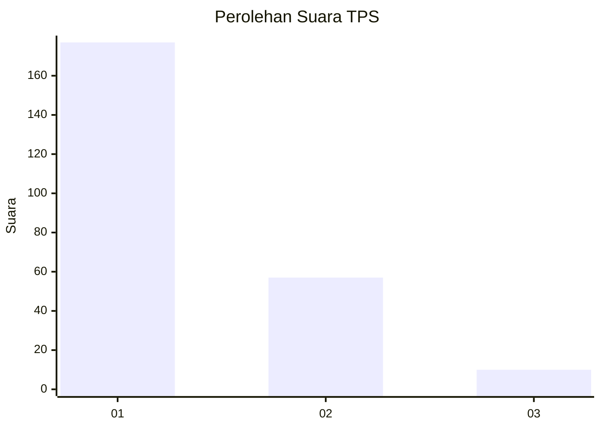
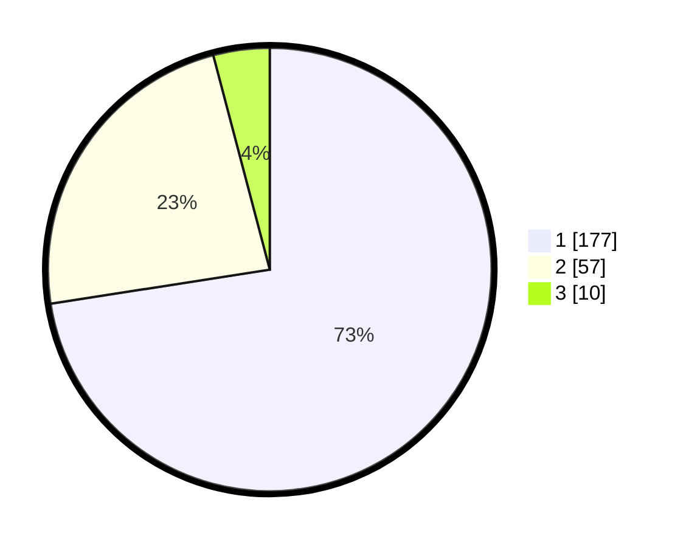

# Hasil

## Grafik

## Tabel

| No. | Nama Paslon    | Suara | Suara (raw) | Persentase |
|:--- |:-------------- | -----:| -----------:| ----------:|
| 1   | ANIES MUHAIMIN | 177   | [177][p-1]  | 72,54      |
| 2   | PRABOWO GIBRAN | 57    | [57][p-2]   | 23,36      |
| 3   | GANJAR MAHFUD  | 10    | [10][p-3]   | 4,10       |

[p-1]: https://github.com/gigit-pemilu/pemilu-2024-21-kepulauan-riau/blob/main/pilpres/hitung-suara/sub/21-kepulauan-riau/sub/71-kota-batam/sub/08-galang/sub/1002-karas/sub/009-tps/sub/paslon-1.txt
[p-2]: https://github.com/gigit-pemilu/pemilu-2024-21-kepulauan-riau/blob/main/pilpres/hitung-suara/sub/21-kepulauan-riau/sub/71-kota-batam/sub/08-galang/sub/1002-karas/sub/009-tps/sub/paslon-2.txt
[p-3]: https://github.com/gigit-pemilu/pemilu-2024-21-kepulauan-riau/blob/main/pilpres/hitung-suara/sub/21-kepulauan-riau/sub/71-kota-batam/sub/08-galang/sub/1002-karas/sub/009-tps/sub/paslon-3.txt

## Foto C Plano

https://sirekap-obj-formc.kpu.go.id/a145/pemilu/ppwp/21/71/08/10/02/2171081002009-20240215-011515--c6618023-0146-419b-bd7d-47aaa52fea20.jpg

https://sirekap-obj-formc.kpu.go.id/a145/pemilu/ppwp/21/71/08/10/02/2171081002009-20240215-011720--946851b5-e081-4135-94cd-aae6e6716411.jpg

https://sirekap-obj-formc.kpu.go.id/a145/pemilu/ppwp/21/71/08/10/02/2171081002009-20240219-143512--fc4de3f9-9597-4e42-ba54-140212882e60.jpg

## Metadata

| Key        | Value               |
| ---------- | ------------------- |
| Time Stamp | 2024-02-19 15:00:00 |

