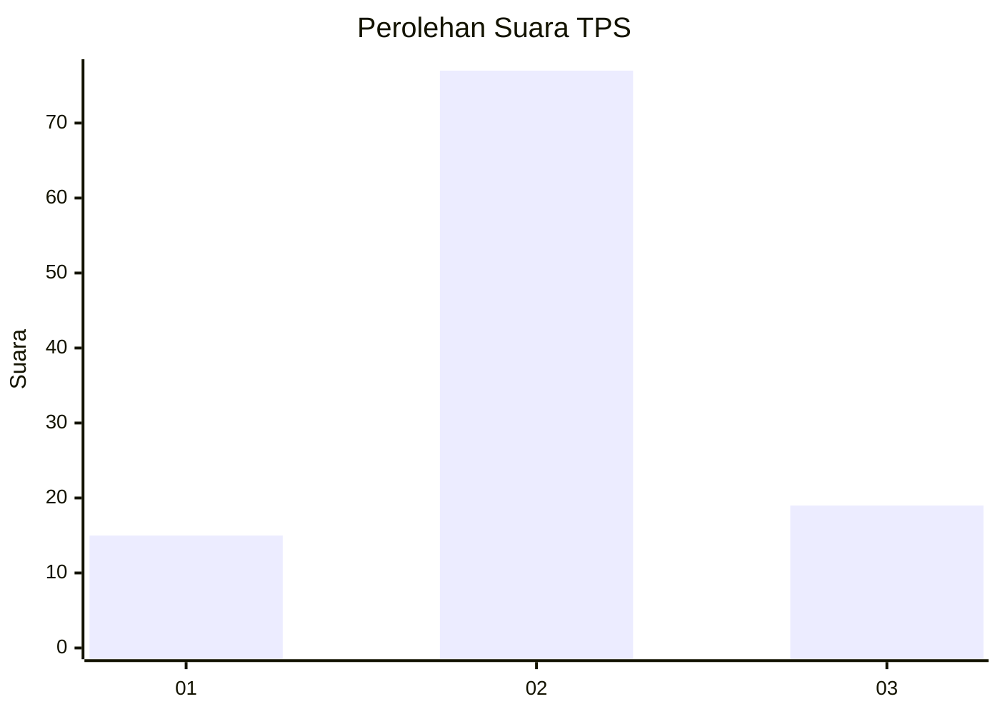
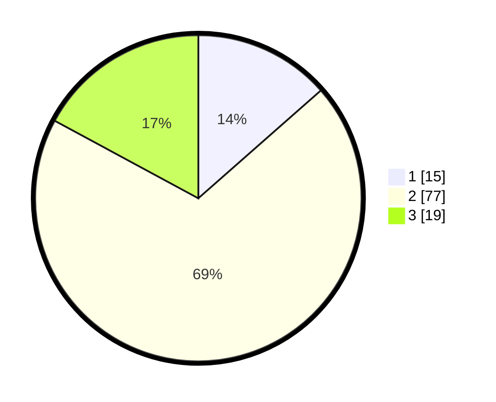

# Hasil

## Grafik

## Tabel

| No. | Nama Paslon    | Suara | Suara (raw) | Persentase |
|:--- |:-------------- | -----:| -----------:| ----------:|
| 1   | ANIES MUHAIMIN | 15    | [15][p-1]   | 13,51      |
| 2   | PRABOWO GIBRAN | 77    | [77][p-2]   | 69,37      |
| 3   | GANJAR MAHFUD  | 19    | [19][p-3]   | 17,12      |

[p-1]: https://github.com/gigit-pemilu/pemilu-2024-21-kepulauan-riau/blob/main/pilpres/hitung-suara/sub/21-kepulauan-riau/sub/71-kota-batam/sub/08-galang/sub/1003-galang-baru/sub/007-tps/sub/paslon-1.txt
[p-2]: https://github.com/gigit-pemilu/pemilu-2024-21-kepulauan-riau/blob/main/pilpres/hitung-suara/sub/21-kepulauan-riau/sub/71-kota-batam/sub/08-galang/sub/1003-galang-baru/sub/007-tps/sub/paslon-2.txt
[p-3]: https://github.com/gigit-pemilu/pemilu-2024-21-kepulauan-riau/blob/main/pilpres/hitung-suara/sub/21-kepulauan-riau/sub/71-kota-batam/sub/08-galang/sub/1003-galang-baru/sub/007-tps/sub/paslon-3.txt

## Foto C Plano

https://sirekap-obj-formc.kpu.go.id/ed45/pemilu/ppwp/21/71/08/10/03/2171081003007-20240222-143327--5ef5c647-7171-4610-9de2-e3f0ca31ef01.jpg

https://sirekap-obj-formc.kpu.go.id/ed45/pemilu/ppwp/21/71/08/10/03/2171081003007-20240222-143403--4eefcad1-b30b-4f48-981c-f4031ffc8a6e.jpg

https://sirekap-obj-formc.kpu.go.id/ed45/pemilu/ppwp/21/71/08/10/03/2171081003007-20240222-143428--352a358d-914a-4c03-a5b1-a6f837ce729c.jpg

## Metadata

| Key        | Value               |
| ---------- | ------------------- |
| Time Stamp | 2024-02-25 14:00:00 |

