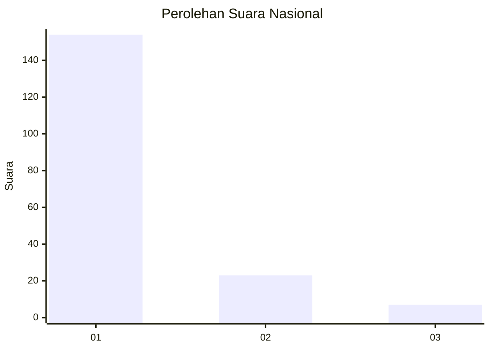
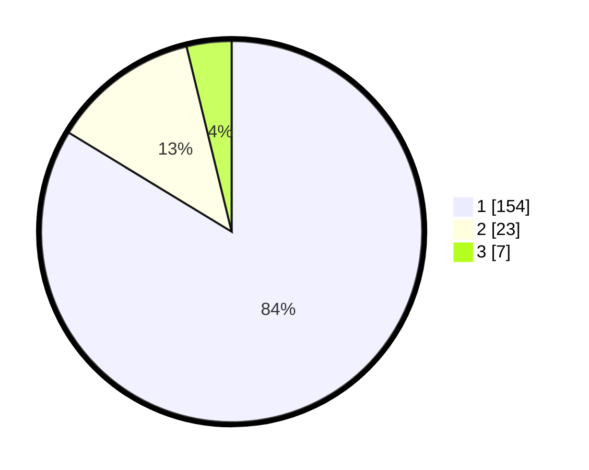

# Hasil

## Grafik

## Tabel

| No. | Nama Paslon    | Suara | Suara (raw) | Persentase |
|:--- |:-------------- | -----:| -----------:| ----------:|
| 1   | ANIES MUHAIMIN | 154   | [154][p-1]  | 83,70      |
| 2   | PRABOWO GIBRAN | 23    | [23][p-2]   | 12,50      |
| 3   | GANJAR MAHFUD  | 7     | [7][p-3]    | 3,80       |

[p-1]: https://github.com/gigit-pemilu/pemilu-2024/blob/main/pilpres/hitung-suara/sub/21-kepulauan-riau/sub/71-kota-batam/sub/08-galang/sub/1004-sembulang/sub/001-tps/sub/paslon-1.txt
[p-2]: https://github.com/gigit-pemilu/pemilu-2024/blob/main/pilpres/hitung-suara/sub/21-kepulauan-riau/sub/71-kota-batam/sub/08-galang/sub/1004-sembulang/sub/001-tps/sub/paslon-2.txt
[p-3]: https://github.com/gigit-pemilu/pemilu-2024/blob/main/pilpres/hitung-suara/sub/21-kepulauan-riau/sub/71-kota-batam/sub/08-galang/sub/1004-sembulang/sub/001-tps/sub/paslon-3.txt

## Foto C Plano

https://sirekap-obj-formc.kpu.go.id/4470/pemilu/ppwp/21/71/08/10/04/2171081004001-20240214-194903--c8d6662a-5ee4-4de9-880d-d0adad91de57.jpg

https://sirekap-obj-formc.kpu.go.id/4470/pemilu/ppwp/21/71/08/10/04/2171081004001-20240214-194715--fdbf717d-44b6-4517-b7ac-25ce8b531ae8.jpg

https://sirekap-obj-formc.kpu.go.id/4470/pemilu/ppwp/21/71/08/10/04/2171081004001-20240214-194820--3dcd82af-5f18-485f-8bcf-98e2e54fc579.jpg

## Metadata

| Key        | Value               |
| ---------- | ------------------- |
| Time Stamp | 2024-02-16 22:01:00 |

