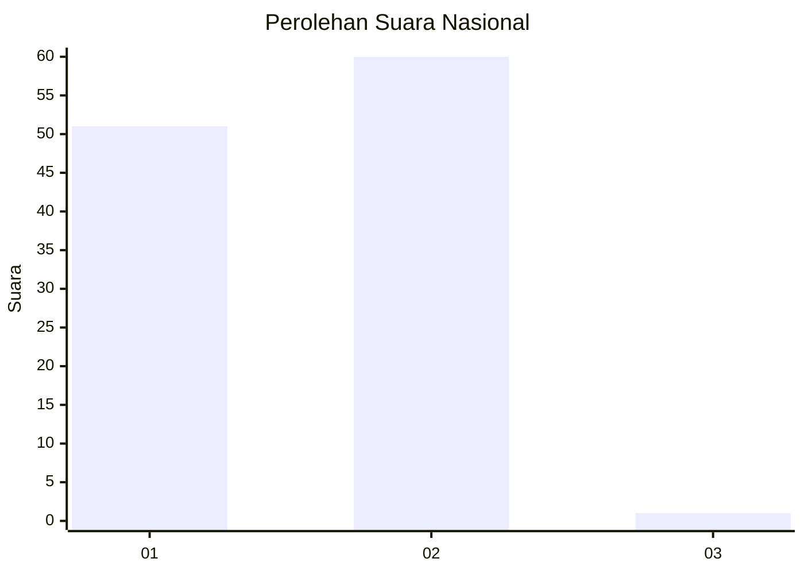
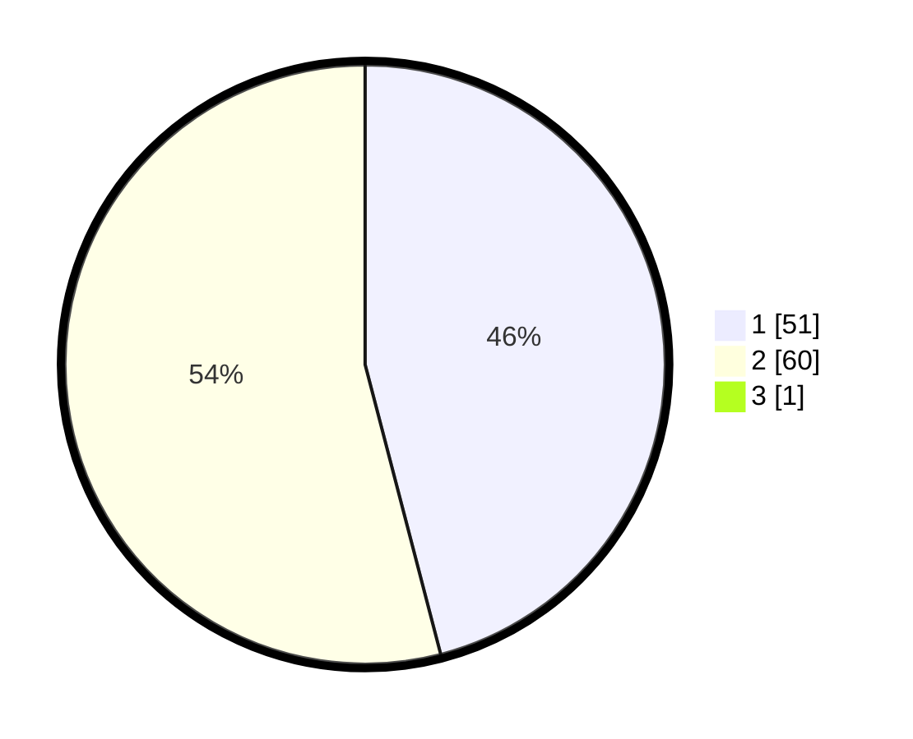

# Hasil

## Grafik

## Tabel

| No. | Nama Paslon    | Suara | Suara (raw) | Persentase |
|:--- |:-------------- | -----:| -----------:| ----------:|
| 1   | ANIES MUHAIMIN | 51    | [51][p-1]   | 45,54      |
| 2   | PRABOWO GIBRAN | 60    | [60][p-2]   | 53,57      |
| 3   | GANJAR MAHFUD  | 1     | [1][p-3]    | 0,89       |

[p-1]: https://github.com/gigit-pemilu/pemilu-2024/blob/main/pilpres/hitung-suara/sub/21-kepulauan-riau/sub/71-kota-batam/sub/08-galang/sub/1004-sembulang/sub/002-tps/sub/paslon-1.txt
[p-2]: https://github.com/gigit-pemilu/pemilu-2024/blob/main/pilpres/hitung-suara/sub/21-kepulauan-riau/sub/71-kota-batam/sub/08-galang/sub/1004-sembulang/sub/002-tps/sub/paslon-2.txt
[p-3]: https://github.com/gigit-pemilu/pemilu-2024/blob/main/pilpres/hitung-suara/sub/21-kepulauan-riau/sub/71-kota-batam/sub/08-galang/sub/1004-sembulang/sub/002-tps/sub/paslon-3.txt

## Foto C Plano

https://sirekap-obj-formc.kpu.go.id/140a/pemilu/ppwp/21/71/08/10/04/2171081004002-20240215-010703--6de2e286-118e-4538-9e2b-ba892c4775e5.jpg

https://sirekap-obj-formc.kpu.go.id/140a/pemilu/ppwp/21/71/08/10/04/2171081004002-20240215-010814--0c85f56a-546d-406c-9fea-c4a65b8ea70d.jpg

https://sirekap-obj-formc.kpu.go.id/140a/pemilu/ppwp/21/71/08/10/04/2171081004002-20240215-010924--3d905623-d135-4e66-b951-57ea5b48eb6a.jpg

## Metadata

| Key        | Value               |
| ---------- | ------------------- |
| Time Stamp | 2024-02-16 22:01:00 |

