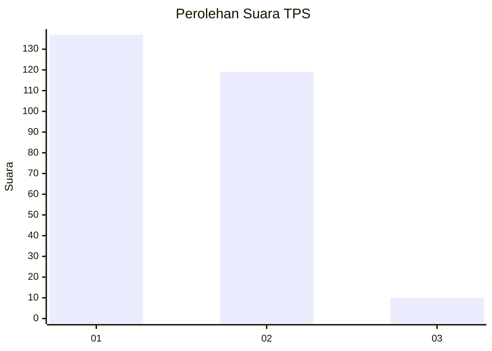
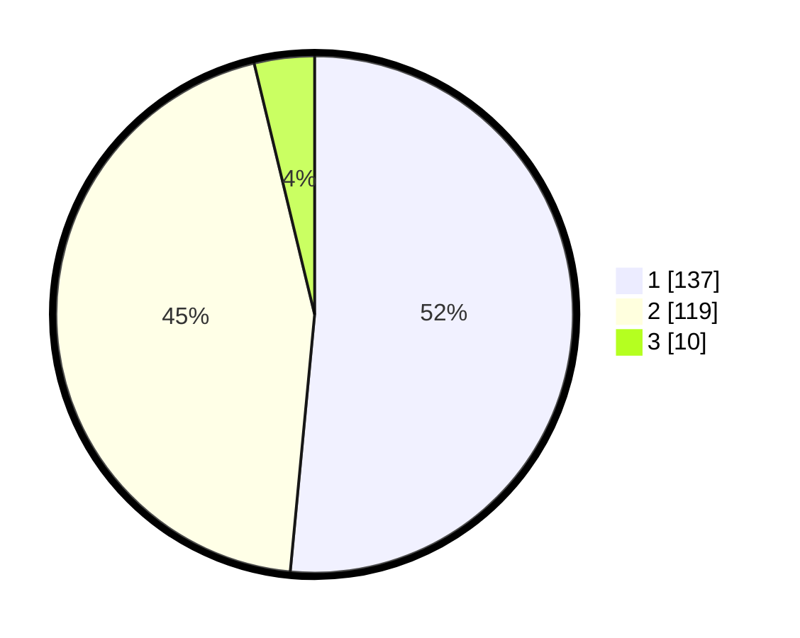

# Hasil

## Grafik

## Tabel

| No. | Nama Paslon    | Suara | Suara (raw) | Persentase |
|:--- |:-------------- | -----:| -----------:| ----------:|
| 1   | ANIES MUHAIMIN | 137   | [137][p-1]  | 51,50      |
| 2   | PRABOWO GIBRAN | 119   | [119][p-2]  | 44,74      |
| 3   | GANJAR MAHFUD  | 10    | [10][p-3]   | 3,76       |

[p-1]: https://github.com/gigit-pemilu/pemilu-2024-21-kepulauan-riau/blob/main/pilpres/hitung-suara/sub/21-kepulauan-riau/sub/71-kota-batam/sub/08-galang/sub/1004-sembulang/sub/009-tps/sub/paslon-1.txt
[p-2]: https://github.com/gigit-pemilu/pemilu-2024-21-kepulauan-riau/blob/main/pilpres/hitung-suara/sub/21-kepulauan-riau/sub/71-kota-batam/sub/08-galang/sub/1004-sembulang/sub/009-tps/sub/paslon-2.txt
[p-3]: https://github.com/gigit-pemilu/pemilu-2024-21-kepulauan-riau/blob/main/pilpres/hitung-suara/sub/21-kepulauan-riau/sub/71-kota-batam/sub/08-galang/sub/1004-sembulang/sub/009-tps/sub/paslon-3.txt

## Foto C Plano

https://sirekap-obj-formc.kpu.go.id/0338/pemilu/ppwp/21/71/08/10/04/2171081004009-20240215-065948--cc243a8c-9ba3-4b86-b08e-fca2e2d3d3e4.jpg

https://sirekap-obj-formc.kpu.go.id/0338/pemilu/ppwp/21/71/08/10/04/2171081004009-20240214-202412--eb2e5b95-cdba-4d9a-8c44-af4fafe6c674.jpg

https://sirekap-obj-formc.kpu.go.id/0338/pemilu/ppwp/21/71/08/10/04/2171081004009-20240214-202510--6776f3f4-4212-4103-8041-43879dd7f179.jpg

## Metadata

| Key        | Value               |
| ---------- | ------------------- |
| Time Stamp | 2024-02-15 17:30:25 |

